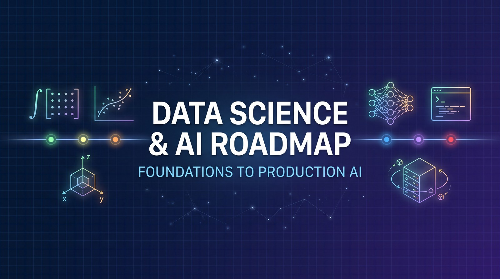
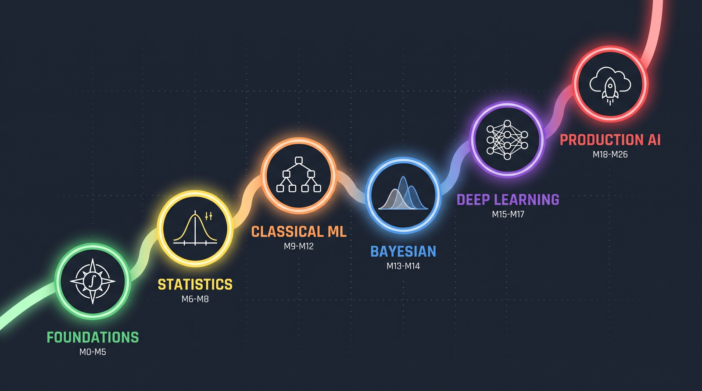

# Data Science & AI Roadmap

**A free-first self-study curriculum, from mathematics and Python to production AI.**

[Start here](START-HERE.md) · [Browse all modules](curriculum/README.md#all-modules) · [Resume studying](guides/progress-tracker.md#resume) · [FAQ](FAQ.md)

## Where to go next

| Your next step | Open this |
|---|---|
| **I'm new. Help me start.** | [Start Here](START-HERE.md#first-step): choose an entry point and do one study session. |
| **I know what I want to learn.** | [Curriculum index](curriculum/README.md#all-modules): jump directly to any of the 27 modules. |
| **I'm returning to my studies.** | [Resume checklist](guides/progress-tracker.md#resume): reopen your module and find the next unfinished task. |

## What this is (in 30 seconds)

A **reading and study roadmap**, not an app or a software package. Read it on GitHub; no installation, account, clone, or fork is required to browse. Courses and learner projects may need their own tools or accounts.

Each module brings together prerequisites, learning resources, and practical work. Start with its recommended resource, then follow the **module's actual reading and project requirements**. A short resource table is a starting point, not a promise that one course covers everything.

**Free-first is the policy, not a guarantee that every current link is free to complete.** Some access labels and Foundations instructions still need correction. Read [known limitations](FAQ.md#known-limitations) if a diagnostic, paywall, or prerequisite seems inconsistent; do not buy a book just to resolve conflicting wording.

## How to use this roadmap

1. **Choose a starting module.** Use [Start Here](START-HERE.md#first-step) if unsure, or the [track chooser](#choose-your-track) if you already have a goal.
2. **Check prerequisites and the deliverable.** The [module guide](guides/how-to-read-a-module.md#reading-order) shows what to read first.
3. **Study, practise, and build.** Use the [resource defaults](guides/how-to-read-a-module.md#pick-one) without treating alternatives as extra compulsory courses. Keep explicit required work in view.
4. **Record your next task.** Bookmark the module heading in your [progress tracker](guides/progress-tracker.md#resume). Check its definition of done and the [project policy](curriculum/README.md#module-projects) before moving on.

## Entry points by experience

- **New to Python:** begin with [M1: Programming Foundations](curriculum/1-foundations.md#module-1). [Start Here](START-HERE.md#first-session) gives a first-session task.
- **Already programming:** choose a target below, then check that module's prerequisites. Python fluency alone does not establish calculus, probability, or ML readiness.
- **Returning after a break:** use [Resume](guides/progress-tracker.md#resume), not another full tour of the repository.

## Choose your track

**Not sure yet? Start with M1; you can choose a destination later.** These are the repository's existing role-focused scope summaries, not exhaustive prerequisite lists or guaranteed study schedules. Follow each module's prerequisites; omitted modules are not automatically waived.

| Your goal | Where to explore |
|---|---|
| **Data Analyst** — analysis and communication | [Statistics & Data](curriculum/README.md#statistics-and-data), then [M25: Product DS](curriculum/6-frontier-production.md#module-25). |
| **Data Scientist** — inference and predictive modelling | [Foundations](curriculum/README.md#foundations), [Statistics](curriculum/README.md#statistics-and-data), and [Classical ML](curriculum/README.md#classical-ml). |
| **Data Engineer** — databases and data systems | [M4: Algorithms](curriculum/1-foundations.md#module-4), [M8a: SQL](curriculum/2-statistics-and-data.md#module-8a), and [M8b: Distributed Data](curriculum/2-statistics-and-data.md#module-8b). |
| **ML Engineer** — model training and serving | [Classical ML](curriculum/README.md#classical-ml), [Deep Learning](curriculum/README.md#deep-learning), and [M24: MLOps](curriculum/6-frontier-production.md#module-24). |
| **AI Engineer, Applications** — products using existing models | [Practitioner track](guides/practitioner-track.md#practitioner-track): applied scope, projects, and trade-offs. |
| **AI Engineer, Systems** — model internals and infrastructure | [Deep Learning](curriculum/README.md#deep-learning) and [Frontier & Production](curriculum/README.md#frontier-and-production). |
| **Research / PhD preparation** — mathematical and research depth | [Full curriculum index](curriculum/README.md#all-modules) and [M26: Research capstone](curriculum/6-frontier-production.md#module-26). |

Existing module sequences by track

These summaries are retained for reference, not newly resequenced. They omit prerequisites and contain abbreviated ranges; open the linked module index to check each module before starting. For example, the Data Analyst row lists M6, whose stated prerequisite is M5. The Applications and Systems rows describe different emphases, not levels of seniority.

| Track | Recommended modules | Portfolio outcome |
|---|---|---|
| **Data Analyst** | M1 → M6 → M7 → M8a → M25 → M26 | Reproducible analysis, dashboard, and stakeholder memo |
| **Data Scientist** | M1–M7 → M9–M14 → M25 → M26 | Validated model plus causal or experimental evaluation |
| **Data Engineer** | M1 → M4 → M7 → M8a → M8b → M24 → M26 | Tested batch/streaming data platform with observability |
| **ML Engineer** | M1–M12 → M15–M17 → M24 → M26 | Model served behind an API with CI, monitoring, and SLOs |
| **AI Engineer (Applications)** | [Fast lane](guides/practitioner-track.md#practitioner-track): M1 → M7 → M8a → intuition-level M2/M3/M5 → M18 → M21–M24 → M26 | Deployed product built **on** a foundation model: RAG or agent system with an eval suite, tracing, guardrails, and a cost/latency budget |
| **AI Engineer (Systems/Research-adjacent)** | M1 → M8a → M15–M18 → M21–M24 → M26 | Evaluated RAG or agent system with tracing and guardrails, plus architecture-level understanding of the models it serves |
| **Research / PhD prep** | M0–M18 → M23 → M26 Research Track | Reproducible paper, ablations, and public research artifact |

[Open the full module index](curriculum/README.md#all-modules) · [Read fast-lane trade-offs](guides/practitioner-track.md#when-you-must-come-back-to-the-math-spine)

## Curriculum at a glance

Six subject groups, called **strata**, organise the module pages. Numbers are stable identifiers, not a requirement to take every module in numerical order. [Why M19/M20 are absent](FAQ.md#structure).

| Browse | Modules | Focus |
|---|---|---|
| [Foundations](curriculum/README.md#foundations) | M0–M5 | Proofs, Python, calculus, linear algebra, algorithms, probability |
| [Statistics & Data](curriculum/README.md#statistics-and-data) | M6, M6½, M7, M8a, M8b | Inference, causal reasoning, data analysis, SQL, distributed systems |
| [Classical ML](curriculum/README.md#classical-ml) | M9–M12 | Regression, classification, clustering, ensembles |
| [Probabilistic ML](curriculum/README.md#probabilistic-ml) | M13–M14 | Bayesian inference, MCMC, time series |
| [Deep Learning](curriculum/README.md#deep-learning) | M15–M17 | Neural networks, transformers, generative models, reinforcement learning |
| [Frontier & Production](curriculum/README.md#frontier-and-production) | M18, M21–M26 | LLMs, retrieval, agents, safety, MLOps, product work, capstone |

Visual overview (optional)

## Useful links

- **Study help:** [Read a module](guides/how-to-read-a-module.md#reading-order) · [Choose a resource](guides/how-to-read-a-module.md#pick-one) · [Optional guided companions](guides/companion-curricula.md) · [Get unstuck](guides/how-to-read-a-module.md#common-ways-people-get-stuck).
- **References, when needed:** [Books](resources/books.md) · [Toolchain](resources/toolchain.md) · [Citation key](guides/sources.md#citation-key) · [Career planning](guides/career-operations.md). Supporting course pages are linked beside their modules in the [index](curriculum/README.md#all-modules).
- **Report a problem:** [Confusing instructions or a broken link](https://github.com/akazadivu-design/data-sci/issues/new/choose) · [Contribution guide](CONTRIBUTING.md) · [Code of conduct](CODE_OF_CONDUCT.md).

About the roadmap and maintenance

## Goal

Develop mathematical and programming foundations, apply them to data and ML problems, and build documented projects. Study duration depends on prior knowledge, chosen scope, practice, and available time—not a promised hiring date. See [planning estimates and their limits](FAQ.md#how-long).

## Who this is for

Beginners, returning learners, analysts, engineers, and research-oriented learners. Choose the depth your goals require; this independent roadmap does not award a university credential or imply institutional affiliation.

### Maintainer material — safe to ignore as a learner

[Changelog](CHANGELOG.md#refresh-log) · [Verification log](audit/VERIFICATION.md) · [Foundations improvement proposal](audit/Foundations_M0-M5_Improvement_Plan.md) · [Repository tools](tools/README.md).

The improvement proposal is review material, not an approved replacement syllabus. Navigation changes do not implement its new diagnostic, prerequisites, or assessment rules.

## Acknowledgements & Attribution

University sources and artwork attribution

This curriculum synthesises publicly-available syllabi from:

* **IIT Madras** — [study.iitm.ac.in/ds](https://study.iitm.ac.in/ds/) (BS in Data Science and Applications, 2025–26).
* **Harvard University** — [harvard-iacs.github.io](https://harvard-iacs.github.io/) (CS 109A/B), [stat110.hsites.harvard.edu](https://stat110.hsites.harvard.edu/) (STAT 110), [harvard-ml-courses.github.io/cs181-web/](https://harvard-ml-courses.github.io/cs181-web/) (CS 1810, Spring 2026), [cs50.harvard.edu/python](https://cs50.harvard.edu/python/) (CS50P).
* **Massachusetts Institute of Technology** — [introml.mit.edu/spring26](https://introml.mit.edu/spring26) (6.390), [gradml.mit.edu](https://gradml.mit.edu/) (6.790), [**deeplearning6-7960.github.io**](https://deeplearning6-7960.github.io/) (6.7960 Fall 2025), [introtodeeplearning.com](https://introtodeeplearning.com/) (6.S191 2026), [micromasters.mit.edu/ds](https://micromasters.mit.edu/ds/) (Statistics & Data Science MicroMasters), [visionbook.mit.edu](https://visionbook.mit.edu/) (Foundations of Computer Vision 2024), [ocw.mit.edu](https://ocw.mit.edu/) (18.01/18.02/18.06/6.0001/6.0002/6.006), [ocw.mit.edu/14-387](https://ocw.mit.edu/courses/14-387-applied-econometrics-mostly-harmless-big-data-fall-2014/) (14.387 Applied Econometrics).
* **University of Cambridge** — [cl.cam.ac.uk/teaching/2526](https://www.cl.cam.ac.uk/teaching/) (Part IA/IB/II), [mlmi.eng.cam.ac.uk](https://www.mlmi.eng.cam.ac.uk/) (MPhil MLMI 2026 entry).
* **Stanford University** — [cs336.stanford.edu](https://cs336.stanford.edu/) (Language Modeling from Scratch, Spring 2026) · [cs246.stanford.edu](https://web.stanford.edu/class/cs246/) (Mining Massive Datasets) · [web.stanford.edu/~jurafsky/slp3](https://web.stanford.edu/~jurafsky/slp3/) (SLP 3rd ed. draft) · [web.stanford.edu/class/ee364a](https://web.stanford.edu/class/ee364a/) (Convex Optimization).
* **UC Berkeley** — [ischool.berkeley.edu/courses/datasci/241](https://www.ischool.berkeley.edu/courses/datasci/241) (MIDS Causal Inference — anchor for M6½) · [rail.eecs.berkeley.edu/deeprlcourse](https://rail.eecs.berkeley.edu/deeprlcourse/) (CS285 Deep RL) · [llmagents-learning.org](https://llmagents-learning.org/) (LLM Agents MOOC — anchor for M22).
* **CMU / UMich (Product-DS anchors)** — [heinz.cmu.edu](https://www.heinz.cmu.edu/programs/public-policy-management-master/data-analytics) (MSPPM-DA) · [si.umich.edu](https://www.si.umich.edu/programs/master-applied-data-science) (MADS).
* **Hugging Face** — [huggingface.co/learn](https://huggingface.co/learn) (Agents Course, Smol Course, Smol Training Playbook).
* **Microsoft** — [Data Science for Beginners](https://github.com/microsoft/Data-Science-For-Beginners) and [ML for Beginners](https://github.com/microsoft/ML-For-Beginners), used as project-based companion curricula with quizzes, assignments, and guided lesson navigation.
* **Anthropic / MCP Consortium** — [modelcontextprotocol.io](https://modelcontextprotocol.io/) (Nov 2025 spec) · [transformer-circuits.pub](https://transformer-circuits.pub/) (mechanistic interpretability research).

All university material remains © their respective institutions; this repository only cites and organises publicly‑disclosed syllabi.

**Images.** All artwork in [`assets/`](assets/) is original to this repository and carries no third-party licence obligation. `hero-banner.jpg` and `roadmap-overview.jpg` are AI-generated originals; the six `stratum-*.jpg` section banners are drawn programmatically by [`assets/make_banners.py`](assets/make_banners.py) (Pillow only, deterministic — re-run it to regenerate or restyle them). No stock photography, no commercially-licensed imagery, and no images scraped from third-party pages are used anywhere in this repository. See [`assets/README.md`](assets/README.md).

---

**Start small. Practise deliberately. Build and explain your work.**

[Start here](START-HERE.md#first-step) · [All modules](curriculum/README.md#all-modules) · [Resume](guides/progress-tracker.md#resume)
