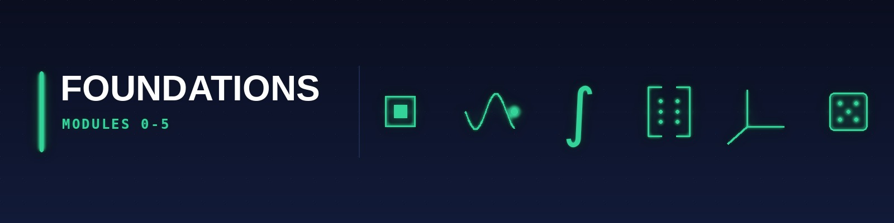

[🏠 Roadmap home](../README.md) · [📚 Curriculum index](README.md) · [🟨 Statistics & Data (M6–M8b) →](2-statistics-and-data.md)

---

# 🟩 FOUNDATION STRATUM — Modules 0–5

> These six modules establish the non-negotiable mathematical and programming substrate. **A weakness in any one will cause silent failure later** — e.g., a shaky grasp of eigenvalues cripples PCA, a shaky grasp of chain rule cripples backprop, a shaky grasp of `∀ / ∃ / ⟹` cripples your ability to read a single PRML proof.

---

## 🩺 Math-Foundations Diagnostic & Remediation Map

> **Why this section exists:** Most self-learners fail at Modules 9–17 not because ML is hard, but because they skipped (or mis-sequenced) one of *six* prerequisite skills. Below is a **15-question, 60-minute diagnostic** plus a **remediation table** so you can fix the weakness *before* it metastasises.

### Step 1 — Take the 15-question self-diagnostic (free, 60 min)

Pick **one** of these freely-available diagnostic instruments — each maps cleanly to the 6 strands you must master:

| # | Strand | Diagnostic instrument | Pass bar | Remediation if you fail → |
|---|---|---|---|---|
| 1 | **Pre-calculus & algebra** | [MIT 18.01A diagnostic (Q1–Q10)](https://ocw.mit.edu/courses/18-01a-calculus-fall-2005/resources/exam_a/) | 8/10 | Module **0a** (Khan Academy Pre-Calc) |
| 2 | **Trigonometry & complex numbers** | [Paul's Online Trig diagnostic](https://tutorial.math.lamar.edu/) | 7/10 | Module **0a** (Khan Academy Trig + Euler's formula) |
| 3 | **Proof writing & logic** | [Velleman *How To Prove It* §1.5 exercises](https://www.cambridge.org/core/books/how-to-prove-it/) | 4/5 | Module **0b** (Hammack *Book of Proof* + Velleman + Lean tutorial) |
| 4 | **Single-variable calculus** | [MIT 18.01 Final Exam](https://ocw.mit.edu/courses/18-01-single-variable-calculus-fall-2006/pages/final-exam/) | 70 % | Module **2** (full) |
| 5 | **Linear algebra (computational)** | [MIT 18.06 Quiz 1](https://ocw.mit.edu/courses/18-06-linear-algebra-spring-2010/exams/) | 70 % | Module **3** (full) |
| 6 | **Probability sense** | [Harvard Stat 110 Practice Strategic Practice 1–3](https://stat110.hsites.harvard.edu/) | 70 % | Module **5** (full) |

### Step 2 — Use the remediation paths

* **Score < 50 %:** Do **Module 0** end-to-end (≈ 6–10 weeks at 10 hrs/week) before touching Module 2.
* **Score 50–70 %:** Spot-fix using the per-topic links inside Module 0a / 0b.
* **Score > 70 %:** Skip Module 0; you are ready for Module 1 + 2 in parallel.

### Step 3 — Adopt the **Math Maturity Operating Manual**

Independent of *which* topic, every elite programme (MIT, Cambridge, Harvard) implicitly assumes you have these **seven habits**:

1. **Quantifier discipline** — when you read "for every / there exists", you can write it as `∀ / ∃` and negate it correctly.
2. **Definition-unfolding** — given a theorem, you can rewrite each term to its primitive definition before reasoning.
3. **Counter-example reflex** — when you doubt a claim, you immediately try `n=0`, `n=1`, the empty set, the singleton, and the constant function.
4. **Proof-template recall** — induction, contradiction, contrapositive, direct, construction, pigeonhole — each as a *template* you can fill in.
5. **Notation hygiene** — distinguish `=` (equal), `:=` (defined-as), `≡` (congruent / identical), `≈` (approximately), `∼` (asymptotic), `∝` (proportional).
6. **Computational verification** — every symbolic claim you make is sanity-checked in **SymPy** (algebra) or **NumPy** (numerical) within 5 minutes.
7. **Lean / proof-assistant exposure** — *not required*, but doing one chapter of [Velleman's *How To Prove It With Lean*](https://djvelleman.github.io/HTPIwL/) **changes how you read every subsequent definition** for the rest of your career.

> **Cited source for habits 1–6:** Cambridge IB Discrete Mathematics + Harvard Math 22a "Reasoning, Proof, and Linear Algebra" course handbooks (2025–26).

---

## Module 0: Mathematical Maturity Bridge — Pre-Calculus, Logic & Proof

> **Status:** Optional **only** if you scored > 70 % on every diagnostic above. Otherwise: **mandatory**.

* **The Tutor's "Why":** No university teaches *the leap* from procedural high-school math to definition-driven university math — they assume you already made it. The result: 60 %+ of self-learners stall at Module 5 (probability proofs) or Module 9 (regression assumptions). Cambridge's IB CST course explicitly assumes "Mathematics for Natural Sciences" maturity; MIT 6.7960 assumes 18.05 + a proof course; Harvard CS 1810 assumes Math 22a (linear algebra **with proofs**). **This module IS that proof course, compressed and free.**

* **Strict Prerequisites:** Working knowledge of high-school algebra (solve linear and quadratic equations).

### Sub-module 0a — Pre-Calculus & Trigonometry Refresher (≈ 2–4 weeks)

* **Exhaustive Topic List:**
  * **Numbers:** ℕ ⊂ ℤ ⊂ ℚ ⊂ ℝ ⊂ ℂ; absolute value as distance; intervals; surds and rationalising.
  * **Algebra:** factorisation (difference of squares, sum/difference of cubes), polynomial long division, partial fractions, exponent and log laws, change-of-base formula, **completing the square** (the single most-cited identity in regression).
  * **Functions:** domain/range, composition, invertibility, even/odd, increasing/decreasing, piecewise, absolute value, floor/ceiling.
  * **Conic sections:** circle, ellipse, parabola, hyperbola — equations and parametrisations (you'll see them again in Gaussians and SVMs).
  * **Trigonometry:** unit circle, radian measure, six trig functions, identities (Pythagorean, sum/difference, double-angle, half-angle, product-to-sum), inverse trig, polar coordinates.
  * **Complex numbers:** Cartesian and polar form, **Euler's formula `eⁱᶿ = cos θ + i sin θ`** (the bridge to Fourier transforms in M3), De Moivre's theorem, roots of unity.
  * **Sequences & series:** arithmetic and geometric, sum formulas (you will re-derive these in MGFs in M5).
  * **Limits — informal:** ε-δ intuition, one-sided limits, infinite limits, limits at infinity.

* **2026 Resources:**
  * **Primary (free):** [Khan Academy Precalculus](https://www.khanacademy.org/math/precalculus) — 10 units, ≈ 40 hours, includes mastery quizzes.
  * **Alternative (free, MIT-quality):** [MIT 18.01A Calculus with Pre-Calc](https://ocw.mit.edu/courses/18-01a-calculus-fall-2005/) — combines refresher with calculus, ideal if you have 6+ weeks.
  * **Reading:** Stewart *Calculus, Early Transcendentals* (9th ed.) — Appendix A (numbers), Appendix B (coordinate geometry), Appendix C (graphs), §1.1–§1.5 (functions and models).
  * **Computational verification:** every identity must be checked in **SymPy** within 1 line (e.g., `sympy.simplify(sin(x)**2 + cos(x)**2 - 1)`).

### Sub-module 0b — Logic, Proof & Mathematical Vernacular (≈ 4–6 weeks · CORE)

* **Exhaustive Topic List:**
  * **Propositional logic:** truth tables, conjunction `∧`, disjunction `∨`, negation `¬`, implication `⟹`, biconditional `⟺`, **converse / contrapositive / inverse** (and which are logically equivalent).
  * **Predicate logic:** universal `∀`, existential `∃`, **negating quantified statements** (`¬∀x P(x) ≡ ∃x ¬P(x)` — the single most error-prone identity in undergraduate maths).
  * **Sets:** ∅, ∈, ⊆, ⊊, ∪, ∩, complement, Cartesian product, power set, Russell's paradox (and why ZFC patches it).
  * **Functions formally:** as relations satisfying functional dependence; injection, surjection, bijection; image and pre-image; composition; inverse function theorem (statement only).
  * **Relations:** reflexive, symmetric, transitive, equivalence relations, partitions, partial and total orders.
  * **Cardinality:** finite, countably infinite (ℕ ∼ ℤ ∼ ℚ), uncountable (ℝ via Cantor's diagonal); pigeonhole as a corollary.
  * **Proof techniques (with at least 3 worked examples each):**
    1. **Direct proof** — e.g., sum of two evens is even.
    2. **Proof by contradiction** — e.g., √2 is irrational; there are infinitely many primes.
    3. **Proof by contrapositive** — e.g., if `n²` is even then `n` is even.
    4. **Proof by mathematical induction** (weak and strong) — e.g., `Σk=1ⁿ k = n(n+1)/2`; well-ordering principle.
    5. **Proof by construction** — e.g., explicitly construct a bijection ℕ → ℤ.
    6. **Proof by cases** — e.g., triangle inequality.
    7. **Pigeonhole principle** — e.g., among any 13 people, two share a birth-month.
  * **Number theory primer:** divisibility, gcd, Euclidean algorithm (with extended version), Bezout's identity, modular arithmetic, Fermat's little theorem, Chinese Remainder Theorem (used in cryptography and hashing).
  * **Combinatorial identities:** Pascal's rule, hockey-stick identity, Vandermonde's identity (you will re-encounter all three in Stat 110 Lec 1–2).
  * **(Optional) Lean 4 first contact:** prove `∀ n : ℕ, n + 0 = n` interactively. *Not required for the curriculum but a 10× force-multiplier on every later module's confidence.*

* **2026 Resources:**
  * **Primary text (free, CC-BY):** [_Book of Proof_ (Hammack, **3rd Edition, 2018; revised 2025**)](https://richardhammack.github.io/BookOfProof/) — chapters 1–10. Open Textbook Initiative-approved; used at 50+ universities.
  * **Companion text:** [_How to Prove It: A Structured Approach_ (Velleman, **3rd Edition, Cambridge 2019**)](https://www.cambridge.org/core/books/how-to-prove-it/) — chapters 1–6 + the new **[*How to Prove It With Lean* (Velleman, 2024)](https://djvelleman.github.io/HTPIwL/)** companion (free, browser-based).
  * **Discrete-math companion:** [_Mathematics for Computer Science_ (Lehman, Leighton, Meyer — MIT 6.042J, **2024 edition free PDF**)](https://ocw.mit.edu/courses/6-042j-mathematics-for-computer-science-spring-2015/resources/mit6_042js15_textbook/) — chapters 1–5 (Proofs, Induction, Number Theory).
  * **Video course:** [Stanford CS103 Mathematical Foundations of Computing — full lecture notes](https://web.stanford.edu/class/cs103/) (publicly mirrored).
  * **Free online interactive course:** [_Introduction to Mathematical Thinking_ (Keith Devlin — Coursera, evergreen)](https://www.coursera.org/learn/mathematical-thinking) — Stanford-led, free audit.
  * **Practical implementation:** **SymPy 1.13+** for symbolic verification; **Lean 4 + Mathlib** (optional) — `lean4-web` runs in browser, no install needed.

* **Outcome:** When you finish Module 0b you can **read any theorem statement in Stat 110 / 18.06 / CS 1810 and re-state it formally before attempting the proof.** That single skill is the difference between a frustrated learner and an MIT-track one.

* **Suggested Pace:** 6 weeks at 10 hrs/week = 60 hrs total; or 12 weeks at 5 hrs/week. **Do not skip the exercises** — Hammack provides 600+ with hints, and *doing 200 of them* is the entire point of this module.

> ### ⚡ Intuition-First Alternative (Practitioner Track)
>
> **The route:** Skip Module 0 entirely. Go straight to [M1](#module-1), and pick up mathematical vocabulary as it appears via [StatQuest](https://statquest.org/) and the [Manga Guides](../resources/books.md#practitioner-shelf). Return here only if you later hit the wall described below.
>
> **The argument for it:** Video 3 (04:47) — *"You need intuition, not derivation skills. Get the concepts down and then move forward."* Video 1 (00:44–01:09) reports that months spent on manual derivations "took years longer than it needed to" and did not yield "great intuition for why models behave the way they do in practice."
>
> **What you give up — stated plainly:** Module 0 is not a maths course, it is a *reading* course. Without it you cannot parse `∀ / ∃`, negate a quantified statement, or unfold a definition — which means every theorem statement in Stat 110, ESL, PRML, and Murphy remains opaque. You will be able to *use* methods and unable to *check* them.
>
> **Come back when:** you enter [M13](4-probabilistic-ml.md#module-13) (Bayesian derivations), any research-track work, or you find yourself unable to tell whether a paper's claim is actually supported. Module 0 is 60 hours; it does not expire.

---

## Module 1: Programming Foundations & Computational Thinking

* **The Tutor's "Why":** All 2026 data-science work is Python-first (with selective Polars/R/Julia). You cannot derive a gradient if you cannot write a loop. This module is the gateway — master it, or every subsequent module becomes guesswork.

* **Strict Prerequisites:** High-school algebra. A working laptop with VS Code installed.

* **Exhaustive Topic List:**
  * **[Harvard CS50P · Week 0]**: Functions, variables, types (int/float/str), `print`, formatted strings, conditionals, boolean expressions.
  * **[Harvard CS50P · Week 1]**: Conditionals, `match` statement, flow control, truthy/falsy semantics.
  * **[Harvard CS50P · Week 2]**: Loops (`for`, `while`), iterables, `break`/`continue`, `enumerate`, `zip`.
  * **[Harvard CS50P · Week 3]**: Exceptions, `try/except/else/finally`, raising custom exceptions, `assert`.
  * **[Harvard CS50P · Week 4]**: Libraries, `import`, `pip`, standard library tour (`random`, `statistics`, `sys`, `pathlib`).
  * **[Harvard CS50P · Week 5]**: Unit testing, `pytest`, test-driven development, fixtures, parametrise.
  * **[Harvard CS50P · Week 6]**: File I/O, CSV, JSON, binary files, context managers (`with`), PIL/Pillow basics.
  * **[Harvard CS50P · Week 7]**: Regular expressions, `re.search/match/sub/findall`, character classes, anchors, lookaheads.
  * **[Harvard CS50P · Week 8]**: Object-Oriented Programming: classes, `__init__`, attributes, methods, `@classmethod`, `@staticmethod`, `@property`, inheritance, `super()`, dunder methods (`__str__`, `__repr__`, `__eq__`).
  * **[Harvard CS50P · Week 9]**: `et cetera` — set/dict comprehensions, generators (`yield`), decorators, `*args`/`**kwargs`, type hints (`typing` module, 2026 `|` syntax).
  * **[IITM BSCS1001 — Computational Thinking]**: Algorithmic decomposition, state machines, invariants, correctness proofs (loop invariants), complexity intuition (counting ops).
  * **[IITM BSCS1002 — Programming in Python]**: Python interpreter model, memory model (reference semantics), mutability vs immutability, scope (LEGB), closures, iterators vs generators vs async generators.
  * **[MIT 6.0001 (archived edX)]**: Branching, iteration, string manipulation, recursion (factorial, Fibonacci, Towers of Hanoi), debugging methodology, efficiency (big-O informal intro), tuples, lists, aliasing, cloning, mutating, dictionaries.
  * **[MIT 6.0002]**: Optimisation problems, knapsack, graph-theoretic models, dynamic programming motivation, random walks, Monte Carlo simulation, sampling + confidence, experimental data curve-fitting, statistical myths.

* **2026 Resources:**
  * **Primary Course Link:** [Harvard CS50P — 2024 edition](https://cs50.harvard.edu/python/) · [MIT 6.0001 on OCW](https://ocw.mit.edu/courses/6-0001-introduction-to-computer-science-and-programming-in-python-fall-2016/)
  * **Required Reading (Latest 2026 Editions):**
    * _Fluent Python_ (**2nd Edition, 2022** — the current edition; [fluentpython.com](https://www.fluentpython.com/) ✅) — Luciano Ramalho — chapters 1–6, 9 (closures/decorators), 17 (iterators).
    * _Python Crash Course_ (**3rd Edition** — the current edition; [No Starch](https://nostarch.com/python-crash-course-3rd-edition) ✅) — Eric Matthes — for absolute beginners only.
  * **Practical Implementation:** **Python 3.12+** (pattern matching, improved error messages, per-interpreter GIL awareness). IDE: **VS Code** with `ms-python.python`, `charliermarsh.ruff`, `ms-python.mypy-type-checker`. Dependency manager: **`uv`** (2024-released, now standard).

* **🛠 Modern Python Tooling:**
  * **Type hints + mypy/pyright + Pydantic v2** — every production ML codebase uses typed Python. Learn: `TypedDict`, `Protocol`, `Generic`, `Annotated`, `TYPE_CHECKING`; [Pydantic v2 docs](https://docs.pydantic.dev/) ✅ for data-validation and settings management.
  * **[`uv` — Astral's ultra-fast package manager (0.11.7, Apr 2026)](https://docs.astral.sh/uv/)** ✅ — replaces `pip`/`pip-tools`/`virtualenv`/`pipx`/`poetry`. Learn `uv init`, `uv add`, `uv run`, `uv lock`, `uv tool install`.
  * **`async`/`asyncio` + `anyio`** — required for serving LLM APIs (M24), streaming pipelines (M8b), and batching tokeniser calls. Read [Python docs asyncio](https://docs.python.org/3/library/asyncio.html) ✅ + *Fluent Python* ch 19–21.
  * **Git + GitHub Actions CI** — pre-commit hooks, branch-protection, conventional commits, GitHub Actions workflows for test/lint/build.
  * **`pytest` + `hypothesis` (property-based testing)** — [hypothesis docs](https://hypothesis.readthedocs.io/) ✅. Every ML engineer at FAANG writes property-based tests for numerical code; learn the `@given` decorator and shrinking.
  * **`ruff` + `pyright`** for lint + typecheck; **`pre-commit`** to run them on every commit.

### 📅 Official pacing structure — the four-phase Python roadmap

The topic list above is *what* to learn. This is *when*, and — more importantly — *what you must have shipped* by the end of each phase. Pacing and milestones adapted from Scrimba's [beginner's guide to learning Python (2026)](https://scrimba.com/articles/how-to-learn-python-a-beginners-guide-2026/) ✅ and reconciled with the CS50P week map.

| Phase | Weeks | Goal | Core skills | **Milestone you must ship** |
| :--- | :--- | :--- | :--- | :--- |
| **1 — Foundations** | 1–4 | Stop being confused by syntax | Variables, types, operators, conditionals, loops, functions, lists/dicts/tuples/sets, string methods | A **number-guessing game** and a **command-line calculator** — both in a git repo with a README |
| **2 — Working Python** | 5–8 | Write programs that touch the outside world | File I/O, CSV/JSON, exceptions, `pathlib`, modules + `import`, standard library, virtual envs, regular expressions | A **file-I/O CLI tool** (e.g. an expense tracker or file organiser) that reads and writes real files and survives bad input |
| **3 — Real-World Python** | 9–14 | Write code another engineer would accept | OOP (classes, inheritance, dunders), decorators, generators, comprehensions, type hints, `pytest`, `requests`, git branching + PRs, debugging | An **API-consuming application** with a class-based design, a `pytest` suite, type hints, and a CI workflow that runs on every push |
| **4 — Specialisation** | Month 4–6+ | Point Python at a domain | NumPy/pandas (→ [M7](2-statistics-and-data.md#module-7)), a web framework (Flask/FastAPI), Docker, deployment | **2–3 deployed portfolio projects** — see the [Minimum Production Bar](6-frontier-production.md#production-bar) |

**Phase-matched project ladder.** Match project difficulty to the phase you are actually in. Building above your rung produces copy-paste; building below it produces boredom.

| Rung | Phase | Project options |
| :--- | :--- | :--- |
| **Beginner** | 1 | Number-guessing game · password generator · Pomodoro timer · expense tracker · Markdown-to-HTML converter |
| **Intermediate** | 2–3 | Reddit scraper · Spotify listening-history analyser · Discord bot · weather CLI (real API + caching + error handling) · bulk file organiser |
| **Advanced** | 4 | Flask blog with authentication · sentiment analyser on a pretrained Hugging Face model · stock dashboard · RAG chatbot over your own notes |

> **Note on the advanced rung.** The last two entries are deliberately the *same* deliverables as the [M7](2-statistics-and-data.md#module-7) and [M21](6-frontier-production.md#module-21) module projects. Phase 4 of Python is not a separate track — it *is* the beginning of the data/AI curriculum. Do not build them twice.

### 🐍 Free Python course matrix

There is no single best free Python course; there is a best *pair*. This matrix is synthesised from Scrimba's [best free Python courses for beginners in 2026](https://scrimba.com/articles/best-free-python-courses-for-beginners-in-2026/) ✅, with every link independently live-verified (see [`audit/VERIFICATION.md`](../audit/VERIFICATION.md)).

| Course | Hours | Format | Free certificate? | Projects | Best for |
| :--- | :--- | :--- | :--- | :--- | :--- |
| **[Scrimba — Learn Python](https://scrimba.com/learn-python-c02t)** ✅ | ~5.6 h · 58 parts | Interactive screencasts you can edit and run inline (Olof Paulson) | Yes | Many small in-browser challenges | The fastest possible *start*. Removes environment-setup friction entirely |
| **[Harvard CS50P](https://cs50.harvard.edu/python/)** ✅ | ~100 h · 10 weeks | Lectures + graded problem sets (David Malan) | Yes (free certificate) | 9 problem sets + final project | The single best **rigour** option; the spine of this module's topic list |
| **[University of Helsinki — Python Programming MOOC](https://programming-24.mooc.fi/)** ✅ | 200+ h · 14 parts | Text-based, browser-graded, auto-tested exercises (no video) | ECTS credits available | Hundreds of auto-graded exercises | Learners who prefer **reading over watching** and want relentless exercise volume |
| **[freeCodeCamp — Scientific Computing with Python](https://www.freecodecamp.org/learn/scientific-computing-with-python/)** ✅ | ~300 h | Video + browser projects | Yes (free certification) | 5 certification projects | A **free credential** plus scientific-computing framing. ⚠️ Content is older than the others — verify Python-3 idioms against the official docs as you go |
| **[Coursera — Python for Everybody (Michigan, Severance)](https://www.coursera.org/specializations/python)** ✅ | ~32 h (audit) | University lectures + readings | No — certificate is paid; **audit is free** | Weekly assignments | Learners who want a **classic university sequence** and databases/web-scraping coverage |
| **[Official Python Tutorial](https://docs.python.org/3/tutorial/)** ✅ | ~15 h | Reference-grade prose | No | None | The **authoritative** source. Use as a companion, never as your first course |
| **[Google's Python Class](https://developers.google.com/edu/python)** ✅ | ~10 h | Written lessons + exercises | No | Small exercise sets | Programmers **already fluent in another language** who need Python syntax fast |
| **[Automate the Boring Stuff with Python](https://automatetheboringstuff.com/)** ✅ | Book (3rd Ed., 2025) | Free full text online (Al Sweigart) | No | Chapter-end practice projects | **Motivation and immediate utility** — the single best "why would I use this?" answer |

> **The recommended pairing stack.** No single course produces competence. Run them in this order:
> **1. [Scrimba — Learn Python](https://scrimba.com/learn-python-c02t)** for a frictionless first two weeks →
> **2. [Automate the Boring Stuff](https://automatetheboringstuff.com/)** to convert syntax into things you actually use →
> **3. [CS50P](https://cs50.harvard.edu/python/) *or* the [Helsinki MOOC](https://programming-24.mooc.fi/)** for the depth, testing discipline, and OOP that the fast courses skip. Pick CS50P if you learn from lectures; pick Helsinki if you learn from exercises.
>
> **Red flags in any Python course you find elsewhere.** Reject it if (a) it teaches **Python 2** (`print` as a statement, `raw_input`, integer division by default) or (b) it **never reaches OOP, exceptions, or testing** — those are exactly the topics that separate a tutorial-completer from someone employable.

### 🔨 How to actually study this module — the tutorial-hell escape protocol

Tutorial hell is the state of continuously consuming instruction while producing nothing. It feels like progress because it is comfortable, and it is the single most common failure mode in self-taught Python. The protocol below is the escape.

1. **Build before you feel ready.** You will never feel ready. Start the phase milestone at ~60 % confidence and let the gaps surface as concrete, searchable questions.
2. **Close the tutorial and rebuild from memory.** After finishing any guided project, delete it and rebuild it with the tab closed. What you cannot reproduce is what you have not learned — that list is your actual study plan.
3. **Hold a 2:1 build-to-watch ratio.** Two hours writing your own code for every one hour of instruction. If the ratio inverts for a week, you are in tutorial hell.
4. **Read, break, and fix other people's code.** Clone a small open-source Python repo, read it until you can explain the entry point, deliberately break something, then fix it. Reading production code is a distinct skill from writing greenfield code, and job interviews test it.
5. **Join a community and be publicly accountable.** Post weekly what you shipped. External accountability is what survives the week your motivation does not — see [Career Operations](../guides/career-operations.md#career-operations).

> **The principle underneath all five:** comfortable learning is mostly fake learning. Video 1 (09:30) calls the mechanism the *fluency illusion*; video 2 (07:12) frames the fix as taking the internal locus of control — you own the outcome, so you own the discomfort. Difficulty is the signal that encoding is happening.

### 🤖 Disciplined AI-assistant policy (applies to M1–M5)

AI coding assistants are the fastest way to learn Python and the fastest way to never learn it. The difference is entirely in *what you ask for*.

**Permitted while working through M1–M5:**
* "Explain what this error message means and what category of bug causes it."
* "Review the code I already wrote and name the weaknesses — do not rewrite it."
* "Quiz me on decorators. Ask questions, do not give answers."
* "Explain three ways to structure this, with trade-offs" — then you choose and you type it.

**Not permitted while working through M1–M5:**
* "Write this function for me."
* Pasting a milestone project's requirements into a model and shipping the output.
* Accepting any autocomplete you could not have written yourself and cannot explain line by line.

> **⚠️ The fluency illusion.** Video 1 (09:30): *"There's this fluency illusion where AI hands you a perfect answer, and you walk away feeling like you understood it, but you didn't do the cognitive work that makes the knowledge stick."* This is the failure mode the policy exists to prevent. The cost is invisible until an interview or a production incident, at which point it is total.
>
> **The policy loosens after M5.** Once the fundamentals are encoded, using models to generate boilerplate, scaffold tests, and draft config is straightforward professional leverage — and [M22](6-frontier-production.md#module-22) treats agentic coding as a first-class engineering topic. The restriction is developmental, not moral.

### 📚 Cited sources added in v2026.3

* **[Scrimba — *Best Free Python Courses for Beginners in 2026*](https://scrimba.com/articles/best-free-python-courses-for-beginners-in-2026/)** ✅ *(verified 2026-07-26)* — source for the [free Python course matrix](#python-course-matrix), the pairing stack, and the Python-2/no-OOP red flags.
* **[Scrimba — *How to Learn Python: A Beginner's Guide (2026)*](https://scrimba.com/articles/how-to-learn-python-a-beginners-guide-2026/)** ✅ *(verified 2026-07-26)* — source for the four-phase pacing structure, the weekly milestones, the phase-matched project ladder, the tutorial-hell escape protocol, and the honest time-to-competence estimates in the [Fast Lane](../guides/practitioner-track.md#practitioner-track).
* **Video 1 — [*How to Become an ML Engineer*](https://www.youtube.com/watch?v=UZ_rK9gzVSc)** (03:00–04:00) — the Python competence bar for ML work: data types, control flow, functions, and file handling, then straight into NumPy and pandas ([M7](2-statistics-and-data.md#module-7)). The *fluency illusion* warning is at 09:30.
* **Video 3 — [*The Only 7 Books You Need to Become an AI Engineer*](https://www.youtube.com/watch?v=Pr9oRVtAqCM)** (01:21) — Python is "table stakes" for the AI Engineer role; *Automate the Boring Stuff* is named as the entry point (see the [Practitioner Shelf](../resources/books.md#practitioner-shelf)).

* **📦 Module Project (mandatory) — Weather CLI**
  * **Deliverable:** A command-line weather tool that takes a city name, calls a real public weather API, caches responses to disk so repeated calls do not re-hit the network, and prints a formatted forecast. Class-based design, type hints throughout.
  * **Definition of done:** (1) `pytest` suite covering the happy path, a bad city name, a network timeout, and a malformed API response — network mocked, not live; (2) `README.md` with install, usage, and one screenshot of real output; (3) a 1-page results memo recording what broke while you built it and how you diagnosed it.
  * **Stretch (adds one production element):** Wire a GitHub Actions workflow that runs `ruff` + `pytest` on every push, and make the badge green.
  * *Archetype source: video 1 (13:40) — the "weather CLI with real API, caching and error handling" tier; Phase 3 milestone of the [four-phase roadmap](#module-1).*

---

## Module 2: Single-Variable & Multivariable Calculus + Matrix Calculus & Convex Optimisation

* **The Tutor's "Why":** Gradients, backpropagation, maximum-likelihood estimation, and Bayes-rule derivations all live or die on calculus. You will not understand *why* SGD converges without it. Harvard's CS 1810 (2026) explicitly requires AM 22a (calc + lin alg). **Crucially, every modern paper denotes gradients in *matrix-calculus* notation (Jacobians, Hessians, vector-by-matrix derivatives) — and 90 % of self-learners have never seen this formalism.** This module fixes that gap.

* **Strict Prerequisites:** Module 0 (proof literacy) + Module 1 (so you can verify integrals with SymPy).

* **Exhaustive Topic List:**
  * **[MIT 18.01.1x · Differentiation]**: Limits and continuity (ε-δ definition), derivative as a limit, power/product/quotient/chain rules, trig derivatives, exponential and log derivatives, implicit differentiation, linear/quadratic approximations, related rates, Mean Value Theorem, L'Hôpital's rule, optimisation (first/second derivative tests), Newton's method.
  * **[MIT 18.01.2x · Integration]**: Antiderivatives, Fundamental Theorem of Calculus (both parts + proofs), u-substitution, integration by parts, trigonometric integrals, partial fractions, improper integrals, Riemann sums, numerical integration (trapezoidal, Simpson's rule), applications (areas, volumes of revolution, arc length, surface area, centre of mass, work).
  * **[MIT 18.01.3x · Coordinate Systems & Infinite Series]**: Polar coordinates, parametric curves, conic sections, sequences, series convergence tests (ratio, root, integral, comparison, alternating series), power series, Taylor & Maclaurin series (**with remainder bounds — used in Newton's-method convergence and stochastic-gradient analysis**), complex numbers, Euler's formula.
  * **[MIT 18.02 · Multivariable Calculus]**: Vectors in ℝⁿ, dot and cross products, lines and planes, vector-valued functions, partial derivatives, tangent planes, total differential, **gradient vector & directional derivatives** (the foundation of gradient descent), chain rule (multivariable), **Hessian matrix** (used in Newton's method and second-order optimisers), Lagrange multipliers (→ SVM dual), double/triple integrals, change of variables, Jacobian determinant, vector fields, line integrals, Green's theorem, Stokes' theorem, divergence theorem.
  * **[IITM BSMA1001 — Math for DS I]**: Function basics, domain/range, piecewise functions, composition, inverse functions; limits; differentiation applied to business problems; definite vs indefinite integration; matrix-vector product as linear combination (preview of M3).
  * **[IITM BSMA1003 — Math for DS II]**: Vector calculus for optimisation, constrained optimisation, Lagrange multipliers with KKT conditions, convex functions, Jensen's inequality, convex optimisation preview.
  * **[Cambridge Data Science — Wischik]**: Calculus of variations (used in variational inference, M13).
  * **[MIT 18.063 / 18.S096 · Matrix Calculus for Machine Learning, IAP 2023 + Jan 2026 — Edelman & Johnson]**: **Differentials in the language of linear maps** (the *correct* modern view that subsumes both numerator-layout and denominator-layout conventions); derivatives of vector-valued functions of vectors (Jacobians); derivatives of scalar-valued functions of matrices (gradients); derivatives of matrix-valued functions of matrices (4-tensors / Kronecker products); chain rule as composition of linear maps; **forward-mode and reverse-mode automatic differentiation** (the operational foundation of every DL framework); cost analysis of forward-vs-reverse AD (matrix-multiplication-cost argument); derivatives through SVD, eigendecomposition, matrix inverse, determinant, log-determinant, trace, Frobenius norm; **adjoint method** for differentiating through ODE/PDE solutions (used in Neural ODEs and diffusion solvers, M16).
  * **[Stanford EE364A · Convex Optimization I — Boyd & Vandenberghe (Lectures 1–10) — *promoted from Module 9 to here as a foundation*]**: Convex sets (hyperplanes, half-spaces, polyhedra, balls, ellipsoids, norm cones, positive semi-definite cone), operations preserving convexity, convex functions (definition via secant inequality, first- and second-order conditions, Jensen's inequality), epigraph, sub-level sets, conjugate function, **convex optimisation problems** (LP, QP, QCQP, SOCP, SDP — and *which ML problems map to each*), Lagrangian duality, **KKT conditions** (the single most-cited result in classical ML), strong vs weak duality, complementary slackness, perturbation analysis. **Why here, not later:** every regression / SVM / logistic / GLM proof in Modules 9–14 *assumes* this material.
  * **[The Matrix Cookbook — Petersen & Pedersen, 2024 update]** + **[Parr & Howard "The Matrix Calculus You Need For Deep Learning" (arXiv:1802.01528, 2024 revision)]** as *daily-reference* lookup PDFs.

* **2026 Resources:**
  * **Primary Course Link:** [MITx 18.01.1x](https://mitxonline.mit.edu/courses/course-v1:MITxT+18.01.1x/) · [18.01.2x](https://mitxonline.mit.edu/courses/course-v1:MITxT+18.01.2x/) · [18.01.3x](https://mitxonline.mit.edu/courses/course-v1:MITxT+18.01.3x/) · [MIT OCW 18.02SC Multivariable](https://ocw.mit.edu/courses/mathematics/18-02sc-multivariable-calculus-fall-2010/)
  * **Matrix-Calculus track:** [MIT 18.S096 / 18.063 — Matrix Calculus for ML (IAP 2023 + Jan 2026)](https://github.com/mitmath/matrixcalc) — full lecture notes, video, problem sets *all open* on GitHub.
  * **Convex-Optimisation track:** [Stanford EE364A — Boyd, lectures + slides + book](https://web.stanford.edu/class/ee364a/) · [Free PDF of *Convex Optimization* (Boyd & Vandenberghe, Cambridge 2004, 6th printing 2023)](https://stanford.edu/~boyd/cvxbook/) · YouTube lecture series (re-recorded **Spring 2024**).
  * **Required Reading (Latest 2026 Editions):**
    * _Calculus: Early Transcendentals_ (**9th Edition, 2025 reprint**) — James Stewart — chapters 1–12.
    * **[Recommended freely-available alternative]** _Active Calculus_ (Boelkins et al., **2024 edition, free online**) — used at 80+ liberal-arts colleges.
    * **[Free, MIT-quality, 2024-revised]** Strang & Herman _Calculus, Vol 1–3_ (OpenStax, free PDF) — explicit OCW companion.
    * _Mathematics for Machine Learning_ — Deisenroth, Faisal, Ong (**book PDF last updated December 2025**) — Chapters 5 (Vector Calculus), 6 (Probability), **7 (Continuous Optimization)**. [mml-book.com](https://mml-book.com/) — **explicitly recommended by Harvard CS 1810 (2026)**.
    * ***The Matrix Cookbook*** — Petersen & Pedersen (2024 web update) — [PDF mirror via MIT 18.S096](https://ocw.mit.edu/courses/18-s096-matrix-calculus-for-machine-learning-and-beyond-january-iap-2023/external-resources/the-matrix-cookbook-pdf_fa1edb35-184a-410d-9d60-34488dbc72ee/).
    * **Parr & Howard** "The Matrix Calculus You Need For Deep Learning" — free on arXiv `1802.01528` (revised); also as an HTML web-book at [explained.ai/matrix-calculus](https://explained.ai/matrix-calculus/).
    * **Boyd & Vandenberghe** _Convex Optimization_ (Cambridge 2004; **6th printing 2023**, free PDF as above) — chapters 1–5 mandatory; 6–11 optional and revisited in M9–M11.
    * 3Blue1Brown: [_Essence of Calculus_ playlist (16 videos, ≈ 3 hrs)](https://www.youtube.com/playlist?list=PLZHQObOWTQDMsr9K-rj53DwVRMYO3t5Yr) — required visual intuition.
    * **[Imperial College "Mathematics for Machine Learning" Coursera Specialization (Deisenroth, Cooper, Page — last refreshed Mar 2025)](https://www.coursera.org/specializations/mathematics-machine-learning)** — three courses: Linear Algebra · Multivariable Calculus · PCA. Free audit. *Pedagogically the gentlest on-ramp.*
  * **Practical Implementation:** **SymPy 1.13+** for symbolic verification; **JAX 0.7+** `jax.grad` / `jax.jacrev` / `jax.jacfwd` / `jax.hessian` for automatic differentiation — learn these NOW as you'll need them for all of M15+. **`cvxpy` 1.5+** for convex optimisation modelling (DCP), **`autograd`** as a teaching aid for hand-coding back-prop. Optionally explore **`Zygote.jl`** in Julia for source-to-source AD intuition.

* **Suggested Sequencing (16 weeks at 10 hrs/week):**
  1. Weeks 1–4: Single-variable calc (18.01.1x + 18.01.2x).
  2. Weeks 5–6: Series + Taylor (18.01.3x).
  3. Weeks 7–10: Multivariable (18.02 SC), with daily SymPy verification.
  4. Weeks 11–13: **Matrix calculus** (MIT 18.063 + Parr-Howard) — *the highest-leverage 3 weeks in the whole curriculum*.
  5. Weeks 14–16: **Convex optimisation** (EE364A Lectures 1–10) — write 5 small `cvxpy` programs (LP, LASSO, SVM, portfolio, max-likelihood logistic).

* **🧠 Automatic Differentiation Theory (2026.2 NEW sub-section):** Understanding AutoDiff is non-negotiable for M15+.
  * **Forward-mode (JVP — Jacobian-Vector Product):** Propagate dual numbers `(x, ẋ)` through the computational graph. Cost: O(n) extra for n inputs. Best when **inputs ≪ outputs** (rare in ML).
  * **Reverse-mode (VJP — Vector-Jacobian Product):** Forward pass builds a tape/graph; backward pass propagates cotangents. Cost: O(n) extra for n outputs. This is **backpropagation**. Best when **outputs ≪ inputs** (always true in ML: scalar loss, millions of parameters).
  * **Mixed-mode:** For Hessian-vector products (`Hv = ∇(∇L · v)`) used in second-order optimisers, Newton-CG, and natural gradient — apply forward-over-reverse or reverse-over-forward.
  * **Checkpointing:** Trade compute for memory by recomputing activations during backward pass (used in FSDP / gradient-checkpointing in M15).
  * **Practical:** `jax.grad`, `jax.jvp`, `jax.vjp`, `jax.jacrev`, `jax.jacfwd`, `jax.hessian`; `torch.autograd.grad`, `torch.func.vmap`, `torch.func.jacrev`; all cross-reference the [MIT 18.063 matrix-calc notes](https://github.com/mitmath/matrixcalc) already cited above.

> ### ⚡ Intuition-First Alternative (Practitioner Track)
>
> **The route (≈ 10–15 hours instead of 160):** Watch [3Blue1Brown — *Essence of Calculus*](https://www.3blue1brown.com/topics/calculus) (12 videos) for the derivative-as-rate-of-change and chain-rule pictures, then [StatQuest's gradient-descent series](https://statquest.org/) for the optimisation loop. Read *The Manga Guide to Calculus* if you want a book. Skip Stewart, skip 18.01/18.02, skip EE364A. **Do not skip the AutoDiff sub-section above** — read it as a *conceptual* description of what `loss.backward()` does; you need that model to debug training.
>
> **The argument for it:** Video 1 (01:41–02:06) puts 3Blue1Brown and StatQuest at Phase 1 and budgets **2–4 weeks** for "a rough mental map rather than mastery." Video 3's speaker reports never hand-computing a chain rule in six years at Amazon and Coursera (04:47).
>
> **What you give up — stated plainly:** you will not be able to derive a gradient, verify a paper's update rule, reason about convergence rates, or use KKT conditions to understand why the SVM dual looks the way it does. When a model fails to converge you will be limited to empirical remedies (change the LR, change the optimiser) rather than diagnostic ones.
>
> **Come back when:** you reach [M13](4-probabilistic-ml.md#module-13) variational inference, [M16](5-deep-learning.md#module-16) diffusion/score-matching, [M17](5-deep-learning.md#module-17) policy-gradient derivations, or any research role. The convex-optimisation half (EE364A) in particular is assumed by every proof in M9–M14.

* **📦 Module Project (mandatory) — Gradient-descent laboratory**
  * **Deliverable:** A small NumPy package that minimises a user-supplied scalar function. Implement (a) finite-difference gradients, (b) analytic gradients for three test functions (quadratic bowl, Rosenbrock, logistic loss), and (c) plain gradient descent, momentum, and Adam. Plot the optimisation trajectory over a contour map for each.
  * **Definition of done:** (1) `pytest` suite asserting that your analytic gradient matches the finite-difference gradient to `1e-6` — this is the gradient-check discipline every DL codebase depends on; (2) `README.md` with the three contour plots and a table of iterations-to-convergence per optimiser; (3) a results memo answering *why* momentum beats plain GD on Rosenbrock, in your own words.
  * **Stretch:** Reproduce your Adam result using `jax.grad` and show the two agree — this is your bridge into [M15](5-deep-learning.md#module-15).
  * *Fast-lane note: intuition-track learners may implement (a) and (c) only and skip the analytic derivations, but must still pass the gradient check.*

---

## Module 3: Linear Algebra — Computational, Geometric & Abstract

* **The Tutor's "Why":** *Every* modern ML algorithm — from linear regression to attention heads in GPT-class transformers — is a composition of matrix operations. Strang's 18.06 is the global gold standard for the *computational* view; Axler's *Linear Algebra Done Right* (**4th edition, 2024, freely available**) is the gold standard for the *abstract / proof-based* view that PRML, Bishop 2024, and Cambridge MLMI implicitly assume. **You need both.** Cambridge's MLMI Module 1 requires eigendecomposition mastery before week 3.

* **Strict Prerequisites:** Module 0b (proof literacy) + Module 2 (partial derivatives for matrix calculus).

* **🧭 Suggested Two-Pass Pedagogy:**
  * **Pass 1 — Computational (5 weeks):** Strang 18.06 + 3Blue1Brown — focus on *doing* row-reduction, computing eigenvalues, running SVD on toy matrices. Goal: numerical fluency.
  * **Pass 2 — Abstract (4 weeks):** Axler 4e (Chapters 1–7, skipping Chapter 8 if PhD-track is not the goal) — focus on *proving* spectral theorem, why SVD always exists, why orthogonal projection minimises distance. Goal: theoretical confidence.
  * **Pass 3 — Applications (3 weeks):** Strang's *Linear Algebra and Learning from Data* + Townsend's *Linear Algebra for Data Science* (Cambridge 2024) — focus on *the eight matrix factorisations of ML* (LU, QR, eigendecomposition, SVD, Cholesky, polar, NMF, randomised SVD).

* **Exhaustive Topic List:**
  * **[MIT 18.06 · Strang]**: Systems of linear equations, Gaussian elimination, LU factorisation, vector spaces, subspaces (column space, null space, row space, left null space — the "four fundamental subspaces"), rank-nullity theorem, linear independence, basis, dimension, orthogonality, Gram-Schmidt process, QR decomposition, projections, least squares (normal equations), determinants (cofactor expansion, properties), **eigenvalues and eigenvectors** (characteristic polynomial, diagonalisation), **Singular Value Decomposition (SVD)** (full and reduced forms, Eckart-Young theorem, pseudoinverse), positive-definite matrices (Cholesky), similar matrices, Jordan form, complex matrices (Hermitian, unitary), fast Fourier transform as a change of basis, linear transformations, applications to graphs (Laplacian), applications to differential equations (matrix exponential).
  * **[Axler — *Linear Algebra Done Right* 4e (2024) · *abstract pass*]**: Vector spaces *axiomatically* (no a-priori reference to ℝⁿ), subspaces, sums and direct sums, linear independence, basis, dimension; **linear maps as the central object** (kernel, image, the fundamental theorem of linear algebra); polynomials over ℂ (the algebraic backbone of eigentheory); eigenvalues, eigenvectors, **invariant subspaces, generalised eigenspaces**; **inner-product spaces** (axioms, Cauchy-Schwarz, triangle inequality, orthonormal bases via Gram-Schmidt, orthogonal complements, orthogonal projection as best approximation); **operators on inner-product spaces** (self-adjoint, normal, **the Spectral Theorem — proven without determinants**, polar decomposition, **SVD via the spectral theorem**); positive operators and isometries; trace and determinant *properly* defined (via characteristic polynomial coefficients, not as the Leibniz formula).
  * **[3Blue1Brown — Essence of Linear Algebra (16 videos, evergreen)]**: Geometric intuition for determinants as signed-volume scaling, eigenvectors as invariant directions, change of basis as relabelling, **dot product as the dual of a linear map** (the trick that makes attention "queries · keys" feel inevitable).
  * **[IITM BSMA1003]**: Matrix rank via row reduction, solvability of linear systems, null space / column space correspondence, linear maps, basis transformations, symmetric matrices and spectral theorem.
  * **[Harvard CS 1810 prereq (AM 22a / Math 21b)]**: Inner product spaces, orthogonal complement, projection matrices `P = A(AᵀA)⁻¹Aᵀ`, quadratic forms, positive semi-definiteness as condition for convex loss.
  * **[Cambridge Data Science — Wischik, Lec 2-3 "Feature Spaces"]**: Vector spaces as abstract objects, bases, inner products, orthonormal bases, projection onto subspace, **"model fitting as projection"** (critical insight for understanding linear regression), design of features, basis functions (polynomial, Fourier, radial).
  * **[Cambridge MLMI 1]**: Eigendecomposition as diagonalisation, SVD applications to dimensionality reduction and image compression.
  * **[Strang & Drineas/Mahoney — *Numerical Linear Algebra at scale*]**: Condition number κ(A) and numerical-stability intuition, **why floating-point matters** (catastrophic cancellation; why you never `(AᵀA)⁻¹Aᵀy` in practice — use `np.linalg.lstsq` or QR), **randomised SVD** (Halko-Martinsson-Tropp, 2011 — the algorithm Hugging Face uses for embedding compression), iterative methods (power iteration, Lanczos, Arnoldi → ARPACK), **Krylov subspaces** as preview of conjugate-gradient.

* **2026 Resources:**
  * **Primary Course Link:** [MIT 18.06 OCW SC version (Strang, 2011) — evergreen](https://ocw.mit.edu/courses/mathematics/18-06sc-linear-algebra-fall-2011/) · [3Blue1Brown EoLA](https://www.youtube.com/playlist?list=PLZHQObOWTQDPD3MizzM2xVFitgF8hE_ab)
  * **Abstract / Proof Track:** [_Linear Algebra Done Right_ — Axler, **4th Edition, Springer 2024, FREE PDF + Kindle**](https://linear.axler.net/) — the cleanest abstract treatment ever written; 400 pp.; includes worked solutions.
  * **Applications-first Track:** [_Linear Algebra for Data Science, Machine Learning, and Signal Processing_ — Hero/Fessler/Townsend (Cambridge, 2024, hardback)](http://www.cambridge.org/highereducation/isbn/9781009418140) — explicitly cross-references PCA, SVD-of-images, low-rank approximation.
  * **Required Reading (Latest 2026 Editions):**
    * _Introduction to Linear Algebra_ (**6th Edition, 2023**) — Gilbert Strang. Companion to 18.06.
    * _Linear Algebra and Learning from Data_ (**2019; 2025 reprint with errata**) — Strang — specifically written for ML era; covers randomised SVD, NMF, neural-net Jacobians.
    * ***Linear Algebra Done Right* (Axler, 4e, 2024)** — chapters 1–7 mandatory for proof maturity.
    * _Mathematics for Machine Learning_ — Deisenroth et al. — Chapters 2, 3, 4.
    * **[*Numerical Linear Algebra* — Trefethen & Bau (SIAM, 1997, 25th-anniversary printing 2022)]** — for any student going into systems / scaling (M19).
  * **Free interactive notebooks:** [`fastai/numerical-linear-algebra` — Rachel Thomas USF (2019, still gold-standard, all-Jupyter)](https://github.com/fastai/numerical-linear-algebra) — covers SVD, randomised methods, PageRank, compressed sensing in 12 lectures.
  * **Practical Implementation:** **NumPy 2.x** (`np.linalg.eig`, `np.linalg.svd`, `np.linalg.solve`, `np.linalg.lstsq`). **SciPy 1.14+** for sparse linear algebra (`scipy.sparse.linalg`, ARPACK eigensolvers, `splu`). Use **`jax.numpy`** for GPU-accelerated linear algebra once comfortable. **`einops` 0.8+** to write tensor operations in *index notation* — once you internalise this, you can read every transformer paper without effort.

* **Mandatory mini-projects (do **all five**):**
  1. **PCA on MNIST from scratch** using only `np.linalg.svd` — recover 95 % variance in `k` components, plot `k`.
  2. **Image compression** via truncated SVD on a single greyscale photo — show MSE-vs-rank curve.
  3. **PageRank** as power iteration on the link-matrix — verify on a 5-node toy graph by hand.
  4. **Linear regression two ways** — `(AᵀA)⁻¹Aᵀy` *vs* `np.linalg.lstsq` *vs* QR *vs* SVD; compare numerical errors on Hilbert matrices (κ ≈ 10¹⁵).
  5. **Spectral clustering** on the two-moons dataset — Laplacian eigenmaps in 30 lines.

* **🔢 Numerical Linear Algebra (2026.2 NEW sub-section):** Production ML code that gets this wrong silently corrupts training.
  * **Factorisations used in ML:** LU (solving Ax=b), Cholesky (SPD systems, Gaussian MLE, KFAC), QR (least-squares, Gram-Schmidt, Arnoldi), **Householder reflections** (numerically stable QR — the *right* way), SVD (low-rank approx, pseudoinverse, PCA), **randomised SVD** (Halko-Martinsson-Tropp — standard for embedding compression at scale).
  * **Iterative solvers:** Conjugate Gradient (CG) for large sparse SPD systems, Lanczos/Arnoldi for dominant eigenvalues, GMRES for non-symmetric. These matter for Gaussian-Process inversion (M13), natural gradient (M17), and implicit differentiation through optimisation (M15).
  * **Condition number & stability:** Why `np.linalg.lstsq(A, b)` beats `np.linalg.inv(A.T @ A) @ A.T @ b` by 10+ orders of magnitude on ill-conditioned designs. Read *Trefethen & Bau* Lectures 12–16.
  * **Floating-point traps:** catastrophic cancellation, log-sum-exp trick, Kahan summation, mixed-precision (bf16/fp16/fp8) for DL.

> ### ⚡ Intuition-First Alternative (Practitioner Track)
>
> **The route (≈ 8–12 hours instead of 12 weeks):** Watch [3Blue1Brown — *Essence of Linear Algebra*](https://www.3blue1brown.com/topics/linear-algebra) (16 videos) end to end. That series is already cited in this module's topic list as the source of the geometric intuition — for the fast lane it becomes the *whole* module rather than a companion to Strang and Axler. Optionally add *The Manga Guide to Linear Algebra*. Then do **mini-project 1 only** (PCA on MNIST via `np.linalg.svd`) so the ideas touch code.
>
> **The argument for it:** Video 1 (01:41–02:06) names Essence of Linear Algebra specifically as the Phase 1 resource, with the goal being a mental map, not mastery.
>
> **What you give up — stated plainly:** the two-pass pedagogy above exists because computational fluency and abstract fluency are different skills. You keep neither in full. You will recognise "eigenvector = invariant direction" but not be able to prove the spectral theorem, derive why SVD always exists, or reason about the four fundamental subspaces. Practically, this bites in two places: **understanding *why* PCA works** (rather than that it does), and **numerical stability** — the `(AᵀA)⁻¹Aᵀy` versus `lstsq` trap above is a real production bug you will now only avoid by rule-following.
>
> **Come back when:** you touch [M11](3-classical-ml.md#module-11) beyond `sklearn.decomposition`, [M16](5-deep-learning.md#module-16) attention mathematics, or any systems work where conditioning matters. The Numerical Linear Algebra sub-section is the highest-value re-entry point for engineers.

---

## Module 4: Discrete Math, Algorithms & Data Structures

* **The Tutor's "Why":** Interviews for FAANG/quant/research roles test DSA rigorously; beyond that, you cannot design feature pipelines (hashing, bloom filters) or understand graph ML without it. **Cambridge ML & Bayesian Inference (2025-26) explicitly lists Discrete Mathematics as a prerequisite.**

* **Strict Prerequisites:** Module 1 (can write and debug Python).

* **Exhaustive Topic List:**
  * **[OSSU baseline / GaTech Algorithms I]**: ArrayList implementation, singly/doubly linked lists, stacks, queues, circular buffers, amortised analysis of dynamic arrays.
  * **[OSSU baseline / GaTech Algorithms II]**: Binary trees, BST operations (insert, delete, search, traversal — in/pre/post-order, level-order), heaps (min-heap, max-heap, heapsort, priority queue), skip lists, hashmaps (open addressing vs chaining, load factor, rehashing, perfect hashing).
  * **[GaTech Algorithms III]**: Self-balancing trees — AVL (rotations, balance factor), 2-4 trees, red-black trees, B-trees (used in databases — Module 8), divide-and-conquer (master theorem, merge sort, quicksort, strassen matrix multiplication).
  * **[GaTech Algorithms IV]**: Pattern matching (Boyer-Moore, KMP, Rabin-Karp), graph algorithms (BFS, DFS, topological sort), **Dijkstra's shortest path**, Bellman-Ford, **Minimum Spanning Tree (Prim's, Kruskal's)**, dynamic programming (LCS, edit distance, knapsack, matrix-chain multiplication), NP-completeness, approximation algorithms.
  * **[IITM BSCS2002 — PDSA in Python]**: Complexity analysis (O, Ω, Θ), master theorem proofs, graph representations (adjacency list/matrix), topological sort with DFS, DAG shortest paths, strongly connected components (Tarjan, Kosaraju).
  * **[Cambridge Discrete Math]**: Proof techniques (induction, contradiction, contrapositive), set theory, relations, equivalence classes, partial orders, functions (injection, surjection, bijection), counting (permutations, combinations, inclusion-exclusion, pigeonhole), recurrence relations, generating functions (preview of MGFs in M5), graph theory (Euler paths, Hamiltonian cycles, planarity, chromatic number), elementary number theory (gcd, Euclidean algorithm, modular arithmetic — used in cryptography and hashing).
  * **[Cambridge ML & Real-World Data · Topic 3]**: **Social networks analysis** — properties of networks (degree, diameter), betweenness centrality, clustering using betweenness centrality, detection of cliques in unstructured networks.
  * **[2026.2 addendum — Randomised & Streaming Algorithms]**: **Bloom filters** (false-positive rate calculus, counting bloom, cuckoo filter), **MinHash / locality-sensitive hashing (LSH)** (Jaccard similarity estimation for dedup and near-duplicate detection, used in LLM pre-training data pipelines), **HyperLogLog** (cardinality estimation), **Count-Min Sketch** (frequency estimation for streaming), **reservoir sampling** (uniform sampling from a stream of unknown length), **randomised quicksort**, **Karger's min-cut**. *All of these appear in modern data-engineering interviews (M8a/M8b).*
  * **[Amortised Analysis]**: Aggregate / accounting / potential methods applied to dynamic arrays, splay trees, union-find with path-compression — the mental model behind *"why Python `list.append` is O(1) amortised"*.
  * **[Approximation Algorithms]**: PTAS / FPTAS definitions, vertex-cover 2-approximation, set-cover greedy log-factor, k-means approximation, **primal-dual schema** — relevant for NP-hard pipeline-scheduling problems (M8b).

* **2026 Resources:**
  * **Primary Course Link:** [GaTech DSA I-IV on edX](https://www.edx.org/learn/data-structures/the-georgia-institute-of-technology-data-structures-algorithms-i-arraylists-linkedlists-stacks-and-queues) (Java) **OR** [MIT 6.006 Introduction to Algorithms OCW](https://ocw.mit.edu/courses/6-006-introduction-to-algorithms-spring-2020/) (Python — **more aligned with 2026 workflow**).
  * **Required Reading (Latest 2026 Editions):**
    * _Introduction to Algorithms_ (**4th Edition, 2022**) — Cormen, Leiserson, Rivest, Stein (CLRS) — the canonical reference.
    * _Algorithm Design Manual_ (**3rd Edition, 2020**) — Skiena — for problem-solving intuition.
    * _Concrete Mathematics_ (**2nd Edition**) — Graham, Knuth, Patashnik — for discrete-math depth.
  * **Practical Implementation:** Pure Python + `collections` (deque, defaultdict, Counter), **`sortedcontainers`**, **`networkx` 3.x** for graph algorithms, **LeetCode** + **Codeforces** for practice.

* **📦 Module Project (mandatory) — Constraint-based meal planner**
  * **Deliverable:** A program that, given a food database (calories + macros + cost per item) and a set of constraints (daily calorie target, minimum protein, budget ceiling, no more than *k* repeats per week), produces a valid 7-day meal plan. Solve it twice: once with your own search/DP formulation, once with a solver (`pulp` or `ortools`), and compare.
  * **Definition of done:** (1) `pytest` suite including at least one *infeasible* constraint set that your program correctly reports as unsatisfiable rather than crashing or silently returning garbage; (2) `README.md` stating the formulation explicitly — decision variables, objective, constraints; (3) a results memo comparing your hand-rolled search against the solver on runtime and solution quality, and stating the complexity class of the problem you just solved.
  * **Stretch:** Expose it as a Streamlit app so a non-programmer can change the constraints and see a new plan.
  * *Archetype source: video 1 (14:05) — the constraint-based meal planner, cited there specifically because it demonstrates problem formulation rather than model-fitting.*

---

## Module 5: Probability Theory — The Language of Uncertainty

* **The Tutor's "Why":** Harvard's Joe Blitzstein (Stat 110) calls probability "the soul of statistics." In 2026, every ML model is a probability distribution — diffusion models are score-matched Gaussians; LLMs are autoregressive categoricals; Bayesian networks are joint PMFs. This is **the** pivotal module.

* **Strict Prerequisites:** Modules 2 and 3 (integration for continuous RVs; matrices for multivariate distributions).

* **Exhaustive Topic List:** *(Blitzstein's 34-lecture Stat 110 is the spine; everything else confirms or extends it.)*
  * **[Harvard STAT 110 · Lec 1]**: Probability and Counting — sample spaces, events, naïve definition of probability, multiplication rule, permutations, combinations, binomial coefficient identities.
  * **[STAT 110 · Lec 2]**: Story proofs, axioms of probability (Kolmogorov), inclusion-exclusion.
  * **[STAT 110 · Lec 3]**: Birthday problem, properties of probability (monotonicity, Bonferroni).
  * **[STAT 110 · Lec 4-6]**: Conditional probability, Law of Total Probability, Bayes' Theorem, **Monty Hall**, **Simpson's Paradox**.
  * **[STAT 110 · Lec 7-8]**: Gambler's ruin, random variables, CDF, PMF.
  * **[STAT 110 · Lec 9-10]**: **Expectation** — linearity of expectation (with non-independent RVs!), indicator RVs, fundamental bridge.
  * **[STAT 110 · Lec 11]**: **Poisson distribution** — Poisson paradigm, Poisson approximation to binomial.
  * **[STAT 110 · Lec 12-13]**: Discrete vs continuous RVs, **Uniform**, **Normal** (standard and general), 68-95-99.7 rule, universality of the uniform.
  * **[STAT 110 · Lec 14]**: Location, scale, **LOTUS** (Law of the Unconscious Statistician).
  * **[STAT 110 · Lec 16]**: **Exponential distribution** — memorylessness, connection to Poisson process.
  * **[STAT 110 · Lec 17-18]**: **Moment Generating Functions (MGFs)** — uniqueness, computing moments, MGF of sums of independent RVs.
  * **[STAT 110 · Lec 19]**: **Joint, conditional, and marginal distributions**, independence, transformations.
  * **[STAT 110 · Lec 20]**: **Multinomial**, Cauchy (and why its mean doesn't exist).
  * **[STAT 110 · Lec 21]**: **Covariance and Correlation**, Cauchy-Schwarz.
  * **[STAT 110 · Lec 22]**: Transformations of random variables, **convolutions** (sum of RVs).
  * **[STAT 110 · Lec 23]**: **Beta distribution** — conjugate prior for binomial (preview of M13).
  * **[STAT 110 · Lec 24]**: **Gamma distribution**, Poisson process in detail, arrival times.
  * **[STAT 110 · Lec 25-27]**: **Order statistics**, **conditional expectation** as an RV, Adam's law (E[E[Y|X]] = E[Y]), Eve's law (law of total variance).
  * **[STAT 110 · Lec 28]**: **Inequalities** — Markov, Chebyshev, Cauchy-Schwarz, Jensen, Chernoff bounds.
  * **[STAT 110 · Lec 29]**: **Law of Large Numbers** (weak and strong), **Central Limit Theorem** (statement and MGF proof).
  * **[STAT 110 · Lec 30]**: **Chi-squared**, **Student-t**, **Multivariate Normal** (mean vector, covariance matrix, conditional MVN).
  * **[STAT 110 · Lec 31-33]**: **Markov chains** — transition matrix, stationary distribution, reversibility, convergence (detailed balance preview for MCMC).
  * **[STAT 110 · Lec 34]**: A look ahead — Brownian motion, martingales.
  * **[MIT 6.431x / MicroMasters C1]**: Complements Stat 110 with a more engineering-flavoured treatment — probability spaces, conditioning as information update, Bayesian vs frequentist views introduced, discrete/continuous RVs, multiple RVs, derived distributions, convergence in probability vs distribution vs almost sure, Bernoulli process, Poisson process, elementary queueing, hidden random processes.
  * **[IITM BSMA1002 · Week 1-12]**: Types of data and scales of measurement (nominal/ordinal/interval/ratio), descriptive vs inferential statistics; frequency distributions; measures of central tendency (mean/median/mode) with formal definitions; measures of dispersion (range, variance, standard deviation, IQR); five-number summary and boxplots; association (contingency tables, Pearson correlation, point-biserial correlation); counting principles (addition/multiplication rule, factorials); permutations and combinations; probability (events, axioms); conditional probability, multiplication rule, independence, law of total probability, Bayes' theorem; random variables (PMF, CDF); expectation and variance of discrete RVs; Bernoulli trials, binomial, Poisson; continuous RVs (uniform, exponential).
  * **[Cambridge Data Science — Wischik · "Handling probability models"]**: PDF and CDF manipulation, Bayes's rule, **Monte Carlo estimation** (first rigorous introduction), empirical distribution as a function.
  * **[Cambridge Data Science — Wischik · "Random processes"]**: Markov chains (discrete time), **stationarity and drift analysis**, processes with memory, learning a random process from data.

* **Critical Additions (April 2026):**
  * **Concentration inequalities for ML — beyond Chebyshev:** **Hoeffding's inequality** (the workhorse of generalisation bounds), **McDiarmid's bounded-differences inequality**, **Bernstein's inequality**, **sub-Gaussian** and **sub-exponential** random variables, ψ-Orlicz norms, **Bernstein-Chernoff bound for VC-dimension** (the 1971 Vapnik-Chervonenkis result that started statistical learning theory). Without these you cannot read a single PAC-learning theorem in M9.
  * **Information theory primer (the overlap with probability):** **entropy `H(X) = −Σ p log p`**, joint and conditional entropy, **mutual information `I(X;Y)`**, **KL divergence `D_KL(P‖Q)` and Jensen's inequality**, cross-entropy (the loss function of every classifier and every LM), **f-divergences** (TV, JS, Hellinger), **Fano's inequality** (lower bounds for classification error). Cited from MIT 6.7960 Wk 5–6 (Information Theory) and Cover & Thomas Ch 1–2.
  * **Measure-theoretic bridge — *taught minimally so you can read PML2 (Murphy 2023)*:** σ-algebras (Borel), measurable functions, Lebesgue integral *vs* Riemann (why we need it: integrating discontinuous limits), **Radon-Nikodym derivative `dν/dμ`** (the *correct* definition of "density"), almost-sure convergence vs convergence in probability vs in distribution vs in `L²` (the four convergence types every probabilist mixes up), pushforward measures, **dominated and monotone convergence theorems** (used implicitly every time you swap an integral and a limit in MCMC analysis). **Goal:** read Wasserman *All of Statistics* Ch 21 or Murphy PML2 Ch 1 without panic — *not* to do measure-theoretic exercises.
  * **Probability in code — *do these three concretely*:** (1) **inverse-CDF sampling** for any 1-D distribution, hand-coded; (2) **rejection sampling** + **importance sampling** with diagnostics (effective sample size); (3) **Monte-Carlo integration** of a 5-D integral with confidence-interval analysis.

* **2026 Resources:**
  * **Primary Course Link:** [Harvard Stat 110 full playlist (Blitzstein, 34 lectures)](https://www.youtube.com/playlist?list=PL2SOU6wwxB0uwwH80KTQ6ht66KWxbzTIo) · [Handouts & problems](https://stat110.hsites.harvard.edu/) (browser only — `curl` is bot-gated) · [MITx 6.431x](https://micromasters.mit.edu/ds/)
  * **Required Reading (Latest 2026 Editions):**
    * _Introduction to Probability_ (**2nd Edition, 2019; 2024 reprint**) — Joseph Blitzstein & Jessica Hwang — [free PDF](https://projects.iq.harvard.edu/stat110/home) — **chapters 1-12 cover-to-cover**. This is the primary text.
    * _Introduction to Probability_ (**2nd Edition, 2008**) — Bertsekas & Tsitsiklis — companion to 6.431x.
    * **[_Introduction to Probability for Data Science_ — Stanley H. Chan (Michigan Publishing, 2021/2023, FREE PDF + HTML)](https://probability4datascience.com/)** — *the* book that bridges Stat-110-style probability to Python/MATLAB code; hundreds of worked computational examples; **adopted by 30+ US engineering programmes** (incl. Purdue, Michigan).
    * _Mathematics for Machine Learning_ — Deisenroth et al. — Chapter 6.
    * **[_Information Theory, Inference, and Learning Algorithms_ — David MacKay (Cambridge 2003, **free PDF**)](https://www.inference.org.uk/itila/)** — a singular masterpiece; chapters 1–6 give the cleanest entropy/MI exposition in any language.
    * **[_High-Dimensional Probability_ — Roman Vershynin (Cambridge 2018, **free draft online**)](https://www.math.uci.edu/~rvershyn/papers/HDP-book/HDP-book.html)** — *the* reference for sub-Gaussian, concentration, and random matrices; chapters 1–3 sufficient for ML purposes.
    * **(Optional, PhD-track only)** _Probability with Martingales_ — David Williams (Cambridge 1991), or _Measure, Integral and Probability_ — Capinski & Kopp (Springer 2nd ed., 2014) — for the measure-theoretic complement after Stat 110.
  * **Practical Implementation:** **SciPy 1.14+** `scipy.stats` (every distribution you'll need); **NumPy** `np.random.Generator` (modern PCG64 / Philox RNG, **default since NumPy 1.17**); begin using **`distrax`** (JAX) or **`torch.distributions`** (PyTorch) for *differentiable* distributions — you'll need these in M13. **`tensorflow_probability` 0.24+** (JAX-substrate) for advanced bijectors (used in normalising flows, M16).

* **Suggested Pace (12 weeks at 10 hrs/week):**
  * Weeks 1–8: Stat 110 lectures 1–28 + Blitzstein-Hwang exercises 1–10 from each chapter.
  * Weeks 9–10: Concentration inequalities + information-theory primer (MacKay Ch 1–6 + Vershynin Ch 1–2).
  * Weeks 11–12: Stat 110 lectures 29–34 + measure-theoretic bridge (Wasserman Ch 21 *or* Capinski-Kopp Ch 1–4 if PhD-track).
  * **Capstone exercise:** write a 30-line script that empirically demonstrates the CLT, the Hoeffding bound, and the Galton-Watson process, all in one notebook. *If you can do this without help, you have actually learned probability.*

> ### ⚡ Intuition-First Alternative (Practitioner Track)
>
> **The route (≈ 15–20 hours instead of 120):** [StatQuest's probability and statistics playlists](https://statquest.org/) plus *The Manga Guide to Statistics*, then — and this part is **mandatory even on the fast lane** — the capstone exercise above. Simulating the CLT yourself is cheap, requires no proof machinery, and is the single highest-value hour in this module.
>
> **The argument for it:** Video 1 (02:18–02:42) treats probability as something absorbed through StatQuest alongside ML overviews rather than as a standalone 12-week course. Video 3 (06:03) makes StatQuest's *Illustrated Guide to Machine Learning* one of its seven books precisely because it teaches "how the math actually applies to the results."
>
> **What you give up — stated plainly:** more than in any other math module. Probability is where the fast lane is most expensive, because uncertainty is not an implementation detail — it is the object being modelled. Without MGFs, conditional expectation as a random variable, and the concentration inequalities, you cannot reason about why a validation estimate is trustworthy, why a confidence interval is the width it is, or what a Bayesian posterior actually is. **This is the one math module we recommend fast-lane learners over-invest in relative to the video doctrine.**
>
> **Come back when:** you enter [M6](2-statistics-and-data.md#module-6) inference in earnest, [M6½](2-statistics-and-data.md#module-6-half) causal work, [M13](4-probabilistic-ml.md#module-13), or any role with "Data Scientist" in the title. In our [job survey](../guides/career-operations.md#skills-checklist), statistics/inference language appeared in 5 of 16 postings and A/B-testing language in 6 of 16 — concentrated almost entirely in the DS roles.

* **📦 Module Project (mandatory) — Monte Carlo intuition engine**
  * **Deliverable:** A simulation suite that answers four probability questions numerically *and* analytically, and shows the two converge: (1) the birthday problem, (2) the Monty Hall problem, (3) the coupon-collector expected time, (4) a random walk's hitting-time distribution. One module per problem, one shared `simulate(n_trials)` interface.
  * **Definition of done:** (1) `pytest` suite asserting each simulated estimate lands within a stated tolerance of the closed-form answer at a fixed seed; (2) `README.md` with a convergence plot per problem (estimate vs `n_trials`, with the analytic value as a horizontal line); (3) a results memo explaining what the convergence rate you observed tells you about the Law of Large Numbers and the CLT.
  * **Stretch:** Add a variance-reduction technique (antithetic variates or control variates) to one problem and quantify the efficiency gain.
  * *This project is the reason the [fast lane](../guides/practitioner-track.md#practitioner-track) tells you to over-invest in M5 relative to the other maths modules: probability is the one branch you cannot fake with library calls.*

---

[🏠 Roadmap home](../README.md) · [📚 Curriculum index](README.md) · [🟨 Statistics & Data (M6–M8b) →](2-statistics-and-data.md)
