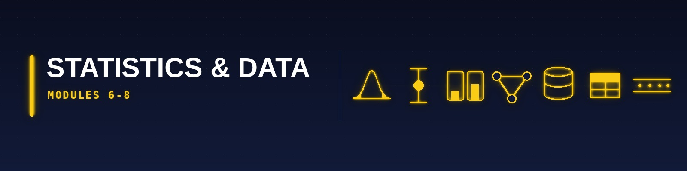

[🏠 Roadmap home](../README.md) · [📚 Curriculum index](README.md) · [← 🟩 Foundations (M0–M5)](1-foundations.md) · [🟧 Classical ML (M9–M12) →](3-classical-ml.md)

---

# 🟨 CORE STATISTICS STRATUM (Modules 6–8)

---

## Module 6: Statistical Inference

* **The Tutor's "Why":** This is where mathematics meets reality. Every p-value in a Nature paper, every A/B test at Meta, every FDA drug approval, hinges on the concepts in this module. Harvard STAT 111 and MIT 18.6501x are the twin pillars.

* **Strict Prerequisites:** Module 5 (must know MGFs, CLT, joint distributions).

* **Exhaustive Topic List:**
  * **[Harvard STAT 111 / MIT 18.6501x]**: Statistical models (parametric, non-parametric, semi-parametric); estimators and their properties — unbiasedness, consistency, efficiency, sufficiency (Neyman-Fisher factorisation), completeness, Rao-Blackwell theorem, Lehmann-Scheffé theorem; Cramér-Rao lower bound.
  * **[MIT 18.6501x]**: **Maximum Likelihood Estimation** — construction, invariance, asymptotic normality, Fisher information, observed vs expected information; **Method of Moments**; delta method.
  * **[MIT 18.6501x]**: **Parametric hypothesis testing** — null vs alternative, Type I / Type II errors, power, size, Neyman-Pearson lemma, Likelihood Ratio Test (Wilks' theorem), Wald test, score test.
  * **[MIT 18.6501x]**: Confidence intervals — construction by pivoting, Wald CIs, likelihood-based CIs, bootstrap CIs.
  * **[MIT 18.6501x]**: Goodness-of-fit tests — chi-squared test, Kolmogorov-Smirnov test, Anderson-Darling.
  * **[MIT 18.6501x]**: Linear regression inference — Gauss-Markov theorem proof, sampling distribution of β̂, ANOVA decomposition (SST = SSR + SSE), F-test for nested models.
  * **[Harvard CS109A · Lec 7 "Probability"]**: Review of Stat 110 concepts in regression context.
  * **[Harvard CS109A · Lec 8 "Inference in Regression and Hypothesis Testing"]**: t-tests for regression coefficients, confidence vs prediction intervals, multiple testing issues (Bonferroni, Holm, Benjamini-Hochberg FDR).
  * **[Harvard CS109A · Lec 21 "Experimental Design"]**: Randomisation, blocking, factorial designs, power analysis (a priori sample size computation), **causal inference preview** (ATE, ATT), Simpson's paradox revisited.
  * **[Cambridge Data Science · "Inference"]**: **Bayesianism** vs **frequentism** — epistemic vs aleatory uncertainty. Frequentist confidence intervals construction. Hypothesis testing as decision rule. **Bootstrap resampling** (non-parametric bootstrap, parametric bootstrap, block bootstrap for time series).
  * **[IITM BSMA1004 — Statistics for Data Science II]**: Sampling distributions (χ², t, F); estimation (point and interval); tests for one/two means/proportions/variances; paired t-test; McNemar's test; non-parametric tests (sign, Wilcoxon, Mann-Whitney, Kruskal-Wallis); contingency tables (χ² test of independence); ANOVA (one-way, two-way, with and without interaction); simple and multiple linear regression hypothesis testing.
  * **[Harvard CS 1810]**: Estimators — **Maximum a Posteriori (MAP)** as the Bayesian regularised counterpart to MLE.

* **2026 Resources:**
  * **Primary Course Link:** [MITx 18.6501x Fundamentals of Statistics](https://www.edx.org/course/fundamentals-of-statistics) · [Harvard STAT 111 course page](https://beta.my.harvard.edu/course/STAT110/2025-Fall/001)
  * **Required Reading (Latest 2026 Editions):**
    * _All of Statistics_ (**2nd printing, Springer 2004**, still canonical) — Larry Wasserman — chapters 6–15.
    * _Statistical Inference_ (**2nd Edition**) — Casella & Berger — the rigorous graduate-level reference.
    * _An Introduction to Statistical Learning with Python (ISLP)_ (**2023, 2025 reprint**) — James, Witten, Hastie, Tibshirani, Taylor — Chapters 2-3.
  * **Practical Implementation:** **`statsmodels` 0.14+** for classical inference (OLS, GLM, ANOVA), **`pingouin`** for modern stats API, **`scipy.stats`** for tests. Use **R 4.4+** with `{tidyverse}`, `{broom}`, `{infer}` for when you need publication-grade stats.

* **➡️ Cross-ref note (NEW v2026.2):** A/B testing, experimental design, and causal inference have been promoted out of this module into a **dedicated Module 6½ — Causal Inference & Experimentation** (directly below) because every senior-DS interview at Meta / Netflix / Booking / Uber tests this material in depth.

* **📦 Module Project (mandatory) — Inference toolkit from scratch**
  * **Deliverable:** A package implementing, without `scipy.stats` doing the work for you: bootstrap confidence intervals (percentile + BCa), a permutation test, a two-sample t-test, and a multiple-comparison correction (Bonferroni + Benjamini–Hochberg). Then run all four on one real dataset and write up what they disagree about.
  * **Definition of done:** (1) `pytest` suite cross-validating each of your implementations against the `scipy.stats` equivalent to within tolerance; (2) `README.md` stating each test's assumptions and what happens when they are violated; (3) a results memo that includes at least one honest instance of *"this test said significant and I do not believe it, here is why."*
  * **Stretch:** Add a power-analysis function and use it to compute the sample size your dataset would have needed to detect a stated effect. Log the result — this is the calculation that most real experiment designs skip.
  * **Anti-goal:** Do not produce a notebook full of p-values. The deliverable is a tested library plus a document about uncertainty.

---

## Module 6½: Causal Inference & Experimentation

* **The Tutor's "Why":** In 2026, this is the #1 differentiator between a *junior ML engineer* and a *senior data scientist*. Netflix, Meta, Uber, Booking, Airbnb, and every product-data-science org hires specifically for causal-inference fluency. Berkeley MIDS dedicates an entire course to it ([DATA 241 · Causal Inference](https://www.ischool.berkeley.edu/courses/datasci/241) ✅). MIT 14.387 *Mostly Harmless Big Data* covers the econometric half. **Correlation≠causation is not a slogan — it is a formal theorem (Pearl's do-calculus).** This module closes the single largest production-DS gap identified in the April 2026 benchmark PDF.

* **Strict Prerequisites:** Module 5 (joint distributions, conditional expectation), Module 6 (hypothesis testing, CIs, bootstrap).

* **Exhaustive Topic List:**
  * **A/B Testing Foundations:** Randomisation as the identification strategy, potential outcomes framework (Rubin/Neyman), ATE / ATT / CATE / LATE estimands, sample-size and MDE (minimum detectable effect) calculations, one-sided vs two-sided tests, Type I/II control, **sequential testing & always-valid p-values** (Howard et al. 2021), **group-sequential designs** with O'Brien-Fleming/Pocock boundaries, **CUPED variance reduction** (Deng et al. Microsoft 2013 — the single most impactful variance-reduction trick), stratified randomisation, cluster-randomised experiments.
  * **Interference & Network Effects:** **SUTVA violations**, switchback experiments (Uber/Lyft), **spillover** in social networks, ego-cluster randomisation, graph-cluster randomisation, synthetic control for marketplace platforms.
  * **Multiple Testing:** Bonferroni, Holm-Bonferroni, Hochberg, **Benjamini-Hochberg FDR control**, Storey's q-values, sequential multiple testing.
  * **Resampling-Based Inference:** Non-parametric bootstrap (Efron), parametric bootstrap, block bootstrap for time-series, **permutation tests** (exact inference under the null), conformal inference preview (M9).
  * **Bayesian A/B Testing:** Beta-Binomial for conversion rates, Normal-Normal for continuous metrics, **expected loss / expected regret stopping rules**, multi-armed bandits (Thompson sampling, UCB) as a replacement for fixed-horizon A/B tests.
  * **Causal Graphs & do-Calculus:** Directed Acyclic Graphs (DAGs), **d-separation** criterion, Markov equivalence classes, **Pearl's do-operator** and the three rules of do-calculus, confounders / mediators / colliders, **M-bias** and **butterfly-bias** (colliders you didn't know you conditioned on), identifiability.
  * **Adjustment Strategies:** **Backdoor criterion** (sufficient-adjustment sets), **frontdoor criterion**, **instrumental variables (IV)** and the LATE theorem (Imbens-Angrist), **2SLS**, **Difference-in-Differences (DiD)** and parallel-trends assumption, **Regression Discontinuity Design (RDD)** sharp and fuzzy, **Synthetic Control Method** (Abadie et al.), **matching** (exact, Mahalanobis, propensity-score, CEM).
  * **Modern Causal ML:** **Double/Debiased ML** (Chernozhukov et al. 2018) as the bridge to high-dimensional confounders, **Causal Forests** (Wager & Athey) for heterogeneous treatment effects, **doubly-robust estimators** (AIPW, TMLE), **meta-learners** (S-, T-, X-, R-, DR-learner), **uplift modelling** for marketing.
  * **Python Stack:** [DoWhy](https://github.com/py-why/dowhy) ✅ (end-to-end causal workflow), [EconML](https://econml.azurewebsites.net/) ✅ (Microsoft, heterogeneous TE), [CausalML](https://causalml.readthedocs.io/) ✅ (Uber, uplift), [Pyro](https://pyro.ai/) (probabilistic programming for causal models), `statsmodels` IV/2SLS, `linearmodels` (panel/IV).

* **2026 Resources:**
  * **Primary Course (free):** [Brady Neal — *Introduction to Causal Inference*, Fall 2020 (YouTube + lecture notes; still the gold-standard free course)](https://www.bradyneal.com/causal-inference-course) ✅
  * **Econometric track:** [MIT 14.387 — *Applied Econometrics (Mostly Harmless Big Data)*, Fall 2014 OCW](https://ocw.mit.edu/courses/14-387-applied-econometrics-mostly-harmless-big-data-fall-2014/) ✅
  * **Harvard CAUSALab** — [course materials + *What If* book](https://www.hsph.harvard.edu/causal/) ✅
  * **Practical book (free, 2024):** [Matheus Facure — *Causal Inference for the Brave and True*](https://matheusfacure.github.io/python-causality-handbook/landing-page.html) ✅ — every chapter is a runnable notebook.
  * **Required Reading:**
    * Hernán & Robins — [*Causal Inference: What If* (free PDF, 2024 revision)](https://www.hsph.harvard.edu/miguel-hernan/wp-content/uploads/sites/1268/2024/01/hernanrobins_WhatIf_2jan24.pdf) ✅
    * Pearl, Glymour & Jewell — *Causal Inference in Statistics: A Primer* (Wiley 2016).
    * Pearl — *Causality: Models, Reasoning, and Inference* (Cambridge 2e, 2009) — the reference.
    * **Kohavi, Tang & Xu** — [*Trustworthy Online Controlled Experiments*](https://www.cambridge.org/core/books/trustworthy-online-controlled-experiments/D97B26382EB0EB2DC2019A7A7B518F59) ✅ (Cambridge 2020) — **the industrial A/B-testing bible**.
  * **Communities / living resources:** [exp-platform.com](https://exp-platform.com/) ✅ (Ron Kohavi's blog + papers from Microsoft ExP platform), [Statistical Modeling, Causal Inference & Social Science (Gelman blog)](https://statmodeling.stat.columbia.edu/), Pearl's *UCLA Causality Blog*.

* **📋 Mandatory mini-projects:**
  1. **Design + simulate an A/B test** with CUPED variance reduction — show the % reduction in required sample size.
  2. **Fit an IV regression** on a realistic dataset (e.g., [NLSY or Angrist-Krueger 1991 compulsory-schooling](https://economics.mit.edu/sites/default/files/publications/Does%20Compulsory%20School%20Attendance.pdf)) — reproduce the returns-to-education estimate.
  3. **Use DoWhy end-to-end**: model → identify → estimate → refute — on a confounded synthetic dataset; show refutation tests (placebo, random common cause, unobserved-confounder sensitivity).
  4. **Causal Forest on lalonde / criteo-uplift**: estimate CATEs, plot HTE heatmap, produce a targeting policy + its evaluation via doubly-robust off-policy estimation.

---

## Module 7: Data Wrangling, EDA & Visualisation

* **The Tutor's "Why":** "The data scientist spends 80% of their time on data preparation" is a cliché because it's true. Harvard CS109A dedicates **three full weeks** to this before any modelling.

* **Strict Prerequisites:** Module 1 (Python).

* **Exhaustive Topic List:**
  * **[Harvard CS109A · Lec 1 "Introduction to CS109A"]**: The data-science life-cycle (CRISP-DM revisited for 2026), question framing, translating business problems into statistical ones.
  * **[Harvard CS109A · Lec 2 "Introduction to PANDAS and EDA"]**: `DataFrame` / `Series` model, indexing (`.loc`, `.iloc`), filtering, `groupby`-`apply`-`combine`, `merge`/`join`/`concat`, `melt`/`pivot`/`stack`/`unstack`, datetime handling, categorical dtype, missing-value representations.
  * **[Harvard CS109A · Lab 1 "Data formats, sources, and scraping"]**: Web scraping with BeautifulSoup, Requests session management, handling JS-rendered pages with Playwright, API consumption (REST, GraphQL, OAuth), handling CSV/TSV/JSON/JSONL/Parquet/Arrow/Avro.
  * **[Harvard CS109A · Lab 2 "Pandas & EDA 2"]**: Outlier detection (z-score, IQR rule, isolation forest preview), distributional plots (histogram binning strategies — Freedman-Diaconis, Sturges, Scott), QQ plots, log-transforms, Box-Cox transforms.
  * **[Harvard CS109A · Lec 9 "Missing Data & Imputation"]**: MCAR / MAR / MNAR taxonomy (Rubin 1976), listwise/pairwise deletion, mean/median/mode imputation, **k-NN imputation**, **MICE (Multivariate Imputation by Chained Equations)**, multiple imputation, domain-specific imputation.
  * **[Harvard CS109A · Lec 12 "Visualization"]**: Grammar of graphics (Wilkinson), Cleveland-McGill perceptual hierarchy (position > length > angle > area > colour), Tufte's principles (data-ink ratio, small multiples), choropleth vs cartogram, interactive dashboards.
  * **[Harvard CS109A · Lec 13 "Ethics"]**: Fairness in data collection, selection bias, survivorship bias, historical bias, measurement bias, informed consent, differential privacy preview.
  * **[IITM BSMS2001 — Business Data Management]**: Real-world data in business context, Excel-to-Python migration, data warehousing vs data lakes, ETL vs ELT, slowly-changing dimensions.
  * **[IITM BSMS2002 — Business Analytics]**: Descriptive / diagnostic / predictive / prescriptive analytics framework, KPIs, dashboarding, **Tableau / PowerBI** vs **Streamlit / Dash / Plotly**.
  * **[MIT 15.773 — Hands-on DL]**: Data-centric AI — **data augmentation**, weak supervision, active learning preview, label noise.

* **2026 Resources:**
  * **Primary Course Link:** [Harvard CS109A 2021 schedule](https://harvard-iacs.github.io/2021-CS109A/pages/schedule.html) (latest public) · Lectures 1, 2, 9, 12, 13, 21.
  * **Required Reading (Latest 2026 Editions):**
    * _Python for Data Analysis_ (**3rd Edition, 2022**) — Wes McKinney (pandas creator) — chapters 5–10.
    * _Storytelling with Data_ — Cole Nussbaumer Knaflic — communication principles.
    * _Fundamentals of Data Visualization_ — Claus Wilke — [free online](https://clauswilke.com/dataviz/).
  * **Practical Implementation:** **Polars 1.x** (fastest DataFrame library of 2026, Arrow-native, lazy evaluation) as primary; **pandas 2.2+** with PyArrow backend for compatibility. **`matplotlib 3.9+`**, **`seaborn 0.13+`**, **`plotly 5.x`**, **`altair 5.x`**, and **`great_tables`** for publication-grade tables. **`ydata-profiling`** (formerly pandas-profiling) for automated EDA.

* **🔧 Modern Data Tooling:**
  * **[Polars 1.40+](https://pola.rs/)** ✅ — the pandas successor; Rust-powered, Arrow-native, lazy frames, query optimiser. Learn `pl.LazyFrame`, `pl.col`, `pl.Expr`, expression-based group-by, streaming engine.
  * **[DuckDB 1.5+](https://duckdb.org/)** ✅ — "SQLite for analytics." In-process OLAP over Parquet/Arrow; zero-config; faster than pandas on anything > 100MB. Perfect for EDA on 100-GB datasets from a laptop.
  * **[Great Expectations](https://greatexpectations.io/)** ✅ + **[Pandera](https://pandera.readthedocs.io/)** ✅ — schema + data-quality validation; declarative expectations; catch data drift before it reaches models.
  * **[Plotly 5.x](https://plotly.com/python/)** ✅ + **[Altair 5.x](https://altair-viz.github.io/)** ✅ + **[Observable Plot](https://observablehq.com/plot/)** ✅ — the modern grammar-of-graphics ecosystem; Plotly for interactivity, Altair for Vega-Lite precision.
  * **Dashboards:** **[Streamlit](https://streamlit.io/)** ✅ for ML demos, **[Gradio](https://www.gradio.app/)** ✅ for HF-style model UIs, **[Evidently](https://www.evidentlyai.com/)** ✅ for data-drift dashboards.
  * **Feature Engineering Discipline:** Target encoding with K-fold smoothing, **train-test leakage** (temporal, group, target-leak from future aggregates), time-based features (lag, rolling, expanding windows), cyclical encoding (sin/cos of hour/month), **sklearn Pipelines + ColumnTransformer** as the *only* correct way to avoid leakage. Reference: [*Feature Engineering for Machine Learning* — Zheng & Casari (O'Reilly 2018)](https://www.oreilly.com/library/view/feature-engineering-for/9781491953235/).

* **📦 Module Project (mandatory) — End-to-end EDA on a dataset nobody has cleaned**
  * **Deliverable:** Pick a genuinely messy public dataset — a government open-data portal, not a Kaggle "cleaned" CSV. Produce a reproducible pipeline (script, not a notebook) that ingests raw files, validates them, cleans them, and emits both a tidy Parquet file and a small set of publication-quality figures answering three questions you wrote down *before* you started.
  * **Definition of done:** (1) A data-validation layer (`pandera` or explicit assertions) that fails loudly on schema drift, plus a `pytest` suite over your transform functions; (2) `README.md` with the three questions, the three figures, and a data dictionary; (3) a results memo listing every judgement call you made while cleaning — dropped rows, imputed values, outliers kept or removed — because that list is what a reviewer will actually interrogate.
  * **Stretch:** Re-run the same pipeline in Polars and report the wall-clock difference on the full dataset.
  * **Anti-goal:** No `df.describe()` dumps. Every figure must answer a stated question.

---

## Module 8a: Databases, SQL & Warehouses

* **The Tutor's "Why":** In 2026, data rarely fits in RAM. IITM dedicates a full diploma-level course (BSCS2001) + two specialisation courses to this. You need SQL fluency for 90% of industry jobs. **Module 8 has been split in v2026.2** into **M8a (Databases, SQL & Warehouses)** here, and **M8b (Distributed Data & Streaming)** directly below — because the 2026 production data stack (Spark + Iceberg + Airflow + Kafka + dbt) is a full module in its own right and cannot share airtime with SQL fundamentals.

* **Strict Prerequisites:** Module 4 (hashing, trees, randomised/streaming algos).

* **Exhaustive Topic List:**
  * **[IITM BSCS2001 — DBMS (Prof. P.P. Das)]**: Relational model (tuples, relations, schemas, keys — super/primary/candidate/foreign), relational algebra (selection σ, projection π, union, intersection, difference, Cartesian product, join variants, division), **SQL DDL** (CREATE, ALTER, DROP), **SQL DML** (SELECT/INSERT/UPDATE/DELETE), JOINs (inner, left/right/full outer, cross, self, lateral), subqueries (correlated vs uncorrelated), CTEs (recursive and non-recursive), window functions (`OVER`, `PARTITION BY`, `ROW_NUMBER`, `RANK`, `LAG`, `LEAD`, `SUM() OVER`), set operations (UNION, INTERSECT, EXCEPT), views, indexes (B-tree, hash, bitmap, covering), transactions and **ACID properties**, isolation levels (read uncommitted/committed, repeatable read, serialisable), concurrency control (two-phase locking, MVCC), recovery (WAL, ARIES), normalisation (1NF/2NF/3NF/BCNF/4NF/5NF), functional dependencies, Armstrong's axioms.
  * **Advanced SQL (2026 Industry Interview Canon):** Query plans (EXPLAIN ANALYZE), cost-based optimisation, partitioning (range/list/hash), bitmap indexes, covering indexes, **recursive CTEs** for hierarchical data, **LATERAL joins**, **PIVOT / UNPIVOT**, **MERGE / UPSERT**, JSON/JSONB queries (Postgres), array types, `PERCENTILE_CONT`, `QUALIFY` clause (Snowflake/BQ), approximate aggregations (`APPROX_COUNT_DISTINCT` powered by HyperLogLog).
  * **[OSSU baseline — Coursera DB Specialisation]**: Data warehouse concepts (star schema, snowflake schema, fact/dimension tables), OLAP cubes, slice/dice/drill-down/roll-up, **SCD Type 0/1/2/3/6**, ETL vs ELT pipeline design, **Kimball dimensional modelling**, Data Vault 2.0 (preview).
  * **Cloud Warehouses (2026 production stack):** **Snowflake** (warehouses, virtual warehouses, time travel, zero-copy clone), **BigQuery** (slot-based pricing, BI-engine, materialised views), **Amazon Redshift**, **Databricks SQL Warehouse**, **DuckDB** (single-node), **ClickHouse** (OLAP, real-time).
  * **[dbt — Data Build Tool](https://docs.getdbt.com/)** ✅: models, sources, tests (`unique`, `not_null`, `accepted_values`, relationships), **macros** (Jinja templating), **incremental models** (with `unique_key`, late-arriving facts), **snapshots** (SCD Type 2 automation), **packages** (`dbt_utils`, `dbt_expectations`), exposures, metrics, MetricFlow integration.
  * **[OSSU — MongoDB path]**: Document databases, BSON, sharding, replica sets, aggregation pipeline ($match, $group, $project, $lookup, $unwind), indexing strategies.

* **2026 Resources:**
  * **Primary Course Link:** [IITM BSCS2001 course page](https://study.iitm.ac.in/ds/course_pages/BSCS2001.html) · [Stanford CS145 Intro to Databases](https://web.stanford.edu/class/cs145/) ✅ · [Databricks Academy](https://www.databricks.com/learn/training/home) (free path) · [dbt Learn](https://learn.getdbt.com/) ✅ (free dbt Fundamentals course).
  * **Required Reading (Latest 2026 Editions):**
    * _Designing Data-Intensive Applications_ — Martin Kleppmann (2017; 2026 revised edition in progress) — chapters 1–4, 10–11.
    * _Database System Concepts_ (**7th Edition, 2019**) — Silberschatz, Korth, Sudarshan.
    * **The Kimball Group** — [*The Data Warehouse Toolkit* (3e)](https://www.kimballgroup.com/data-warehouse-business-intelligence-resources/books/data-warehouse-dw-toolkit/) ✅ — the dimensional-modelling bible.
    * Reis & Housley — [*Fundamentals of Data Engineering*](https://www.oreilly.com/library/view/fundamentals-of-data/9781098108298/) ✅ (O'Reilly 2022) — Chapters 5–8 for the DB/warehouse half.
  * **Practical Implementation:** **PostgreSQL 17** (with `pgvector` extension), **DuckDB 1.5+**, **SQLAlchemy 2.x** with async, **dbt-core 1.11.8**, **sqlmesh** (dbt alternative), **Snowflake** or **BigQuery** free-tier for cloud practice.

* **📦 Module Project (mandatory) — Reddit scraper → warehouse → dashboard**
  * **Deliverable:** A pipeline that pulls posts and comments from a subreddit you actually care about, lands them in PostgreSQL with a sane normalised schema (plus indexes you can justify), transforms them with SQL into a small star schema, and surfaces three metrics in a Streamlit dashboard.
  * **Definition of done:** (1) Schema DDL committed as migrations, not typed into a client by hand; a `pytest` suite over the extraction and transform layers with the API mocked; (2) `README.md` containing your ER diagram and the `EXPLAIN ANALYZE` output for your slowest query, before and after you added the index; (3) a results memo on what you learned about the data that you did not expect.
  * **Stretch:** Add incremental loading with a watermark column so a re-run does not re-ingest history, and schedule it.
  * *Archetype source: video 1 (13:40) — the Reddit-scraper tier, promoted here from a toy script to a warehouse exercise because SQL is the highest-frequency skill in the [surveyed 2026 postings](../guides/career-operations.md#skills-checklist).*

---

## Module 8b: Distributed Data & Streaming Systems

* **The Tutor's "Why":** Every senior-DS / MLE interview in 2026 covers Spark, Kafka, Airflow, and the lakehouse pattern. Closing this is closing Gap #2 in the benchmark PDF — the single largest production gap. Joe Reis (*Fundamentals of Data Engineering*) and the DataExpert free bootcamp are the two canonical on-ramps.

* **Strict Prerequisites:** Module 4 (randomised / streaming algos, hashing), Module 8a (SQL fluency), Module 1 (async Python).

* **Exhaustive Topic List:**
  * **Storage & File Formats:** **Parquet** (columnar, predicate pushdown, row-groups, page-level statistics), **Apache Arrow** (in-memory columnar, zero-copy IPC), **ORC**, **Avro** (schema evolution), object storage (S3 / GCS / Azure Blob), **lakehouse table formats** — [Apache Iceberg](https://iceberg.apache.org/) ✅ (hidden partitioning, snapshot isolation, time travel, MERGE INTO), [Delta Lake](https://delta.io/) ✅ (ACID on data lake, Z-ordering, vacuum), [Apache Hudi](https://hudi.apache.org/) (streaming upserts).
  * **Distributed Compute:** **Apache Spark 3.5+** — RDDs, DataFrames, Dataset API, Catalyst optimiser, Tungsten execution, **Adaptive Query Execution (AQE)**, broadcast joins vs sort-merge, skew-handling, partitioning and bucketing, caching strategies, PySpark idioms, Spark SQL, MLlib (legacy), **Structured Streaming** (micro-batches, triggers, watermarks). **[Ray Data](https://docs.ray.io/en/latest/data/data.html)** ✅ + **[Dask](https://www.dask.org/)** ✅ as Python-native alternatives. **[Apache Beam](https://beam.apache.org/)** as the portable API.
  * **Orchestration:** **[Apache Airflow](https://airflow.apache.org/)** ✅ — DAGs, operators, sensors, XComs, task groups, dynamic task mapping, backfills, SLAs. **[Dagster](https://dagster.io/)** ✅ — asset-oriented orchestration, software-defined assets, declarative scheduling. **[Prefect](https://www.prefect.io/)** ✅ — Pythonic flows, deployments, agents.
  * **Streaming:** **[Apache Kafka](https://kafka.apache.org/)** ✅ — brokers, topics, partitions, consumer groups, offsets, ISR, **exactly-once semantics**, Kafka Streams, Kafka Connect, Schema Registry (Avro/Protobuf). **[Redpanda](https://redpanda.com/)** ✅ (Kafka-compatible, C++). **[Apache Flink](https://flink.apache.org/)** ✅ (true-streaming, event-time, watermarks, windowing — tumbling/sliding/session, stateful functions). **[Materialize](https://materialize.com/)** / **[RisingWave](https://risingwave.com/)** (streaming SQL).
  * **CAP, Consensus & Consistency:** CAP theorem, PACELC, consensus (Paxos, Raft), eventual consistency, **CRDTs** for collaborative systems, idempotency, exactly-once vs at-least-once vs at-most-once.
  * **[MIT Mining Massive Datasets / Stanford CS246]**: MapReduce algorithms (word count, inverted index, joins), **LSH** (MinHash, random projections), PageRank as eigenvector of stochastic matrix, recommendation systems at scale, frequent itemsets (A-Priori, PCY, Multistage), streaming algorithms (reservoir sampling, Bloom, Count-Min Sketch, HyperLogLog), AdWords / online bipartite matching.

* **2026 Resources:**
  * **Primary Course Link:** [Stanford CS246 2025 lectures (Leskovec)](https://web.stanford.edu/class/cs246/) · [DataExpert.io Free Data Engineer Bootcamp (2025, Zach Wilson)](https://www.dataexpert.io/free-data-engineer-bootcamp) ✅ · [Databricks Spark path](https://www.databricks.com/learn/training/home).
  * **Community handbook:** [DataExpert-io / data-engineer-handbook (free, curated)](https://github.com/DataExpert-io/data-engineer-handbook) ✅ — the 2026 community-maintained DE roadmap.
  * **Required Reading:**
    * Kleppmann — *Designing Data-Intensive Applications* — chapters 6–12 for distributed systems, replication, partitioning, consistency.
    * Reis & Housley — [*Fundamentals of Data Engineering*](https://www.oreilly.com/library/view/fundamentals-of-data/9781098108298/) ✅ — the full data-engineering lifecycle.
    * *Mining of Massive Datasets* (3e, [free online](http://www.mmds.org/)) — Leskovec, Rajaraman, Ullman — chapters 2–7.
    * [*Streaming Systems*](https://www.oreilly.com/library/view/streaming-systems/9781491983867/) — Akidau, Chernyak, Lax (O'Reilly 2018).
  * **Blogs / Newsletters:** [Joe Reis Substack](https://joereis.substack.com/) ✅, [Kimball Group Tips](https://www.kimballgroup.com/) ✅, [High-Scalability](http://highscalability.com/).
  * **Practical Implementation:** **Apache Spark 3.5+** via **PySpark**, **Apache Iceberg** or **Delta Lake** on Parquet, **Apache Airflow 2.x / 3.0-preview**, **Apache Kafka 3.8+** (local via `kraft` mode), **DuckDB** as your single-node Spark stand-in for learning.

* **📋 Mandatory mini-projects:**
  1. **Build a mini lakehouse** on DuckDB + Parquet + Iceberg on your laptop; write `MERGE INTO` upserts; inspect snapshots and time-travel.
  2. **Airflow DAG** that ingests an open API (e.g., NYC Taxi) → stores Parquet on S3/minio → transforms via dbt → serves to a Streamlit dashboard.
  3. **Kafka + Flink** streaming word-count over a simulated tweet stream; exercise watermarks and late data.
  4. **Spark vs Polars vs DuckDB benchmark** on a 10-GB Parquet dataset — measure wall-clock, peak RAM, and lines-of-code.

---

[🏠 Roadmap home](../README.md) · [📚 Curriculum index](README.md) · [← 🟩 Foundations (M0–M5)](1-foundations.md) · [🟧 Classical ML (M9–M12) →](3-classical-ml.md)
