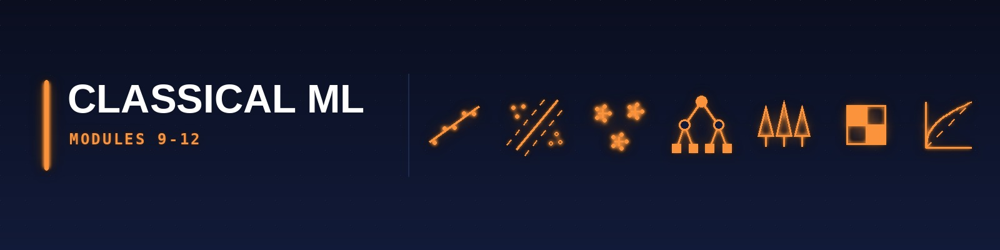

[🏠 Roadmap home](../README.md) · [📚 Curriculum index](README.md) · [← 🟨 Statistics & Data (M6–M8b)](2-statistics-and-data.md) · [🟦 Probabilistic ML (M13–M14) →](4-probabilistic-ml.md)

---

# 🟧 CLASSICAL MACHINE LEARNING STRATUM (Modules 9–12)

> This stratum is the intersection of every university's "first ML course" — MIT 6.390, Harvard CS 1810, Cambridge MLRD/MLBI, IITM BSCS2004/2007/2008.

---

## Module 9: Supervised Learning — Regression Family

* **The Tutor's "Why":** Linear regression is the universal first ML algorithm because it teaches you optimisation, loss functions, regularisation, and statistical inference all at once. The **Gauss-Markov theorem** appears in every single one of our four universities.

* **Strict Prerequisites:** Modules 3 (projections, SVD), 5 (Normal/Student-t), 6 (hypothesis tests for coefficients).

* **Exhaustive Topic List:**
  * **[MIT 6.390 · Lec 1 (Spring 2026): "Intro to ML and Linear Regression"]**: Framing ML problems (problem class, assumptions, evaluation), baselines, **generalisation (train vs test)**, the ERM principle.
  * **[MIT 6.390 · Lec 2: "Regression & Regularization"]**: Ordinary Least Squares (OLS), closed-form normal equations β̂ = (XᵀX)⁻¹Xᵀy, geometric interpretation as projection onto column space of X, **Ridge Regression** (L2 regularisation, closed form, ties to Tikhonov regularisation), **Lasso** (L1 regularisation, sparsity, coordinate descent solver), **Elastic Net**.
  * **[MIT 6.390 · Lec 3: "Gradient Descent"]**: Batch GD, SGD, mini-batch SGD, step-size selection, momentum, Nesterov accelerated gradient, convergence analysis for convex quadratic functions.
  * **[Harvard CS109A · Lec 3 "kNN and Linear Regression"]**: **k-Nearest Neighbours regression** (no training, lazy learning, curse of dimensionality), simple linear regression derivation.
  * **[Harvard CS109A · Lec 4 "Multi-linear and Polynomial Regression"]**: Multiple predictors, design matrix, interaction terms, basis expansions (polynomial, piecewise constant, cubic splines, natural cubic splines, smoothing splines).
  * **[Harvard CS109A · Lec 5 "Model Selection and Cross Validation"]**: Validation set, **K-fold cross-validation** (standard, stratified, LOOCV, time-series CV with `TimeSeriesSplit`), **information criteria** (AIC, BIC, Mallow's Cp, adjusted R²), **bias-variance decomposition** (formal proof).
  * **[Harvard CS109A · Lec 6 "Regularization: Ridge and Lasso"]**: Coefficient paths, hyperparameter search (grid, random, Bayesian optimisation with Optuna), early stopping as implicit regularisation.
  * **[Harvard CS109A · Advanced Section 4 "GLMs"]**: **Generalised Linear Models** — exponential family (canonical form, natural parameter, log-partition function, dispersion), link functions (identity, log, logit, probit, complementary log-log), IRLS algorithm (covered in Cambridge ML&BI).
  * **[IITM BSCS2008 Week 3-4]**: Linear regression in scikit-learn; **gradient descent — batch vs stochastic**; polynomial regression pipeline; regularised linear models.
  * **[Cambridge Data Science · "Feature spaces"]**: Linear models as projection onto span of features; design of features.
  * **[Cambridge ML & Bayesian Inference · "Gaussian processes"]** (2 lectures): **Regression via Gaussian processes**, kernel functions (squared exponential, Matérn, periodic), marginal likelihood for hyperparameter learning, **preview of non-parametric Bayesian regression**.

* **2026 Resources:**
  * **Primary Course Link:** [MIT 6.390 Spring 2026](https://introml.mit.edu/spring26/lectures/lec01) · [Harvard CS109A 2021 Lec 3-6](https://harvard-iacs.github.io/2021-CS109A/pages/schedule.html).
  * **Required Reading (Latest 2026 Editions):**
    * _An Introduction to Statistical Learning with Python_ (ISLP) — Chapters 3, 5, 6.
    * _The Elements of Statistical Learning_ (ESL, 2nd Ed corrected 12th printing) — Chapters 3, 5.
    * _Pattern Recognition and Machine Learning_ (Bishop, 2006) — Chapter 3.
  * **Practical Implementation:** **scikit-learn 1.5+** (`LinearRegression`, `Ridge`, `Lasso`, `ElasticNet`, `KNeighborsRegressor`, `GaussianProcessRegressor`), **statsmodels** for inferential output, **`torch.optim.SGD` / `torch.optim.AdamW`** once you graduate to M15.

* **📦 Module Project (mandatory) — Linear regression from scratch, then honestly evaluated**
  * **Deliverable:** `LinearRegressionScratch` in pure NumPy — closed-form normal equations *and* gradient descent — plus your own Ridge and Lasso (the latter via coordinate descent or ISTA). Compare against `sklearn` on a real regression dataset with a proper train/validation/test split and a regularisation path plot.
  * **Definition of done:** (1) `pytest` suite asserting your coefficients match `sklearn`'s to within tolerance on a fixed-seed synthetic problem where you know the true weights; (2) `README.md` with the regularisation path, residual diagnostics, and a statement of which assumptions your data violates; (3) a results memo explaining what Lasso zeroed out and whether that matches domain sense.
  * **Stretch:** Add a bootstrap confidence interval for each coefficient using your [M6](2-statistics-and-data.md#module-6) toolkit and discuss which coefficients you would actually report.
  * *This is the first rung of the from-scratch discipline described in [Stage 4 of the fast lane](../guides/practitioner-track.md#practitioner-track). Video 1 (05:40) is explicit that implementing the algorithm is what converts a course-watcher into someone who can debug a model.*

---

## Module 10: Supervised Learning — Classification & Kernel Methods

* **The Tutor's "Why":** Classification is supervised learning in its most deployed form — spam filters, credit scoring, disease diagnosis. Support Vector Machines are mandatory at every university because their **dual formulation + kernel trick** is the purest expression of convex optimisation meeting functional analysis.

* **Strict Prerequisites:** Module 9, plus Lagrange multipliers (M2) and quadratic forms (M3).

* **Exhaustive Topic List:**
  * **[MIT 6.390 · Lec 4 (S26): "Logistic Regression"]**: Sigmoid function σ(z) = 1/(1+e⁻ᶻ), log-odds/logit, **cross-entropy loss** (NLL of Bernoulli), gradient (no closed form), decision boundary (linear), multiclass softmax with categorical cross-entropy, one-vs-rest vs multinomial, class imbalance (oversampling, undersampling, SMOTE, class weights, focal loss).
  * **[MIT 6.86x · Unit 1 Lec 2-4]**: **Perceptron algorithm** (Rosenblatt 1958) — update rule, mistake bound (Novikoff's theorem, proof), linear separability, **Hinge loss and margin boundaries**, regularisation.
  * **[MIT 6.86x · Unit 2 Lec 6 "Nonlinear Classification"]**: Feature transformations, **kernel trick** motivation.
  * **[Harvard CS109A · Lec 14-15 "Logistic Regression 1 & 2"]**: MLE estimation, Newton-Raphson / IRLS, Wald CIs for odds ratios, ROC curves, AUC, precision/recall/F1/F2, confusion matrix, calibration (Platt scaling, isotonic regression), threshold selection.
  * **[Harvard CS 1810 (S26)]**: **Support Vector Machines (SVMs)** — maximum-margin hyperplane derivation, hard-margin primal problem, soft-margin with slack variables ξᵢ, **Lagrangian dual formulation**, KKT conditions, support vectors, **kernel trick** (Mercer's theorem), standard kernels (linear, polynomial, RBF/Gaussian, sigmoid), kernel construction rules, string kernels, graph kernels.
  * **[Cambridge ML & Bayesian Inference · Lec "Linear classifiers I" (2 lectures)]**: Supervised learning via **error minimisation**, **Iterative Reweighted Least Squares (IRLS)** with full derivation, **maximum margin classifier** geometric derivation.
  * **[Cambridge ML & Bayesian Inference · Lec "Support vector machines (SVMs)" (2 lectures)]**: The kernel trick formalised, problem formulation as QP, **constrained optimisation and the dual problem**, SVM training algorithm (SMO — Sequential Minimal Optimisation), ν-SVM, one-class SVM for anomaly detection.
  * **[Cambridge ML & Bayesian Inference · Lec "How to classify optimally" (2 lectures)]**: Treating learning probabilistically — **Bayesian decision theory**, **Bayes-optimal classifier**, likelihood functions and priors, Bayes' theorem applied to supervised learning, **Maximum Likelihood vs Maximum a Posteriori hypotheses** (with proof of equivalence in flat-prior case), reinterpretation of backprop as MLE with squared-error or cross-entropy loss.
  * **[Cambridge ML & Real-World Data · Topic 1 "Statistical Classification" (7 sessions)]**: **Naive Bayes** parameter estimation with Laplace smoothing, statistical laws of language (Zipf's, Heaps'), **statistical tests for classification tasks** (McNemar's test for paired classifier comparison), **cross-validation and test sets**, uncertainty and human agreement (Cohen's κ, Fleiss' κ).
  * **[IITM BSCS2008 · Week 5-8]**: Logistic regression in scikit-learn; binary vs multiclass classification via one-vs-rest and softmax; **SVMs** with scikit-learn (`SVC`, `LinearSVC`); kernel selection in practice.
  * **[MIT 6.86x · Unit 1 Lec 4 "Linear Classification and Generalization"]**: VC dimension informal, PAC learning introduction.
  * **[Harvard CS 1810]**: **Linear Discriminant Analysis (LDA)** — generative classifier, equal class covariance assumption, **Quadratic Discriminant Analysis (QDA)**, Gaussian Naive Bayes as diagonal-covariance QDA.

* **2026 Resources:**
  * **Primary Course Link:** [MIT 6.390 S26 Lec 4](https://introml.mit.edu/spring26/lectures/lec04) · [Cambridge ML&BI](https://www.cl.cam.ac.uk/teaching/2526/MLBayInfer/).
  * **Required Reading (Latest 2026 Editions):**
    * _Pattern Recognition and Machine Learning_ — Bishop — Chapters 4, 6, 7.
    * ISLP — Chapters 4, 9.
    * _Learning with Kernels_ — Schölkopf & Smola — deep dive on SVMs.
  * **Practical Implementation:** **scikit-learn** (`LogisticRegression`, `SVC`, `LinearSVC`, `GaussianNB`, `MultinomialNB`, `LinearDiscriminantAnalysis`, `QuadraticDiscriminantAnalysis`); **`libsvm`** directly for research; **`cvxpy`** to hand-code the SVM dual QP for didactic clarity.

* **🎯 Calibration & Reliability:** A classifier that outputs `P(y=1 | x) = 0.9` but is right only 70% of the time is *mis-calibrated* — disastrous for medical, financial, and risk-scoring applications.
  * **Calibration methods:** [**Platt scaling**](https://en.wikipedia.org/wiki/Platt_scaling) (logistic calibration on held-out scores), **isotonic regression** (non-parametric, monotone step-function, better for ≥ 1000 calibration samples), **temperature scaling** (single-parameter scalar on logits; the standard for modern neural networks — Guo et al. ICML 2017), **Beta calibration**, **Dirichlet calibration** (multi-class), **histogram binning**.
  * **Metrics:** **Brier score**, **Expected Calibration Error (ECE)**, **Maximum Calibration Error (MCE)**, **reliability diagrams** (calibration curves), **log-loss** decomposition into refinement + calibration.
  * **Practical:** [`sklearn.calibration.CalibratedClassifierCV`](https://scikit-learn.org/stable/modules/calibration.html), [`sklearn.calibration.calibration_curve`](https://scikit-learn.org/stable/modules/generated/sklearn.calibration.calibration_curve.html), [`netcal`](https://github.com/EFS-OpenSource/calibration-framework) for DL calibration.
  * **Why it matters for 2026 interviews:** every senior-DS interview asks about calibration before asking about model choice.

* **📦 Module Project (mandatory) — Churn prediction, from-scratch core, deployed dashboard**
  * **Deliverable:** Two halves. **(a)** `LogisticRegressionScratch` in NumPy following the `__init__` / `sigmoid` / `fit` / `predict` structure laid out in [the fast lane](../guides/practitioner-track.md#practitioner-track), verified against `sklearn`. **(b)** A real churn-prediction model on a real customer-churn dataset — feature engineering, class-imbalance handling, threshold selection driven by a stated cost matrix rather than by accuracy — surfaced in a deployed Streamlit dashboard that takes a customer record and returns a churn probability plus the top drivers.
  * **Definition of done:** (1) `pytest` suite over both halves, including a leakage test asserting that no feature derived from the target survives into training; (2) `README.md` with the confusion matrix at your chosen threshold, the cost calculation that justified it, a calibration curve, and a **live URL**; (3) a results memo stating what the model would cost the business if deployed at your threshold and at the naive 0.5 threshold.
  * **Stretch:** Add SHAP explanations to the dashboard and a monitoring hook that logs the input-feature distribution so you could detect drift.
  * *Archetype source: video 1 (13:10) — the churn-prediction dashboard is named there as the canonical portfolio project because it forces business framing, not just model-fitting. The "deployed" requirement is not decoration: **a messy project on the internet beats a perfect project on your laptop.***

---

## Module 11: Unsupervised Learning, Dimensionality Reduction & Mixture Models

* **The Tutor's "Why":** The universe is overwhelmingly unlabelled. Every one of our four universities treats PCA as an eigenvalue problem, K-means as Lloyd's algorithm, and mixture models as the EM-algorithm's canonical application. Harvard CS109B's **very first lecture** is clustering.

* **Strict Prerequisites:** Module 3 (SVD, eigendecomposition), Module 5 (multivariate Gaussian), Module 9 (MLE).

* **Exhaustive Topic List:**
  * **[Harvard CS109A · Lec 10 "Principal Component Analysis"]**: **PCA** derivation three ways — variance maximisation, reconstruction error minimisation, and **SVD of the centred data matrix**; eigenvalue scree plot, Kaiser criterion, parallel analysis; **Advanced Section 3: "Math Foundations of PCA"** — formal proof via Lagrange multipliers; kernel PCA; sparse PCA; probabilistic PCA.
  * **[Harvard CS109B · Lec 1-2 "Clustering 1 & 2"]**: **K-means algorithm** (Lloyd's iteration), random initialisation and **K-means++**, within-cluster sum of squares (WCSS), elbow method, silhouette coefficient, gap statistic, **Hierarchical clustering** (agglomerative — single/complete/average/Ward linkage; divisive), dendrograms, cophenetic correlation coefficient, **DBSCAN** (eps, minPts, core vs border vs noise), OPTICS, HDBSCAN (2026 go-to), Mean-Shift, Spectral clustering (graph Laplacian eigenvectors).
  * **[Harvard CS109B · Advanced Section 1 "Gaussian Mixture Models"]**: **GMM** as probabilistic clustering, responsibilities γₙₖ, **EM algorithm** for GMMs — E-step computes responsibilities, M-step updates μₖ, Σₖ, πₖ; convergence proof via Jensen's inequality; choosing K via BIC; comparison to K-means (K-means as degenerate GMM).
  * **[Cambridge ML & Bayesian Inference · "Unsupervised learning I"]**: **The k-means algorithm** derivation, **clustering as a maximum likelihood problem** (hard vs soft assignments).
  * **[Cambridge ML & Bayesian Inference · "Unsupervised learning II"]**: **The EM algorithm** — general form (E-step = variational lower bound, M-step = maximise over parameters), application to clustering, application to missing-data problems, **connection to variational inference** (preview of M13).
  * **[MIT 6.86x · Unit 4 Lec 13-16]**: Clustering 1 & 2; Generative models; **Mixture Models and EM algorithm**; Project 4 — Collaborative Filtering via Gaussian Mixtures (**matrix factorisation perspective**).
  * **[MIT 6.390 · Lec 8 (S26): "Representation Learning"]**: Modern view of unsupervised learning — **autoencoders as non-linear PCA**, bottleneck layer, tied weights, denoising autoencoders, sparse autoencoders.
  * **[MIT 6.790 · Part II "Unsupervised Learning"]**: Dimensionality reduction (PCA, Kernel PCA, **ISOMAP**, **Locally Linear Embedding**, **t-SNE** with perplexity tuning, **UMAP** with `n_neighbors`/`min_dist`), matrix estimation (low-rank matrix completion — Netflix prize), feature extraction from unstructured text (topic models — LDA).
  * **[IITM BSCS2008 · Week 12]**: Unsupervised learning in scikit-learn.
  * **[MIT 6.7960 · Week 7 "Representation learning — similarity-based"]**: **Metric learning**, contrastive learning (SimCLR, MoCo, CLIP training objective), InfoNCE loss, alignment and uniformity criteria.

* **2026 Resources:**
  * **Primary Course Link:** [Harvard CS109B 2022 Lec 1-2](https://harvard-iacs.github.io/2022-CS109B/) · [MIT 6.86x Unit 4](https://www.edx.org/learn/machine-learning/massachusetts-institute-of-technology-machine-learning-with-python-from-linear-models-to-deep-learning).
  * **Required Reading (Latest 2026 Editions):**
    * ESL — Chapter 14.
    * PRML Bishop — Chapters 9, 12.
    * _Probabilistic Machine Learning: An Introduction_ (Murphy, MIT Press 2022) — chapters 20-21.
  * **Practical Implementation:** **scikit-learn** (`KMeans`, `DBSCAN`, `AgglomerativeClustering`, `GaussianMixture`, `PCA`, `KernelPCA`, `TruncatedSVD`); **`hdbscan`**, **`umap-learn`**, **`openTSNE`**; **`pymc`** for Bayesian GMMs.

* **📦 Module Project (mandatory) — K-Means from scratch + a dimensionality-reduction bake-off**
  * **Deliverable:** `KMeansScratch` in NumPy (random init *and* k-means++ init, with inertia tracking and a proper convergence criterion), plus your own PCA via SVD. Then run a comparison on one high-dimensional real dataset: PCA vs t-SNE vs UMAP for visualisation, and K-Means vs DBSCAN vs GMM for clustering, with a defensible cluster-count selection (elbow **and** silhouette **and** a stability check).
  * **Definition of done:** (1) `pytest` suite asserting your K-Means matches `sklearn`'s inertia on a fixed seed and that your PCA's explained-variance ratios match, plus a test that k-means++ beats random init on average over seeds; (2) `README.md` with the embedding plots side by side and an explicit warning about what t-SNE/UMAP distances do *not* mean; (3) a results memo naming the clusters and stating whether you believe they are real structure or artefacts.
  * **Stretch:** Cluster on the PCA projection vs the raw features and quantify how much the preprocessing choice changed your conclusions.
  * *Archetype source: video 1 (06:05) — K-Means is one of the three algorithms named for from-scratch implementation.*

---

## Module 12: Ensemble Methods, Tree-Based Learning & Boosting

* **The Tutor's "Why":** On tabular data (still the majority of enterprise data in 2026), **gradient-boosted trees (XGBoost/LightGBM/CatBoost) beat deep learning** the overwhelming majority of the time. Harvard CS109A dedicates **four full lectures** to trees/bagging/RF/boosting. You must master this before assuming neural networks are always better.

* **Strict Prerequisites:** Modules 9-10 (have solved classification and regression).

* **Exhaustive Topic List:**
  * **[Harvard CS109A · Lec 16 "Decision Tree"]**: CART algorithm (Breiman 1984); splitting criteria — **Gini impurity**, **entropy / information gain**, variance reduction for regression; tree growth; pre-pruning (max_depth, min_samples_split) vs post-pruning (cost-complexity pruning α-path); handling of categorical variables; missing-value handling (surrogate splits).
  * **[Harvard CS109A · Lec 17 "Bagging"]**: Bootstrap aggregation; variance reduction mechanism; out-of-bag (OOB) error estimate as free cross-validation.
  * **[Harvard CS109A · Lec 18 "Random Forest"]**: Feature subsampling (√p for classification, p/3 for regression), **variable importance measures** (Gini importance, permutation importance, SHAP values — previewed), extremely randomised trees (ExtraTrees).
  * **[Harvard CS109A · Lec 19 "Boosting"]**: **AdaBoost** (weighted training, exponential loss derivation, Friedman-Hastie-Tibshirani statistical view), **Gradient Boosting Machines** (functional gradient descent, learning rate shrinkage, stochastic gradient boosting), **XGBoost** (regularised objective, second-order Taylor expansion of loss, handling missing values, sparse-aware split finding), **LightGBM** (histogram binning, GOSS — Gradient-based One-Side Sampling, EFB — Exclusive Feature Bundling, leaf-wise growth), **CatBoost** (ordered boosting, symmetric trees, native categorical handling).
  * **[Harvard CS109A · Lec 20 "Model Interpretability"]**: **SHAP** (Shapley values from coalitional game theory, TreeSHAP efficient computation), **LIME** (local surrogate models), **Partial Dependence Plots**, **ICE plots**, permutation-based feature importance, **counterfactual explanations**.
  * **[Harvard CS109A · Advanced Section 5 "Stacking & Mixture of Experts"]**: **Stacking** (level-0 base learners + level-1 meta-learner), **blending**, **Mixture of Experts** architecture (gating network + expert networks — preview of modern MoE transformers in M18).
  * **[IITM BSCS2008 · Week 9-10]**: Decision Trees, Ensemble Learning, and Random Forests (two full weeks).
  * **[MIT 6.86x]**: Classification and regression trees covered in homework form.
  * **[Harvard CS 1810]**: "Ensemble methods and boosting" as a named topic in the 2026 syllabus.

* **2026 Resources:**
  * **Primary Course Link:** [Harvard CS109A Lec 16-20](https://harvard-iacs.github.io/2021-CS109A/pages/schedule.html).
  * **Required Reading (Latest 2026 Editions):**
    * ISLP — Chapter 8.
    * ESL — Chapter 10 (boosting), 15 (random forests).
    * XGBoost paper (Chen & Guestrin 2016) — mandatory.
    * _Interpretable Machine Learning_ — Christoph Molnar — [free online, 2024 edition](https://christophm.github.io/interpretable-ml-book/).
  * **Practical Implementation:** **scikit-learn** (`DecisionTreeClassifier`, `RandomForestClassifier`, `GradientBoostingClassifier`, `HistGradientBoostingClassifier` — now default, C++-backed), **XGBoost 2.x**, **LightGBM 4.x**, **CatBoost 1.2+**, **`shap` 0.46+**, **`interpret` (Microsoft InterpretML)**, **`dalex`**.

* **📦 Module Project (mandatory) — Decision tree from scratch, then a boosting bake-off**
  * **Deliverable:** `DecisionTreeScratch` in NumPy — Gini and entropy criteria, recursive splitting, depth and min-samples stopping rules, and a `predict` that walks the tree. Then, on one tabular dataset, run a fair comparison of your tree vs `RandomForest` vs `XGBoost` vs `LightGBM` vs `CatBoost` with identical folds and a tuned budget per model.
  * **Definition of done:** (1) `pytest` suite covering a pure-node base case, a single-split dataset whose correct split you can compute by hand, and agreement with `sklearn`'s tree on a fixed-seed problem; (2) `README.md` with a leaderboard table (metric ± CV std, fit time, inference latency) — not just the best score; (3) a results memo answering *"would I ship the best model or the second-best, and why"* using the latency and interpretability columns.
  * **Stretch:** Add a permutation-importance and a SHAP comparison, and explain any disagreement between them.
  * *Archetype source: video 1 (06:05) — decision trees are the third named from-scratch implementation.*

---

[🏠 Roadmap home](../README.md) · [📚 Curriculum index](README.md) · [← 🟨 Statistics & Data (M6–M8b)](2-statistics-and-data.md) · [🟦 Probabilistic ML (M13–M14) →](4-probabilistic-ml.md)
