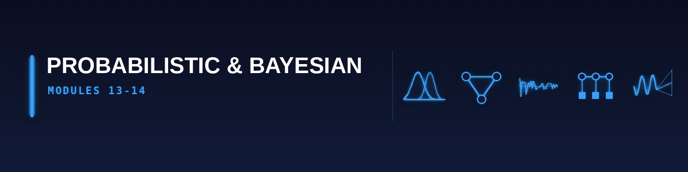

[🏠 Roadmap home](../README.md) · [📚 Curriculum index](README.md) · [← 🟧 Classical ML (M9–M12)](3-classical-ml.md) · [🟪 Deep Learning (M15–M17) →](5-deep-learning.md)

---

# 🟦 PROBABILISTIC & BAYESIAN STRATUM (Modules 13–14)

> **Reading this page:** each module lists many resources — that is a menu, not a to-do list. Take **one** primary course; see the [Pick-One table](../guides/how-to-read-a-module.md#pick-one). Citations like *"Video 1 (05:05)"* are resolved in [sources](../guides/sources.md#citation-key).

---

## Module 13: Bayesian Inference, Graphical Models & MCMC

* **The Tutor's "Why":** Harvard CS109B allocates **weeks 2-4 (five consecutive Bayes lectures)** to this; MIT 6.790 dedicates Part III entirely to it; Cambridge's ML & Bayesian Inference is named after it; Cambridge MLMI Module 1 states it as a foundational objective. Ignore this module and you will never understand uncertainty quantification, variational autoencoders, or modern Bayesian neural networks.

* **Strict Prerequisites:** Module 5 (conjugate priors, Beta, Gamma, Dirichlet, Multivariate Normal), Module 11 (EM algorithm).

* **Exhaustive Topic List:**
  * **[Harvard CS109B · Lec 3 "Bayes 1"]**: **Philosophical basis of Bayesianism** — subjective probability, Cox's theorem (probability as extension of logic), Dutch book argument. Prior × Likelihood ∝ Posterior. Conjugate prior families (Beta-Binomial, Gamma-Poisson, Normal-Normal, Dirichlet-Multinomial, Normal-Inverse-Gamma, Normal-Inverse-Wishart).
  * **[Harvard CS109B · Lec 4 "Bayes 2"]**: **Posterior predictive distribution**, credible intervals vs confidence intervals (conceptual distinction), marginal likelihood (evidence), Bayes factors for model comparison.
  * **[Harvard CS109B · Lec 5 "Bayes 3"]**: **Hierarchical (multi-level) Bayesian models** — partial pooling, shrinkage, James-Stein estimator, empirical Bayes, Gibbs sampling introduction.
  * **[Harvard CS109B · Lec 6 "Bayes 4"]**: **Markov Chain Monte Carlo (MCMC)** — detailed balance condition, **Metropolis-Hastings algorithm** with proposal distributions and acceptance probability, **Gibbs sampling** (when conditionals are tractable), Hamiltonian Monte Carlo (HMC) preview.
  * **[Harvard CS109B · Lec 7 "Bayes 5"]**: **Variational Inference** — ELBO (Evidence Lower Bound) derivation, mean-field approximation, coordinate ascent VI, **stochastic VI**, normalising flows preview, **reparameterisation trick** (preview of VAEs in M16).
  * **[Harvard CS109B · Advanced Section 2 "Particle Filters / Sequential Monte Carlo"]**: **Sequential Monte Carlo** — bootstrap filter, importance sampling, resampling (systematic, residual, stratified), particle degeneracy, effective sample size, auxiliary particle filter.
  * **[Cambridge ML & Bayesian Inference · Lec "Bayesian networks I" (2 lectures)]**: **Directed graphical models (Bayesian networks)** — representing uncertain knowledge as DAGs, joint distribution factorisation, **conditional independence** (d-separation, Markov blanket), **exact inference** (variable elimination, junction tree algorithm / message passing, belief propagation for trees).
  * **[Cambridge ML & Bayesian Inference · Lec "Bayesian networks II"]**: **Markov Random Fields (undirected graphical models)** — Gibbs distributions, potential functions, Hammersley-Clifford theorem, Ising model, **approximate inference**, **Markov chain Monte Carlo methods** (full MH + Gibbs treatment).
  * **[Cambridge ML & Bayesian Inference · Lec "Linear classifiers II"]**: **The Bayesian approach to neural networks** — Laplace approximation (Gaussian at MAP), Bayesian backpropagation (MacKay), MC dropout as approximate Bayesian inference.
  * **[MIT 6.790 · Part III "Probabilistic Modeling"]**: Incorporating prior knowledge, sampling from complex distributions, Bayes rule as basis of all inference, selecting priors (Gaussian → ridge; Laplace → lasso; Dirichlet-process for non-parametric Bayes), **Gibbs sampling derivation**, **Metropolis-Hastings with full proof of detailed balance**.
  * **[MIT 6.790]**: MCMC listed as "one of the top 10 algorithms of all time" alongside quicksort and FFT.
  * **[Cambridge MLMI Module 1]**: **Maximum-likelihood vs Bayesian inference** — strengths and weaknesses of both; **belief propagation** algorithm.
  * **[Harvard CS 1810 (S26)]**: "Graphical models", "hidden Markov models" (→ M14), "inference methods" as syllabus topics.

* **2026 Resources:**
  * **Primary Course Link:** [Harvard CS109B 2022 schedule](https://harvard-iacs.github.io/2022-CS109B/) (Bayes lectures 3-7) · [Cambridge ML&BI 2025-26](https://www.cl.cam.ac.uk/teaching/2526/MLBayInfer/) · [MIT 6.790 Part III](https://gradml.mit.edu/intro/).
  * **Required Reading (Latest 2026 Editions):**
    * _Probabilistic Machine Learning: Advanced Topics_ (Kevin Murphy, **MIT Press 2023**) — Chapters 1-12 (most current Bayesian treatment).
    * _Bayesian Data Analysis_ (**3rd Edition**) — Gelman, Carlin, Stern, Dunson, Vehtari, Rubin (BDA3).
    * _Pattern Recognition and Machine Learning_ — Bishop — Chapters 8 (graphical models), 10 (VI), 11 (MCMC).
    * _Bayesian Reasoning and Machine Learning_ — David Barber — [free PDF](http://www.cs.ucl.ac.uk/staff/D.Barber/brml/) (explicitly listed in Cambridge ML&BI reading list).
  * **Practical Implementation:** **PyMC 5.x** (with PyTensor backend), **NumPyro 0.15+** (JAX-native, 10-100× faster for complex models, standard in 2026 research), **Stan** via `cmdstanpy`, **TensorFlow Probability 0.24+**, **`arviz`** for posterior diagnostics (R̂, ESS, trace plots, posterior predictive checks).

* **📦 Module Project (mandatory) — Bayesian A/B test, end to end**
  * **Deliverable:** A full Bayesian analysis of a real or realistically-simulated experiment in PyMC or NumPyro: state the prior and defend it, fit the posterior, run convergence diagnostics (R-hat, ESS, divergences, trace and rank plots), do prior and posterior predictive checks, and report a decision — including the probability that B beats A by more than a stated business-relevant margin.
  * **Definition of done:** (1) A test asserting R-hat < 1.01 and zero divergences at a fixed seed, so a regression in the model breaks CI; (2) `README.md` with the posterior plots, the prior-sensitivity analysis (re-run under at least two other defensible priors), and the decision rule; (3) a results memo contrasting your Bayesian conclusion with the frequentist p-value from your [M6](2-statistics-and-data.md#module-6) toolkit on the same data — and explaining precisely what each one does and does not claim.
  * **Stretch:** Extend to a hierarchical model across segments and show partial pooling shrinking the noisy small-segment estimates.
  * **Fast-lane note:** This module is where the [intuition-first shortcut runs out](1-foundations.md#module-5). If you are here, you need the probability spine.

---

## Module 14: Sequence Modelling — HMMs, Kalman Filters & Time Series

* **The Tutor's "Why":** Time is the most important axis in the real world. Cambridge ML & Real-World Data dedicates **Topic 2 (4 sessions) entirely** to HMMs with a biological application. MIT MicroMasters C4 is a whole course on time series with interventions. The state-space model framework unifies HMMs, Kalman filters, and particle filters.

* **Strict Prerequisites:** Module 5 (Markov chains — Stat 110 Lec 31-33), Module 13 (message passing).

* **Exhaustive Topic List:**
  * **[Cambridge ML & Real-World Data · Topic 2 "Sequence Analysis" (4 sessions)]**: **Hidden Markov Models (HMM)** — model definition (hidden state chain + observation emissions), assumptions (Markov property on hidden chain, observation independence given state), the three canonical problems (Rabiner 1989):
    1. **Evaluation** — P(observations | model) via **Forward algorithm**.
    2. **Decoding** — most likely hidden sequence via **Viterbi algorithm** (with full dynamic-programming derivation).
    3. **Learning** — parameter estimation via **Baum-Welch / Forward-Backward** (EM for HMMs).
    * Application: **predicting protein interactions with a cell membrane** (Cambridge's specific biological application).
  * **[Harvard CS 1810 (S26)]**: **Hidden Markov Models** as a named 2026 syllabus topic.
  * **[MIT 6.431x]**: Bernoulli process, Poisson process, **hidden random processes** (preview of state-space models).
  * **[Cambridge MLMI 1]**: **Kalman filter** implementation — state-space model for linear Gaussian systems, prediction step and update step, Rauch-Tung-Striebel smoother, **extended Kalman filter (EKF)** for nonlinear systems, **unscented Kalman filter (UKF)**, connection to Bayesian belief update.
  * **[MIT MicroMasters 14.310x / "Data Analysis: Learning Time Series with Interventions"]**: Time series basics — trend, seasonality, cyclicity, stationarity (strong vs weak/covariance stationarity), ACF/PACF, white noise tests (Ljung-Box); ARMA models; **ARIMA** and **SARIMA** (Box-Jenkins methodology); Vector Autoregression (VAR); Granger causality; cointegration and Engle-Granger two-step; **ARCH/GARCH** for volatility; state-space formulation; Kalman filter as linear-Gaussian HMM; structural time-series models (Harvey BSM); **prophet** (Facebook's decomposable model); **DeepAR**, **Temporal Fusion Transformers** (modern 2026 approach); **intervention analysis** (difference-in-differences, interrupted time series, synthetic control); regression discontinuity; instrumental variables for causal inference.
  * **[Harvard CS109B · Lec 17 "Recurrent Neural Networks"]**: **RNN for sequence modelling** (connects to M15).
  * **[Harvard CS109B · Lec 18 "NLP 1 — GRUs / LSTMs"]**: **Long Short-Term Memory (LSTM)** — gate equations (input, forget, output gates), cell state, vanishing gradient solution; **Gated Recurrent Unit (GRU)** — update and reset gates.

* **2026 Resources:**
  * **Primary Course Link:** [Cambridge ML & Real-World Data](https://www.cl.cam.ac.uk/teaching/2324/MLRD/) · [MITx 14.310x](https://micromasters.mit.edu/ds/).
  * **Required Reading (Latest 2026 Editions):**
    * _Forecasting: Principles and Practice_ (**3rd Edition**) — Rob Hyndman — [free online](https://otexts.com/fpp3/).
    * _Time Series Analysis_ — James Hamilton — classical econometric reference.
    * Rabiner, "A Tutorial on Hidden Markov Models" (IEEE 1989) — mandatory historical reading.
    * Bishop PRML — Chapter 13 (sequential data).
  * **Practical Implementation:** **`statsmodels.tsa`** (ARIMA, SARIMAX, VAR, state-space), **`pmdarima`** (auto-ARIMA), **`prophet` 1.1+**, **`hmmlearn`**, **`pykalman`**, **`filterpy`** for Kalman variants, **`darts`** (Unit8's unified TS library — 2026 favourite), **`sktime` 0.30+**, **`neuralforecast`** (Nixtla) for modern deep TS.

* **📦 Module Project (mandatory) — Stock dashboard with honest forecasting**
  * **Deliverable:** A deployed dashboard over a real time series (equities, energy demand, or web traffic) that shows the history, a forecast with prediction intervals, and — critically — a **backtest** using rolling-origin cross-validation. Baselines are mandatory: naive, seasonal-naive, and ARIMA must all appear before any fancy model does.
  * **Definition of done:** (1) `pytest` suite including a test that asserts your backtest split never leaks future data into the past (the single most common bug in time-series code); (2) `README.md` with a metric table across horizons for every model including the naive baselines, and a live URL; (3) a results memo stating plainly whether your model beat seasonal-naive, and if not, saying so.
  * **Stretch:** Add a probabilistic model (or a foundation forecasting model) and compare interval coverage, not just point error.
  * *Archetype source: video 1 (13:55) — the stock dashboard, with the backtest and baseline requirements added because the archetype is otherwise the easiest portfolio project to fake.*

---

[🏠 Roadmap home](../README.md) · [📚 Curriculum index](README.md) · [← 🟧 Classical ML (M9–M12)](3-classical-ml.md) · [🟪 Deep Learning (M15–M17) →](5-deep-learning.md)
