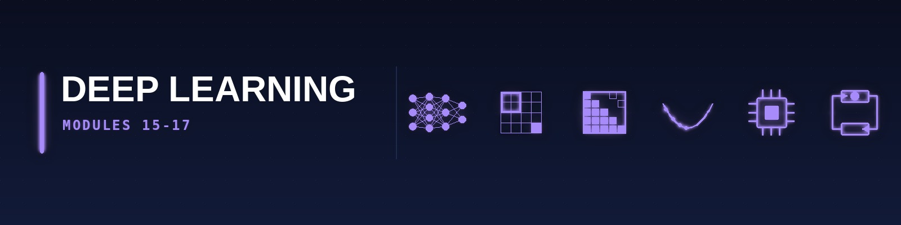

[🏠 Roadmap home](../README.md) · [📚 Curriculum index](README.md) · [← 🟦 Probabilistic ML (M13–M14)](4-probabilistic-ml.md) · [🔴 Frontier & Production (M18, M21–M26) →](6-frontier-production.md)

---

# 🟪 DEEP LEARNING STRATUM (Modules 15–17)

> **Reading this page:** each module lists many resources — that is a menu, not a to-do list. Take **one** primary course; see the [Pick-One table](../guides/how-to-read-a-module.md#pick-one). Citations like *"Video 1 (05:05)"* are resolved in [sources](../guides/sources.md#citation-key).

---

## Module 15: Deep Learning Foundations — MLPs, CNNs, Backprop

* **The Tutor's "Why":** The deep-learning revolution (2012-present) defines modern AI. Harvard CS109B allocates **four full lectures (8-11) to neural network fundamentals**; MIT 6.3900 Spring 2026 spends **three lectures (5, 6, 7) on NNs and CNNs**; MIT 6.7960 is an entire course. Master the mathematics before touching a GPU.

* **Strict Prerequisites:** Module 2 (chain rule), Module 3 (matrix calculus), Module 9 (SGD), Module 10 (logistic regression, cross-entropy loss).

* **Exhaustive Topic List:**
  * **[Harvard CS109B · Lec 8 "Neural Networks 1 (MLP)"]**: Biological motivation vs artificial neuron (McCulloch-Pitts, perceptron), **Multi-Layer Perceptron (MLP)** architecture — affine transformation + activation function; **universal approximation theorem** (Cybenko 1989, Hornik 1991, with proof sketch).
  * **[Harvard CS109B · Lec 9 "NN 2 — Gradient Descent, SGD, BackProp"]**: **Backpropagation algorithm** — full derivation via chain rule as dynamic programming over the computation graph; vanishing/exploding gradients; **Xavier/Glorot initialisation**, **He initialisation** (theoretical justification for each).
  * **[Harvard CS109B · Lec 10 "NN 3 (Optimizers)"]**: **Momentum**, **Nesterov momentum**, **AdaGrad**, **RMSProp**, **Adam**, **AdamW** (decoupled weight decay — 2017 fix), **LAMB** (for large-batch), **Lion** (2023, Chesterton), **Sophia** (2023), learning-rate schedules (step decay, exponential, cosine annealing, warmup, one-cycle), gradient clipping.
  * **[Harvard CS109B · Lec 11 "NN 4 (Regularization)"]**: **L1/L2 weight decay**, **Dropout** (Hinton 2014 — inverted dropout, concrete dropout), **Batch Normalisation** (Ioffe-Szegedy 2015 — full derivation, internal covariate shift debate, post-hoc explanations), **Layer Normalisation**, **Group Normalisation**, **Instance Normalisation**, **RMSNorm** (2026 standard in LLMs), **early stopping**, **data augmentation**, **label smoothing**, **mixup**, **cutmix**.
  * **[Harvard CS109B · Lec 12 "CNNs 1 (Basics)"]**: **Convolutional Neural Networks** — convolution operation (discrete 2D), **kernels as learnable filters**, stride, padding (valid, same, full), pooling (max, average, global), translation equivariance vs invariance; classic architectures: **LeNet-5**, **AlexNet**, **VGG-16/19**, **GoogLeNet/Inception** (1×1 convolutions for dimensionality reduction).
  * **[Harvard CS109B · Lec 13 "CNNs 2 (Regularization)"]**: Data augmentation for vision, dropout in CNNs, batch-norm placement debate.
  * **[Harvard CS109B · Lec 14 "CNNs 3 (Receptive Field)"]**: **Effective receptive field** calculation, dilated/atrous convolutions, **ResNet** (residual connections — identity mapping, full derivation of gradient flow improvement), **DenseNet**, **SqueezeNet**, **MobileNet** (depthwise-separable convolution), **EfficientNet** (compound scaling), **ConvNeXt** (2022 — CNN catches up to ViT).
  * **[Harvard CS109B · Lec 15 "CNNs 4 (Saliency Maps)"]**: Gradient-based saliency, **Grad-CAM** (Selvaraju 2017), integrated gradients, **SmoothGrad**, adversarial examples (FGSM, PGD, Carlini-Wagner).
  * **[Harvard CS109B · Advanced Section 3 "Solvers"]**: Second-order methods, L-BFGS, natural gradient, K-FAC.
  * **[Harvard CS109B · Advanced Section 4 "Segmentation"]**: **Semantic segmentation** (FCN, U-Net, DeepLab); **instance segmentation** (Mask R-CNN); **panoptic segmentation**.
  * **[Harvard CS109B · Advanced Section 5 "SOTA & Transfer Learning"]**: ImageNet pretraining, **fine-tuning** vs **linear probing** vs **LoRA** (→ M18), feature extraction.
  * **[Harvard CS109B · Advanced Section 6 "Autoencoders"]**: Vanilla AEs, denoising AEs, contractive AEs (Jacobian penalty), sparse AEs (KL penalty on activations).
  * **[MIT 6.390 · Lec 5-6-7 (Spring 2026)]**: "Features & Neural Networks I", "Neural Networks II", "Convolutional Neural Networks" — with extensive labs.
  * **[MIT 6.7960 · Fall 2025, Week 1-3 (Beery · He · Khattab)]**: Course overview (Beery); **How to train a neural net** (Beery — SGD, backprop, autodiff, differentiable programming); **Approximation theory** (Khattab — universal approximation, **Barron's theorem**, depth separation); **Architectures: Grids** (Beery — CNNs in depth); **Architectures: Memory and Sequence Modeling** (He — RNNs, LSTMs, sequence models); **PyTorch Tutorial** sessions with Jamie Meindl and Sharut Gupta. Reading: *Foundations of Computer Vision* chapters on neural nets, gradient descent, backprop, CNNs (all [visionbook.mit.edu](https://visionbook.mit.edu/)).
  * **[MIT 6.7960 · Fall 2025, Week 4]**: **Architectures: Transformers** (Beery — tokens + attention + positional codes; Transformers unify MLPs, GNNs, CNNs); **Generalization Theory** (Khattab — PAC, overparameterisation, **double descent**, inadequacy of VC dimension, inductive biases; readings include arXiv 1611.03530, 2503.02113, 2310.00865).
  * **[IITM BSCS3002 — Deep Learning]**: IITM's dedicated Deep Learning course covers the above plus practical engineering on **PyTorch**.
  * **[IITM BSCS2008 · Week 11]**: Neural networks in scikit-learn (MLP introduction).
  * **[Harvard CS 1810]**: Neural networks as a syllabus topic.
  * **[MIT 6.S191 bootcamp]**: Condensed practical treatment.

* **2026 Resources:**
  * **Primary Course Link:** [**MIT 6.7960 Fall 2025 live schedule**](https://deeplearning6-7960.github.io/) (15 weeks · Beery · He · Khattab) · [MIT 6.390 Spring 2026 calendar](https://introml.mit.edu/spring26/calendar) · [**MIT 6.S191 (2026 edition, Amini)**](https://introtodeeplearning.com/) · [Harvard CS109B 2022 (latest public)](https://harvard-iacs.github.io/2022-CS109B/).
  * **Required Reading (Latest 2026 Editions — verified April 2026):**
    * **_Deep Learning: Foundations and Concepts_** — Bishop & Bishop (**Springer 2024**, free online [bishopbook.com](https://bishopbook.com/)) — **primary text** for this module.
    * _Understanding Deep Learning_ — Simon Prince (MIT Press 2024; free online [udlbook.github.io](https://udlbook.github.io/udlbook/)) — chapters 1‑12.
    * _Dive into Deep Learning_ — Zhang, Lipton, Li, Smola — [d2l.ai](https://d2l.ai/) — PyTorch + JAX parallel implementations, continuously updated.
    * _Foundations of Computer Vision_ — Torralba, Isola, Freeman (**MIT Press 2024**, free online at [visionbook.mit.edu](https://visionbook.mit.edu/)) — the official MIT 6.7960 textbook.
    * *Hands‑On Machine Learning with Scikit‑Learn and PyTorch* — Géron (O'Reilly Oct‑Dec 2025).
    * _Deep Learning_ — Goodfellow, Bengio, Courville (2016, still relevant as historical reference).
  * **Practical Implementation:** **PyTorch 2.11.0** (`torch.compile`, FSDP2, CUDA 13, `torch.func.grad`, `torch.distributed.tensor`), **JAX 0.10.0** with **Flax 0.10+** / **NNX** / **Equinox** for functional DL, **Hugging Face Accelerate** for distributed training, **Weights & Biases** or **MLflow 3.11+** for experiment tracking, **Lightning 2.4+** for training‑loop abstraction.

* **🚀 Deep Learning Systems — Training at Scale:** Modern DL is as much a *systems* discipline as an algorithms discipline. Stanford CS336 dedicates weeks to it.
  * **JAX alongside PyTorch:** [JAX docs](https://docs.jax.dev/) ✅, [Flax NNX](https://flax.readthedocs.io/) ✅ — mainstream at Google, DeepMind, Anthropic. Learn `jit`, `vmap`, `pmap`, `scan`, `shard_map`, `jax.Array` with sharding, and the [tour of JAX tutorials](https://docs.jax.dev/en/latest/tutorials.html).
  * **Mixed-Precision Training:** `torch.amp`, `bfloat16` vs `fp16` vs `fp8` (H100/B200), loss-scaling, stochastic rounding; **why bf16 is the 2026 default** (no loss-scaling needed, wider dynamic range).
  * **Gradient Checkpointing:** Trade compute for memory; `torch.utils.checkpoint`, `jax.checkpoint` — required for any model that doesn't fit in GPU RAM.
  * **Fully-Sharded Data Parallel (FSDP / FSDP2):** [PyTorch FSDP API docs](https://docs.pytorch.org/docs/stable/fsdp.html) ✅ + [Getting-Started-with-FSDP2 tutorial](https://docs.pytorch.org/tutorials/intermediate/FSDP_tutorial.html) ✅. Shard parameters, gradients, and optimiser states across GPUs — the 2026 default for any model > 7B.
  * **Distributed primitives:** DDP, FSDP/FSDP2, Tensor-Parallel (Megatron-style), Pipeline-Parallel (GPipe, PipeDream), **3D parallelism** (DP × TP × PP), ZeRO-1/2/3 (DeepSpeed).
  * **Throughput engineering:** [Triton](https://github.com/triton-lang/triton) ✅ kernels, **FlashAttention-2 / 3** (Tri Dao), **PagedAttention** (vLLM), activation recomputation strategies, `torch.compile` with `fullgraph=True`.
  * **Reading:** [*How to Scale Your Model* (Google JAX scaling book, 2024)](https://jax-ml.github.io/scaling-book/) ✅, [PyTorch DTensor docs](https://pytorch.org/docs/stable/distributed.tensor.html), Stanford CS336 Lectures 5-7 (scaling, parallelism, systems).

* **📦 Module Project (mandatory) — Backprop from scratch, then a real CNN**
  * **Deliverable:** Two halves. **(a)** A NumPy-only MLP with manual forward and backward passes for at least Linear, ReLU, and Softmax-CE layers, trained on MNIST to >97 % test accuracy. **(b)** The same task in PyTorch, then a CNN on CIFAR-10 with augmentation, LR scheduling, and a training loop you wrote yourself.
  * **Definition of done:** (1) A gradient-check test comparing every analytic backward pass against finite differences to `1e-5` — non-negotiable; plus a smoke test that the model can overfit a 10-sample batch to near-zero loss (the fastest way to detect a broken training loop); (2) `README.md` with loss/accuracy curves for train and validation, and a confusion matrix; (3) a results memo describing one bug you hit in the backward pass and how the gradient check found it.
  * **Stretch:** Add mixed-precision training and report the throughput and memory difference.
  * **Anti-goal:** Do not start from a tutorial's training loop. The point of the module is that you can write one.

---

## Module 16: Representation Learning, Transformers & Generative Models

* **The Tutor's "Why":** The Transformer (Vaswani et al. 2017, *Attention is All You Need*) is **the** defining architecture of 2026. MIT 6.390 Spring 2026 dedicates Lecture 9 entirely to it. Every frontier lab, from OpenAI to DeepMind to Anthropic, builds on transformers + diffusion. This module is the ticket to research-grade work.

* **Strict Prerequisites:** Module 15 (backprop, CNNs, RNNs, attention preview).

* **Exhaustive Topic List:**
  * **[Harvard CS109B · Lec 16 "Intro to Language Models"]**: n-gram language models, perplexity, statistical LM vs neural LM.
  * **[Harvard CS109B · Lec 17 "Recurrent Neural Networks"]**: RNN forward/backward through time, bidirectional RNNs.
  * **[Harvard CS109B · Lec 18 "NLP 1 (GRUs/LSTMs)"]**: LSTM full derivation, GRU comparison, vanishing-gradient resolution.
  * **[Harvard CS109B · Lec 19 "NLP 2 (ELMo)"]**: Contextual word embeddings, character-level convolutions, bidirectional LM.
  * **[Harvard CS109B · Advanced Section 7 "Word2Vec"]**: **Skip-gram**, **CBOW**, negative sampling, hierarchical softmax, GloVe (global co-occurrence), FastText (subword embeddings).
  * **[Harvard CS109B · Lec 20 "NLP 3 (Seq2Seq & Attention)"]**: **Encoder-decoder architecture**, **Bahdanau attention** (additive), **Luong attention** (multiplicative), content-based vs location-based attention.
  * **[Harvard CS109B · Lec 21 "NLP 4 (Transformers)"]**: **The Transformer** — Vaswani et al. 2017 in full. Scaled dot-product attention (Q, K, V), **multi-head attention**, **positional encoding** (sinusoidal, learned, rotary RoPE, ALiBi, YaRN), encoder stack, decoder stack with masked self-attention, layer norm placement (pre-LN vs post-LN — 2020 pre-LN victory), feed-forward network (GELU → SwiGLU), residual connections.
  * **[Harvard CS109B · Advanced Section 8 "BERT"]**: **BERT** (bidirectional encoder, masked language modelling, next-sentence prediction), **RoBERTa**, **ALBERT**, **DistilBERT**, **ELECTRA** (replaced token detection), **DeBERTa** (disentangled attention).
  * **[MIT 6.390 · Lec 9 (Spring 2026) "Transformers"]**: Dedicated lecture on transformer architecture.
  * **[MIT 6.7960 · Fall 2025 Week 4 "Architectures: Transformers" (Beery)]**: Three key ideas — **tokens, attention, positional codes**; Transformers as unified framework (subsuming MLPs, GNNs, CNNs); reading = *visionbook.mit.edu/transformers*.
  * **[MIT 6.7960 · Fall 2025 Weeks 5‑7 "Representation Learning" (He, Khattab)]**: **Reconstruction‑based** (autoencoders, VQ-VAE, MAE — Masked Autoencoders); **Similarity‑based / Neural Information Retrieval** — information retrieval, contrastive learning (InfoNCE, hard negatives, KL distillation), sub‑linear search & scaling trade‑offs (cross‑encoders, bi‑encoders, **late interaction / ColBERT**); **Representation Learning and Information Theory** — NN‑GP correspondence, NTK — Neural Tangent Kernel.
  * **[MIT 6.7960 · Fall 2025 Weeks 6‑9 "Foundation Models" (Khattab, He)]**: **Pre‑training** (causal LM loss, SmolLM3, OLMo 2, Marin 8B); **Scaling laws** (Kaplan 2020 + Chinchilla 2022 + Emergent Abilities debate: are emergent abilities a mirage?); **Generative models: basics → VAE & GAN → Diffusion & Flows** (Kaiming He); **Post‑training** (instruction tuning, DPO, GRPO).
  * **[Harvard CS109B · Lec 22-23 "GANs 1 & 2"]**: **Generative Adversarial Networks** — minimax game formulation (Goodfellow 2014), optimal discriminator proof, **mode collapse**, **Wasserstein GAN** (earth-mover distance, Kantorovich-Rubinstein duality), **WGAN-GP** (gradient penalty), **DCGAN**, **Progressive GAN**, **StyleGAN 2/3**, **BigGAN**, **Conditional GAN**, **Pix2Pix**, **CycleGAN** (unpaired translation).
  * **[Harvard CS109B · Advanced Section 9 "More GANs"]**: Evaluation metrics (IS, FID, KID, precision-recall), tricks (spectral normalisation, self-attention GAN — SAGAN).
  * **[MIT 6.7960 · Week 8-9 "Generative models"]**:
    * **Basics** — density models, energy-based models, Langevin samplers, **autoregressive models** (PixelRNN, PixelCNN, MADE, WaveNet), GANs.
    * **Representation-meets-generation** — **VAEs** (Kingma 2013) with full ELBO derivation, **reparameterisation trick** (ε ~ 𝒩(0,I); z = μ + σε), β-VAE for disentanglement, VQ-VAE, NVAE.
    * **Conditional models** — cGAN, cVAE, conditional diffusion, paired image-to-image (Pix2Pix), text-to-image (DALL-E, Imagen, Stable Diffusion, Midjourney), image-to-text (captioning).
  * **[MIT 6.7960]**: **Diffusion Models (DDPM)** — forward noising process, reverse denoising process, **score-matching formulation** (Song & Ermon), **variational diffusion** (Ho et al. 2020), classifier-free guidance, **latent diffusion** (Stable Diffusion), **DPM-Solver / DPM-Solver++** (2022 ODE samplers), **Flow Matching** (2023), **Rectified Flow** (2024 — the 2026 SOTA for image/video gen).
  * **[MIT 6.7960 · Week 10-11 "Generalization (OOD) & Transfer Learning"]**: **Adversarial robustness** (FGSM, PGD attacks, certified defences), **distribution shift** (covariate shift, label shift, concept drift), **domain adaptation** (DANN, CORAL, MMD), **foundation models** — fine-tuning, **linear probing**, **knowledge distillation**, **prompting**, **parameter-efficient fine-tuning** (PEFT: adapters, LoRA, QLoRA, IA³, prompt tuning, prefix tuning).
  * **[MIT 6.7960 · Week 11 "Scaling Laws"]**: **Kaplan scaling laws** (2020), **Chinchilla scaling laws** (Hoffmann 2022 — compute-optimal N*D allocation), power-law behaviour, breaking power laws via data pruning, critical batch size.
  * **[IITM BSCS3005 — Computer Vision]**: Image classification, object detection (YOLO v8-v10, DETR), segmentation, video understanding, 3D vision, **NeRF** (Neural Radiance Fields), **3D Gaussian Splatting** (2023 SOTA — 2026 standard for 3D scenes).
  * **[IITM BSCS3004 — LLMs]**: Dedicated course on language modelling (see M18).

* **2026 Resources:**
  * **Primary Course Link:** [**MIT 6.7960 Fall 2025 full schedule**](https://deeplearning6-7960.github.io/) (weeks 4‑11) · [**Stanford CS336 Spring 2026 Lec 3–4**](https://cs336.stanford.edu/) (architectures + MoE) · [Harvard CS109B 2022 Lec 16‑23](https://harvard-iacs.github.io/2022-CS109B/) · [MIT 6.390 S26 Lec 9](https://introml.mit.edu/spring26/lectures/lec09).
  * **Required Reading (Latest 2026 Editions — verified April 2026):**
    * **Bishop & Bishop — *Deep Learning: Foundations and Concepts*** (Springer 2024, free at [bishopbook.com](https://bishopbook.com/)) — chapters on attention and transformers.
    * _Understanding Deep Learning_ — Prince — Chapters 12‑18 (transformers, GANs, VAEs, diffusion).
    * **_Hands‑On Large Language Models_** — Alammar & Grootendorst (O'Reilly, Sep 2024, 428 pp.) — [HandsOnLLM repo](https://github.com/HandsOnLLM/Hands-On-Large-Language-Models).
    * Vaswani et al. 2017 ("Attention is All You Need") — **mandatory primary‑source reading**.
    * Ho, Jain, Abbeel 2020 ("DDPM") — for diffusion.
    * Lipman et al. 2023 ("Flow Matching") & Liu et al. 2022 ("Rectified Flow") — 2026 generative SOTA.
    * Radford et al. 2021 ("CLIP") — multi‑modal foundation.
    * _The Little Book of Deep Learning_ — François Fleuret — concise reference.
  * **Practical Implementation:** **Hugging Face Transformers v5.0 / v4.57 LTS**, **Diffusers 0.30+** (image/video), **PEFT 0.14+** (LoRA/QLoRA/DoRA), **xformers** / **FlashAttention‑3**, **bitsandbytes** (4/8‑bit), **`torch.compile`** + **`torch.fullgraph`** (2× speedups), **Triton 3.x** for custom kernels (Stanford CS336 Lec 6).

* **📦 Module Project (mandatory) — Sentiment analyser on a pretrained model, plus a transformer you built**
  * **Deliverable:** Two halves. **(a)** A deployed sentiment (or topic) classifier built on a pretrained Hugging Face model — fine-tuned or used zero-shot, your choice, but you must justify it — with a proper eval set and error analysis. **(b)** A minimal decoder-only transformer written from scratch (tokeniser → embeddings → multi-head self-attention → residual + layer-norm → LM head) trained on a small corpus until it produces recognisable text.
  * **Definition of done:** (1) `pytest` suite including a shape test for every tensor in the attention block and a causal-mask test proving position *t* cannot attend to *t+1*; (2) `README.md` with the classifier's per-class metrics, a confusion matrix, at least ten inspected misclassifications, and a live URL; (3) a results memo on what your from-scratch model's failure modes taught you about the pretrained one.
  * **Stretch:** Compare your fine-tuned classifier against a well-prompted foundation model on the same eval set and report cost, latency, and accuracy — this is the exact trade-off [M21](6-frontier-production.md#module-21) formalises.
  * *Archetype source: video 1 (13:25) — "sentiment analyser on a pretrained Hugging Face model" is named as the accessible NLP portfolio project; the from-scratch half is added so the module still earns its place in the deep-learning stratum.*

---

## Module 17: Reinforcement Learning & Decision Making

* **The Tutor's "Why":** RL drives robotics, game AI, and — most importantly in 2026 — the RLHF alignment of LLMs. MIT 6.390 Spring 2026 Lec 10-11 covers MDPs and RL. IITM runs a dedicated BSCS3003 course. Harvard CS 1810 (2026) lists reinforcement learning as a named syllabus topic.

* **Strict Prerequisites:** Module 5 (Markov chains, expectation), Module 15 (can train a deep network).

* **Exhaustive Topic List:**
  * **[MIT 6.390 · Lec 10 (Spring 2026) "Markov Decision Processes"]**: **MDP formulation** — (S, A, P, R, γ), episodic vs continuing tasks, **Bellman equations** (value iteration, policy iteration), **optimality** (Bellman optimality operator, contraction mapping theorem proof), dynamic programming for MDPs.
  * **[MIT 6.390 · Lec 11 (Spring 2026) "Reinforcement Learning"]**: **Model-free RL** — **Monte Carlo methods** (first-visit, every-visit), **Temporal Difference (TD)** learning, **TD(0)**, TD(λ), SARSA, **Q-learning** (off-policy TD control), **Deep Q-Networks (DQN)** (Mnih et al. 2015 — experience replay, target network, Atari), Double DQN, Dueling DQN, Rainbow DQN.
  * **[MIT 6.790 · Part IV "Decision Making"]**: Optimising under model uncertainty; **explore-vs-exploit tradeoff**; **credit assignment problem**; two key timescales (state dynamics vs information dynamics) → framework table distinguishing optimisation, MDPs, RL.
  * **[MIT 6.86x · Unit 5 Lec 17-19]**: **Reinforcement Learning 1 & 2**; Applications to **Natural Language Processing** (dialogue systems as RL, text summarisation as RL).
  * **[IITM BSCS3003 — Reinforcement Learning]**: Dedicated 12-week course covering:
    * Multi-armed bandits (ε-greedy, UCB, Thompson sampling, contextual bandits — LinUCB, Neural contextual bandits).
    * Policy gradient methods — **REINFORCE** (Williams 1992, log-likelihood trick derivation), **Actor-Critic** (A2C, A3C), **Advantage function**, **GAE** (Generalised Advantage Estimation).
    * **Trust Region methods** — TRPO (Schulman 2015), **PPO** (Schulman 2017 — clipped objective, the RLHF workhorse), **TRPO vs PPO vs ACKTR**.
    * **Deterministic Policy Gradient** (DPG), **DDPG**, **TD3**, **SAC** (Soft Actor-Critic, max-entropy RL).
    * **Model-based RL** — Dyna-Q, **MuZero**, **DreamerV3** (2024), **World models**.
    * **Inverse RL** (IRL), **Imitation Learning** (Behavioural Cloning, DAgger), **GAIL** (Generative Adversarial Imitation Learning).
    * **Offline RL** — BCQ, CQL, IQL, decision transformer.
    * **Hierarchical RL** — options framework, feudal networks, HIRO.
    * **Multi-agent RL** — self-play, fictitious play, MADDPG, AlphaZero, counterfactual regret minimisation.
  * **[MIT 6.7960 · Week 15 "Efficient Policy Optimization Techniques for LLMs"]**: **RLHF challenges**, simplifying RL policy optimisation to **relative reward regression** (DPO — Direct Preference Optimisation, Rafailov 2023), **IPO**, **KTO**, **ORPO**, multi-turn RLHF extensions.

* **2026 Resources:**
  * **Primary Course Link:** [MIT 6.390 Spring 2026 Lec 10-11](https://introml.mit.edu/spring26/) · [David Silver DeepMind RL Course (YouTube, still canonical)](https://www.youtube.com/watch?v=2pWv7GOvuf0) · **[IITM BSCS3003 Reinforcement Learning](https://study.iitm.ac.in/ds/course_pages/BSCS3003.html)**.
  * **Required Reading (Latest 2026 Editions):**
    * _Reinforcement Learning: An Introduction_ (**2nd Edition, 2018, 2024 reprint**) — Sutton & Barto — [free PDF](http://incompleteideas.net/book/the-book-2nd.html) — **the canonical text**.
    * _Algorithms for Decision Making_ — Kochenderfer, Wheeler, Wray (MIT Press 2022) — [free online](https://algorithmsbook.com/).
    * _Foundations of Deep Reinforcement Learning_ — Graesser & Keng — for practitioners.
  * **Practical Implementation:** **Gymnasium** (successor to OpenAI Gym), **Stable-Baselines3 2.x**, **CleanRL** (single-file implementations — best for learning), **RLlib** (Ray, for distributed), **PettingZoo** (multi-agent), **trl** (Hugging Face — for RLHF), **DeepMind Acme**, **PufferLib** (2025, unified wrapper).

* **📦 Module Project (mandatory) — Agent that actually learns**
  * **Deliverable:** Tabular Q-learning implemented from scratch on a discrete environment (Taxi, FrozenLake, or a gridworld you define), then DQN on a continuous-observation environment (CartPole → LunarLander) with a training loop you wrote. Learning curves over at least five seeds, with mean and spread — single-seed RL results are not evidence.
  * **Definition of done:** (1) `pytest` suite covering the Bellman update on a hand-computable 2-state MDP, the replay buffer's sampling and eviction, and epsilon decay; (2) `README.md` with the multi-seed learning curves, the full hyperparameter table, and a recorded episode; (3) a results memo describing one instability you observed (divergence, catastrophic forgetting, reward hacking of your own reward function) and what fixed it.
  * **Stretch:** Re-run one experiment with a shaped reward and document how the agent exploited your shaping — the cheapest possible lesson in [M23](6-frontier-production.md#module-23)'s specification-gaming material.

---

[🏠 Roadmap home](../README.md) · [📚 Curriculum index](README.md) · [← 🟦 Probabilistic ML (M13–M14)](4-probabilistic-ml.md) · [🔴 Frontier & Production (M18, M21–M26) →](6-frontier-production.md)
