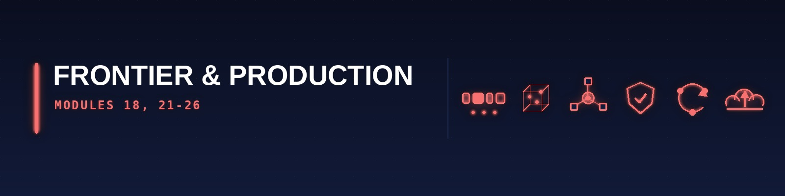

[🏠 Roadmap home](../README.md) · [📚 Curriculum index](README.md) · [← 🟪 Deep Learning (M15–M17)](5-deep-learning.md)

---

# 🔴 FRONTIER & PRODUCTION STRATUM — Modules 18, 21–26

> **Reading this page:** each module lists many resources — that is a menu, not a to-do list. Take **one** primary course; see the [Pick-One table](../guides/how-to-read-a-module.md#pick-one). Citations like *"Video 1 (05:05)"* are resolved in [sources](../guides/sources.md#citation-key).

---

## Module 18: Large Language Models, RLHF & Alignment

* **The Tutor's "Why":** This is the defining technology of 2026. IITM has a **dedicated course BSCS3004 on LLMs**; MIT 6.7960 Week 12 and 15 cover LLMs and RLHF explicitly; Harvard's AC215 covers MLOps for models. If you cannot build, fine-tune, and deploy an LLM in 2026, you are not employable as a senior data scientist.

* **Strict Prerequisites:** Modules 16 (transformers), 17 (PPO, DPO).

* **Exhaustive Topic List:**
  * **[IITM BSCS3004 — LLMs]**: Full dedicated course covering:
    * **Tokenisation** — BPE (Byte Pair Encoding), WordPiece, SentencePiece, Unigram LM, **tiktoken** (OpenAI), SuperBPE (2024).
    * **Pre-training** — causal LM, masked LM, prefix LM, next-token-prediction loss at scale.
    * **Architectures** — GPT family (GPT-2, GPT-3, GPT-4, GPT-4o, **GPT-5** 2025), Llama (1/2/3/4), Mistral, Gemma, Qwen, DeepSeek (R1 reasoning model 2025), Claude (Sonnet 4, Opus 4).
    * **Context-length extensions** — RoPE scaling, YaRN, Position Interpolation, LongRope, ring attention, infinite attention.
    * **Efficient attention** — FlashAttention v1/v2/v3, PagedAttention (vLLM), sliding-window, Mixture-of-Experts (MoE — Mixtral, DeepSeek-V3), State-Space Models (Mamba, Mamba-2, Jamba hybrid), linear attention (RWKV, Retentive Networks).
  * **[MIT 6.7960 Week 12 (2024) "Large Language Models" — Jacob Andreas guest lecture]**: **LLM basics**, **prompting**, **In-Context Learning** (zero-shot, few-shot, chain-of-thought — Wei 2022, tree-of-thought, graph-of-thought), **Chain-of-Thought reasoning** ("Let's think step by step", Kojima 2022), **Instruction tuning** (FLAN, T0, InstructGPT), **Self-Consistency**, **Self-Refine**, **Reflexion**.
  * **[MIT 6.7960 Week 15 / RLHF]**: **RLHF pipeline** — SFT → Reward Modelling → PPO; **Reward hacking** and mitigations; **DPO** (Direct Preference Optimisation, Rafailov 2023 — eliminates reward model); **IPO, KTO, ORPO, SimPO, GRPO** (2025); **Constitutional AI** (Anthropic); **RLAIF** (AI feedback); **multi-turn RLHF**.
  * **[MIT 6.3900 / 6.390 Lec_future]**: Frontier topics.
  * **PEFT — parameter-efficient fine-tuning**: **LoRA** (Hu 2021 — low-rank adaptation), **QLoRA** (Dettmers 2023 — 4-bit quantised), **DoRA** (Weight-Decomposed LoRA, 2024), **AdaLoRA**, **IA³**, **prompt tuning**, **prefix tuning**, **P-tuning v2**, **spectrum fine-tuning**.
  * **Quantisation & compression**: Post-training quantisation (PTQ — GPTQ, AWQ, **SmoothQuant**, **SqueezeLLM**), Quantisation-Aware Training (QAT), 1-bit LLMs (BitNet b1.58), pruning (magnitude, structured, Wanda, SparseGPT), knowledge distillation (TinyBERT, DistilLlama).
  * **Retrieval-Augmented Generation (RAG)**: Dense retrievers (DPR, ColBERT v2, BGE, E5, **Voyage-3** 2025), hybrid search (BM25 + dense), vector databases (**pgvector**, **Qdrant**, **Weaviate**, **Milvus**, **LanceDB** 2026), **GraphRAG** (Microsoft 2024), **Agentic RAG**, reranking (Cohere Rerank 3, **Jina Reranker v2**), **HyDE** (Hypothetical Document Embeddings).
  * **Agentic systems**: Tool use / function calling, **ReAct** (Reasoning + Acting), **MCP (Model Context Protocol)** — Anthropic 2024/2025 standard, multi-agent frameworks (**AutoGen** 0.4+, **CrewAI**, **LangGraph**, **OpenAI Swarm/Agents SDK** 2025, **Claude Code**).
  * **Alignment & Safety**: Red-teaming, jailbreaks (AutoDAN, GCG — Universal Transferable Suffixes), **mechanistic interpretability** (Anthropic, Transformer Circuits — induction heads, circuits, **Sparse Autoencoders** for superposition 2024), **activation steering**, **Representation Engineering** (RepE), scalable oversight (debate, recursive reward modelling, weak-to-strong generalisation).
  * **Evaluation**: MMLU, MMLU-Pro, GPQA, MATH, HumanEval, SWE-Bench, ARC-AGI (François Chollet), BIG-Bench Hard, Long-context (RULER, LongBench), **LMSys Arena** (ELO ratings), **Chatbot Arena Hard**, **LiveCodeBench**, **Aider Leaderboard**.
  * **Multi-modality**: Vision-Language Models (LLaVA, GPT-4V, Claude 3.5 Sonnet Vision, **Molmo** 2024, **Pixtral**), audio (Whisper v3, Voice-Mode, **Moshi**), video (Sora, Veo 2, **Runway Gen-3**, **Kling 2.0**).

* **2026 Resources:**
  * **Primary Course Link:** [**Stanford CS336 Spring 2026 “Language Modeling from Scratch”**](https://cs336.stanford.edu/) (Hashimoto · Liang, LIVE 30 Mar 2026 — 17 lectures + 5 assignments covering tokenizer → Transformer → Triton FlashAttention → parallelism → data pipelines → SFT → RLHF/DPO → RLVR) · [CS336 Spring 2025 archive](https://cs336.stanford.edu/spring2025/) + [YouTube playlist](https://www.youtube.com/playlist?list=PLoROMvodv4rOY23Y0BoGoBGgQ1zmU_MT_) · [IITM BSCS3004](https://onlinedegree.iitm.ac.in/) · [Princeton COS 597 G](https://princeton-nlp.github.io/cos597G/) · [**MIT 6.7960 Fall 2025 Week 8‑9, 11–13**](https://deeplearning6-7960.github.io/) (Foundation Model pre‑/post‑training, scaling laws, inference‑time algorithms) · [Hugging Face Agents Course](https://huggingface.co/learn/agents-course/) (free, certified) · [Hugging Face Smol Training Playbook](https://huggingface.co/spaces/HuggingFaceTB/smol-training-playbook) (200+ pages of real training secrets, Oct 2025).
  * **Required Reading (Latest 2026 Editions — verified April 2026):**
    * **_Build a Large Language Model (From Scratch)_** — Sebastian Raschka (Manning 2024) — **do this alongside CS336 Assignment 1**.
    * **_Hands‑On Large Language Models_** — Alammar & Grootendorst (O'Reilly Sep 2024, 428 pp., [HandsOnLLM repo](https://github.com/HandsOnLLM/Hands-On-Large-Language-Models)).
    * **_AI Engineering_** — Chip Huyen (O'Reilly Jan 2025) — the practical engineer's view.
    * **_Speech and Language Processing_ (3rd Edition draft — continually updated through 2026)** — Jurafsky & Martin — [free online](https://web.stanford.edu/~jurafsky/slp3/) (chapters 9‑11 for LLMs, chapter 14 for dialogue).
    * **_Transformers v5_ release notes** — Hugging Face blog ([huggingface.co/blog/transformers-v5](https://huggingface.co/blog/transformers-v5), Dec 2025).
    * **_MCP Specification — 2025‑06‑18 + Nov 2025 anniversary release_** — [modelcontextprotocol.io/specification](https://modelcontextprotocol.io/specification/2025-06-18).
    * Anthropic Transformer Circuits thread ([transformer-circuits.pub](https://transformer-circuits.pub/)) — mandatory for interpretability.
    * "A Survey of LLMs" (Zhao et al., 2023, updated 2025) — arXiv comprehensive survey.
  * **Practical Implementation:** **Hugging Face `transformers` v5.6+** (April 2026 PyPI), **`datasets` 3.x**, **`accelerate` 1.x**, **`peft` 0.19+** (LoRA/QLoRA/DoRA), **`trl` 1.2+** (SFT, DPO, GRPO, ORPO, KTO, SimPO), **`bitsandbytes` 0.44+**, **`vLLM` 0.19+** (production inference with continuous batching, paged attention, prefix caching), **`SGLang`** (2026 fastest), **`llama.cpp`** + GGUF (CPU inference), **Ollama** / **LM Studio** (local deployment), **LangGraph 1.1+** / **LlamaIndex 0.11+** / **DSPy 3.2+** (2026 prompting frameworks), **`smolagents` 1.24+** + **MCP SDK (Python/TypeScript)** (Anthropic's Nov 2025 standard — used by Claude Desktop, Cursor, VS Code, Zed), **Unsloth** (efficient fine‑tuning, 2× faster), **Marin** / **OLMo 2** / **SmolLM3** open training recipes.

* **🎯 Fine-Tuning Playbook:** Learn the operational trade-offs behind each parameter-efficient fine-tuning method.
  * **When to full-fine-tune vs LoRA vs QLoRA vs DoRA:** cost curves (VRAM, $, wall-clock), quality trade-offs; **LoRA** works for 90% of alignment tasks; **QLoRA** enables 65B on a single 48GB GPU; **DoRA** (Weight-Decomposed LoRA, 2024) closes the full-FT quality gap at LoRA cost.
  * **Frameworks:**
    * [**Unsloth**](https://github.com/unslothai/unsloth) ✅ — 2× faster, 60% less VRAM; drop-in for HF Trainer.
    * [**Axolotl**](https://github.com/axolotl-ai-cloud/axolotl) ✅ — YAML-configured, handles data-prep/packing/sequence-parallel out of the box; the community standard for reproducible open-source fine-tunes.
    * [**TRL**](https://github.com/huggingface/trl) ✅ 1.2+ — SFTTrainer, DPOTrainer, GRPOTrainer, RewardTrainer, ORPOTrainer.
    * [**PEFT**](https://github.com/huggingface/peft) ✅ 0.19+ — LoRA/QLoRA/DoRA/IA³/Prompt Tuning/Prefix Tuning APIs.
  * **Prompt Compilation & DSPy:** [**DSPy**](https://github.com/stanfordnlp/dspy) ✅ 3.2+ — programs-not-prompts, compile signatures with optimisers (BootstrapFewShotWithRandomSearch, MIPROv2, COPRO); [**TextGrad**](https://github.com/zou-group/textgrad) ✅ — differentiate through LLM calls with natural-language gradients.
  * **Inference Optimisation:** [**vLLM 0.19+**](https://docs.vllm.ai/) ✅ (continuous batching, PagedAttention, prefix caching, speculative decoding), [**SGLang**](https://github.com/sgl-project/sglang) ✅ (fastest for structured output and constrained decoding), [**TensorRT-LLM**](https://github.com/NVIDIA/TensorRT-LLM) ✅, **speculative decoding** (Medusa, EAGLE, self-speculation), **KV-cache tricks** (prefix caching, chunked prefill, multi-query/grouped-query attention).
  * **Lifecycle Evals (must-know frameworks):**
    * [**promptfoo**](https://github.com/promptfoo/promptfoo) ✅ — declarative YAML evals + CI integration.
    * [**DeepEval**](https://github.com/confident-ai/deepeval) ✅ — pytest-like LLM evals with G-Eval, faithfulness, hallucination metrics.
    * [**Ragas**](https://github.com/explodinggradients/ragas) ✅ — the de-facto RAG evaluation framework.
    * [**OpenAI Evals**](https://github.com/openai/evals) ✅ — Python + YAML spec, works with any endpoint.
    * [**lm-evaluation-harness (EleutherAI)**](https://github.com/EleutherAI/lm-evaluation-harness) ✅ — the canonical open-source harness (MMLU, GSM8K, HellaSwag, BBH, TruthfulQA, HumanEval).
    * [**HF Open LLM Leaderboard**](https://huggingface.co/open-llm-leaderboard) ✅ — the public scoreboard.

* **📦 Module Project (mandatory) — Fine-tune a small open model and prove it improved**
  * **Deliverable:** Take a small open-weights model, define a narrow task where you can measure quality, build a dataset for it, fine-tune with LoRA/QLoRA, and evaluate against three baselines: the base model zero-shot, the base model with a well-engineered prompt, and a RAG configuration over the same information. Report cost, latency, and quality for all four.
  * **Definition of done:** (1) A committed eval harness — a versioned eval set plus scoring code, runnable by one command; a `pytest` suite over the data-preparation and scoring functions; (2) `README.md` with the four-way comparison table, a training-loss curve, and your dataset card (size, provenance, licence, known gaps); (3) a results memo giving your recommendation and the conditions under which it would flip.
  * **Stretch:** Add a preference-tuning pass (DPO) on a small preference set and show whether it changed anything measurable — including whether it degraded a capability you did not intend to touch.
  * *This project is the empirical version of the [prompting vs RAG vs fine-tuning decision framework](#module-21). Video 1 (07:15) is explicit that being able to reason about that choice — with numbers — is what employers are testing for.*

---

## Module 21: RAG, Vector DBs & Retrieval Systems

* **The Tutor's "Why":** RAG is the single most-deployed LLM pattern in production (Oct 2025: >70% of enterprise LLM deployments per Menlo Ventures state-of-AI report). Getting chunking + retrieval + reranking right is often the difference between a demo and a product.

* **Strict Prerequisites:** Module 18 (LLMs, tokenisation), Module 11 (embeddings, cosine similarity, PCA/SVD for retrieval concepts), Module 8a (SQL — for metadata filtering and hybrid search).

* **Exhaustive Topic List:**
  * **Chunking strategies:** fixed-size, **recursive character splitters**, **semantic chunking** (embedding-based), **sentence-window retrieval**, **parent-document retrieval**, **auto-merging retrieval** (LlamaIndex), **late chunking** (Jina 2024 — embed whole doc, chunk embeddings post-hoc), **contextual retrieval** (Anthropic 2024 — LLM prepends context to each chunk before embedding).
  * **Embeddings:** **OpenAI text-embedding-3-large/small**, **Voyage-3-large** (2025 leader on MTEB), **BGE-M3** (BAAI, multilingual + multi-granularity), **Jina v3**, **Nomic Embed v2**, **Cohere Embed v4**, **NV-Embed** (NVIDIA). Learn **MTEB benchmark** (Massive Text Embedding Benchmark).
  * **Hybrid search:** **BM25** + dense (reciprocal rank fusion, RRF), **SPLADE** (sparse neural retrieval), **ColBERT v2 / ColPali** (late interaction — [ColBERT repo](https://github.com/stanford-futuredata/ColBERT) ✅).
  * **Rerankers:** **Cohere Rerank 3**, **BGE-Reranker v2**, **Jina Reranker v2**, **Voyage Rerank**, **Answer.ai RankZephyr / RankGPT**.
  * **Vector databases:** [**pgvector**](https://github.com/pgvector/pgvector) ✅ (Postgres extension, 2026 default for mixed workloads), [**Qdrant**](https://qdrant.tech/) ✅, [**Weaviate**](https://weaviate.io/) ✅, [**Milvus**](https://milvus.io/) ✅, [**LanceDB**](https://lancedb.com/) ✅ (embedded, Lance format), **Chroma**, **FAISS** (Meta, library — not a DB).
  * **Indexing & ANN algorithms:** **HNSW** (Hierarchical Navigable Small World), **IVF** (Inverted File with quantisation — IVF-PQ, IVF-SQ), **DiskANN**, **ScaNN** (Google), trade-offs (build time vs query latency vs recall@k).
  * **RAG patterns:** naive RAG, **Advanced RAG** (pre-retrieval query rewriting, HyDE, query decomposition, multi-query, step-back prompting), **GraphRAG** (Microsoft 2024 — community summaries, entity graphs), **Agentic RAG** (router + multi-tool), **Corrective RAG (CRAG)**, **Self-RAG**, **FLARE**.
  * **Evaluation:** **Ragas** metrics (faithfulness, answer relevance, context precision, context recall), **nDCG@k**, **MRR**, **recall@k**, **Needle-in-a-Haystack** for long context.

* **2026 Resources:**
  * **Primary Course Link:** [**Pinecone Learning Center**](https://www.pinecone.io/learn/) ✅ (comprehensive free RAG/vector primer) · [**LlamaIndex docs**](https://docs.llamaindex.ai/) ✅ (practical cookbook-driven) · [**LangChain RAG tutorial**](https://python.langchain.com/docs/tutorials/rag/) · [DeepLearning.AI short courses — "Advanced Retrieval for AI" & "Building and Evaluating Advanced RAG"](https://www.deeplearning.ai/).
  * **Required Reading:**
    * Lewis et al. 2020 ("Retrieval-Augmented Generation for Knowledge-Intensive NLP Tasks") — the original RAG paper.
    * Anthropic (Sep 2024) "Introducing Contextual Retrieval" — the 2024 enterprise-grade baseline.
    * Microsoft GraphRAG paper (2024).
    * [BGE / FlagEmbedding docs](https://github.com/FlagOpen/FlagEmbedding) — embeddings best practices.
  * **Practical Implementation:** **LlamaIndex 0.11+**, **LangChain 0.3+**, **Haystack 2.x** (deepset), **DSPy 3.2+** (retrieval modules), **pgvector + Postgres 17**, **Qdrant-client 1.17+**, **Ragas**.

* **⚖️ The decision framework: prompting vs RAG vs fine-tuning (learn this before you build anything)**

  This is the single most-asked design question in an AI-Engineer interview, and the most common way real projects waste money. The failure mode is almost always the same: reaching for fine-tuning when the actual problem was retrieval, or reaching for RAG when a better prompt would have done it. Work down this ladder in order and stop at the first rung that meets your quality bar.

  | Rung | Technique | Fixes | Does **not** fix | Cost / latency | Reach for it when |
  | :-- | :--- | :--- | :--- | :--- | :--- |
  | **1** | **Zero-shot prompting** | Nothing yet — this is your baseline and you are not allowed to skip it | Anything | Cheapest; one call | Always first. You cannot claim an improvement without it. |
  | **2** | **Few-shot / structured prompting** (examples, output schema, chain-of-thought, [DSPy](https://github.com/stanfordnlp/dspy) ✅ optimisers) | Format compliance, task ambiguity, reasoning-depth failures | Missing knowledge; stale facts | Cheap; larger prompt = more tokens | The model *could* know the answer but is answering the wrong question or in the wrong shape. |
  | **3** | **RAG / retrieval** (this module) | **Missing, private, or changing knowledge**; provenance and citation requirements; per-user or per-tenant data | Style, tone, output format, latent skill, deep domain reasoning | Moderate; +retrieval latency, +index cost | The failure is *"it does not know this"* — and especially when the knowledge changes faster than you could retrain. |
  | **4** | **Fine-tuning** (SFT / LoRA — [M18](#module-18)) | **Style, tone, consistent output format, domain-specific behaviour**, latency and cost via a smaller model, skills that do not fit in a prompt | Facts. A fine-tuned model still hallucinates about things it was not taught, and your training set is stale the day you freeze it | Highest up-front; cheapest per token afterwards | The failure is *"it knows this but behaves wrong"*, or you need a small model to do one narrow job cheaply. |
  | **5** | **RAG + fine-tuning together** | Both classes of failure | Bad data or an undefined eval | Highest total | You have measured both failure modes and have the eval suite to prove each component earns its keep. |

  * **The rule that makes this framework operational:** you cannot choose a rung without an **eval set**. Build the eval set first — 50–200 real queries with acceptable answers — then climb. Anyone who fine-tunes before they can measure has bought an unfalsifiable improvement. The [M18 module project](#module-18) makes you run this comparison empirically, with cost and latency columns.
  * **The default answer in 2026 is rung 3.** RAG is cheaper, updates instantly, gives citations, and keeps private data out of weights. Fine-tuning is the specialist tool, not the prestige tool.
  * **Two common misdiagnoses:** (a) *"the model hallucinates, so we will fine-tune"* — hallucination from missing knowledge is a retrieval problem, and fine-tuning usually makes it worse by teaching confident wrongness; (b) *"our RAG returns irrelevant chunks, so we need a better model"* — that is a chunking, embedding, or reranking problem, all of which live in this module and none of which are fixed by a bigger LLM.
  * **Also on the ladder, and frequently forgotten:** longer context windows, tool use / function calling ([M22](#module-22)), and simply routing to a stronger model. Each is cheaper than fine-tuning and should be priced before it.
  * **Sources:** video 1 (07:15) names *"knowing when to use RAG versus fine-tuning"* as a distinguishing skill employers probe for; video 3 (05:52) frames the whole AI-Engineer role as composing prompting, RAG, fine-tuning, and agents over models you did not train. Chip Huyen's [*AI Engineering*](../resources/books.md#practitioner-shelf) is the long-form treatment.

* **📋 Mandatory mini-projects:**
  1. **Build a RAG over your own PDFs** — chunking → pgvector → BGE reranker → answer-with-citations; measure Ragas faithfulness & context precision.
  2. **Hybrid search A/B** — BM25-only vs dense-only vs hybrid-with-RRF; measure nDCG@10 on a labelled query set.
  3. **GraphRAG on a technical corpus** — run Microsoft GraphRAG, inspect community summaries, compare against vanilla RAG on multi-hop questions.

---

## Module 22: Agentic AI — LangGraph, CrewAI, MCP & A2A

* **The Tutor's "Why":** 2025 was the "year of the agent" and 2026 is the year of *reliable* agents. Every 2026 senior AI-engineer interview covers LangGraph + MCP + SWE-bench. HuggingFace launched a certified free [Agents Course](https://huggingface.co/learn/agents-course/) specifically to teach this. Closes Gap #4 of the benchmark PDF.

* **Strict Prerequisites:** Module 18 (LLMs, tool-use, function calling), Module 21 (retrieval).

* **Exhaustive Topic List:**
  * **Agent architectures:** ReAct (Reasoning + Acting), **Reflexion** (self-reflection), **Plan-and-Solve**, **Chain-of-Thought with tools**, **Tree-of-Thoughts**, **Graph-of-Thoughts**, **LATS** (Language Agent Tree Search).
  * **Frameworks (open-source):**
    * [**LangGraph**](https://www.langchain.com/langgraph) ✅ 1.1+ — stateful, cyclic, multi-agent graphs; the 2026 production default.
    * [**CrewAI**](https://docs.crewai.com/) ✅ — role-based multi-agent orchestration.
    * [**smolagents**](https://github.com/huggingface/smolagents) ✅ 1.24+ (Hugging Face) — code-agents that write Python to act; ~1000 LOC.
    * **AutoGen** 0.4+ (Microsoft), **OpenAI Agents SDK** (formerly Swarm, 2025), **Anthropic Claude Agent SDK** (2025).
  * **Model Context Protocol (MCP)** — Anthropic-led open standard (Nov 2024) for LLMs to access tools, resources, and prompts across applications.
    * Base spec: [modelcontextprotocol.io](https://modelcontextprotocol.io/) ✅
    * Spec revisions: [**2025-06-18 spec**](https://modelcontextprotocol.io/specification/2025-06-18) ✅ (structured tool output, resource-based OAuth), **Nov 2025 anniversary release** (code-execution-with-MCP pattern).
    * Implementations: `@modelcontextprotocol/sdk` (Python + TypeScript), [**mcp-servers**](https://github.com/modelcontextprotocol/servers) reference implementations (Filesystem, GitHub, Postgres, Slack, Browser, Google Drive, Sentry). Used in production by Claude Desktop, Cursor, VS Code, Zed, Replit, Sourcegraph Cody, Windsurf.
  * **Agent-to-Agent (A2A) Protocol** — Google's Apr 2025 open standard for cross-platform agent interop (complements MCP: MCP = tool-layer, A2A = agent-layer).
  * **Tooling & Sandboxing:** [**E2B**](https://e2b.dev/) ✅ (cloud sandboxes for code-execution agents), [**Daytona**](https://www.daytona.io/) ✅, [**Modal**](https://modal.com/) ✅ (serverless GPU sandboxes).
  * **Evaluation benchmarks:**
    * [**GAIA**](https://huggingface.co/gaia-benchmark) ✅ — Meta/HF general AI-assistant benchmark (3 levels).
    * [**SWE-bench**](https://www.swebench.com/) ✅ — resolve real GitHub issues; SWE-bench Verified (2024), SWE-bench Multimodal (2025).
    * **τ-bench** (tau-bench, Sierra 2024) — tool-use in realistic customer-service scenarios.
    * **WebArena**, **VisualWebArena** — browser-based agent eval.
    * **BrowseComp** (OpenAI 2025) — hard web-research eval.
  * **Patterns from Anthropic's ["Building Effective Agents"](https://www.anthropic.com/research/building-effective-agents) ✅ (Dec 2024):** workflows (Prompt Chaining, Routing, Parallelization, Orchestrator-Workers, Evaluator-Optimizer) vs true agents (loops with tools). **"Start with prompts, graduate to workflows, only use full agents when you need them."**
  * **🔓 Agent security — prompt injection as a first-class engineering concern:** An agent with tools is an agent with a blast radius. The moment your system reads untrusted text (a web page, an email, a PDF, a user upload, another agent's output) and can then *act*, prompt injection stops being a curiosity and becomes your primary threat model.
    * **Direct prompt injection** — the user tries to override your system prompt ("ignore previous instructions"). Annoying, usually low-impact, easy to demo.
    * **Indirect prompt injection** — the payload is hidden in *content the agent retrieves*, not in what the user typed: a hostile instruction in a web page, a document, a code comment, an issue description, or a tool's response. This is the serious one, because the attacker never has to talk to your system directly. It is also the failure mode that RAG ([M21](#module-21)) and browsing agents structurally invite.
    * **What injection escalates into:** data exfiltration (the agent is told to append secrets to an image URL it fetches), unauthorised tool calls, destructive actions, and **confused-deputy** problems where the agent's credentials are more privileged than the requester's.
    * **Defences, honestly rated — none of them is a solution, and prompt-level mitigation is the weakest layer:**
      * **Least privilege on tools.** Read-only by default; scope credentials per-task; separate the agent that reads untrusted content from the agent that holds write access. This is the only defence with real leverage.
      * **Human-in-the-loop confirmation** for irreversible or privileged actions.
      * **Sandboxed execution** for anything code-shaped (E2B / Daytona / Modal / Firecracker / gVisor, above).
      * **Egress control** — allow-list the domains an agent may fetch or post to; this is what actually stops URL-based exfiltration.
      * **Content/tool-output isolation** — mark retrieved text as data, never as instructions; strip or neutralise instruction-shaped content; do not let tool output flow straight into the system-prompt position.
      * **Input/output guardrails** — [NeMo Guardrails](https://github.com/NVIDIA/NeMo-Guardrails) ✅, [Guardrails AI](https://www.guardrailsai.com/) ✅, [Llama Guard / PurpleLlama](https://github.com/meta-llama/PurpleLlama) ✅, Rebuff, Lakera Guard. Treat these as filters that raise cost for an attacker, not as boundaries.
    * **The stance to hold:** prompt injection is **not solved**, and any vendor claiming otherwise is wrong. Design so that a successful injection is survivable — that is an architecture decision, not a prompt-engineering one. Red-teaming technique and jailbreak taxonomy live in [M23](#module-23); the OWASP Top 10 for LLM Applications is the reference checklist.
  * **📊 Agent eval pipelines — treat evaluation as the deliverable, not the afterthought:** The benchmarks above (GAIA, SWE-bench, τ-bench, WebArena) tell you where the field is; they do not tell you whether *your* agent regressed this morning. You need your own harness.
    * **Trajectory evaluation, not just final-answer accuracy.** Score the steps: did it pick the right tool, with the right arguments, in a sensible order, and did it stop? An agent that reaches the right answer through six wrong tool calls is a latency and cost incident waiting to happen.
    * **Layered metrics:** task success rate · **pass@k** (agents are stochastic — a single run is not a measurement) · steps and tokens per task · **cost per successful task** (the number that actually gets budget approved) · wall-clock latency · tool-error and retry rate · termination behaviour (does it loop forever?).
    * **LLM-as-judge, used with discipline:** cheap and scalable, but biased toward verbose and self-similar answers. Calibrate it against a human-labelled subset, report the agreement rate, and never let an unvalidated judge gate a release.
    * **Run evals as CI.** A frozen eval set + a scored run on every prompt, model, or tool change — this is the agentic equivalent of a test suite, and it is what makes a portfolio project read as production work. Tooling: [DeepEval](https://github.com/confident-ai/deepeval) ✅ (pytest-like), **promptfoo**, [Ragas](https://github.com/explodinggradients/ragas) ✅ for the retrieval leg, [Arize Phoenix](https://github.com/Arize-ai/phoenix) ✅ / [LangSmith](https://www.langchain.com/langsmith) ✅ / W&B Weave for traces (cross-ref [M24](#module-24) AgentOps).
    * **Why this is emphasised:** **6 of the 7 AI-Engineer / Forward-Deployed postings [we surveyed](../guides/career-operations.md#skills-checklist) name evaluation explicitly** — more than RAG, agents, or fine-tuning individually. Building the demo is table stakes; proving it works is the job.

* **2026 Resources:**
  * **Primary Course (free, certified):** [**Hugging Face AI Agents Course**](https://huggingface.co/learn/agents-course/) ✅ — free, certified, uses smolagents + LangGraph + LlamaIndex; covers MCP integration.
  * **Berkeley LLM Agents MOOC:** [**llmagents-learning.org**](https://llmagents-learning.org/) ✅ (Fall 2024, Advanced Spring 2025) — with speakers including Denny Zhou, Graham Neubig, Jason Weston.
  * **Primary articles:**
    * [Anthropic — Building Effective Agents](https://www.anthropic.com/research/building-effective-agents) ✅
    * [OpenAI Cookbook — Agents](https://cookbook.openai.com/topic/agents)
    * [LangChain — "In the Loop" agent series](https://blog.langchain.dev/)
  * **Practical Implementation:** **LangGraph 1.1+**, **CrewAI**, **smolagents 1.24+**, **MCP Python SDK** (`pip install mcp`), **E2B / Modal / Daytona** for sandboxing, **Arize Phoenix / LangSmith / W&B Weave** for tracing (cross-ref to M24).

* **📋 Mandatory mini-projects:**
  1. **Build an MCP server** that exposes a small SQL database; connect it to Claude Desktop or Cursor and run ~10 queries.
  2. **LangGraph multi-agent** researcher that does planning → parallel web-search → synthesis → citation-checking; trace with LangSmith.
  3. **SWE-bench-Lite subset:** run a minimal agent on 5 SWE-bench instances and measure pass@1 vs pass@10.

---

## Module 23: AI Safety, Alignment, Interpretability, Evals & Policy

* **The Tutor's "Why":** No serious 2026 AI/ML role is hired without alignment and safety literacy. MIT AI Safety Forum + Berkeley MIDS + [AISF Alignment Fundamentals](https://aisafetyfundamentals.com/alignment/) ✅ all cover this. Closes Gaps #6, #12, and #13 of the benchmark PDF.

* **Strict Prerequisites:** Module 18 (LLMs, RLHF), Module 22 (agents).

* **Exhaustive Topic List:**
  * **Alignment problem framing:** outer vs inner alignment, specification gaming, reward hacking (Krakovna et al. 2020 taxonomy), mesa-optimisation, goal misgeneralisation (Langosco et al. 2022), deceptive alignment, sycophancy (Sharma et al. Anthropic 2024).
  * **RLHF pathologies & mitigations:** reward-model overoptimisation (Gao et al. 2023 scaling laws for reward hacking), length bias, sycophancy, mode collapse; **Constitutional AI** (Bai 2022), **RLAIF**, **weak-to-strong generalisation** (OpenAI 2023), **scalable oversight** (debate — Irving 2018, recursive reward modelling — Leike 2018, prover-verifier games).
  * **Mechanistic Interpretability:** [**Transformer Circuits thread**](https://transformer-circuits.pub/) ✅ (Anthropic). Core concepts: **features, circuits, motifs**, **induction heads** (Olsson et al. 2022), **superposition** (many features in few neurons), **polysemanticity**, **Sparse Autoencoders (SAEs)** as the 2024-2026 workhorse for recovering monosemantic features — see [**Scaling Monosemanticity** (Templeton et al. 2024)](https://transformer-circuits.pub/2024/scaling-monosemanticity/) ✅ and [**Golden Gate Claude**](https://www.anthropic.com/news/golden-gate-claude) ✅. Extensions: **Crosscoders**, **Transcoders**, **attribution patching**, **path patching**, **activation patching**.
  * **Activation/Representation Engineering:** RepE (Zou et al. 2023), steering vectors, contrastive activation addition (CAA), honesty probes.
  * **Eval harnesses (beyond basic LLM evals):**
    * [**OpenAI evals**](https://github.com/openai/evals) ✅
    * [**lm-evaluation-harness** (EleutherAI)](https://github.com/EleutherAI/lm-evaluation-harness) ✅
    * [**Inspect** (UK AISI)](https://inspect.ai-safety-institute.org.uk/) — dedicated safety-eval framework.
    * [**HF Open LLM Leaderboard**](https://huggingface.co/open-llm-leaderboard) ✅
    * [**METR evals**](https://metr.org/) — task-duration-based capability evals.
    * Dangerous-capability evals: cyber (Cybench), CBRN, persuasion, agentic autonomy.
  * **Jailbreaks & red-teaming:** GCG (Universal adversarial suffixes, Zou 2023), AutoDAN, PAIR, Crescendo, many-shot jailbreaking (Anthropic 2024), prompt-injection at tool layer.
  * **AI Safety Policy & Regulation (2026):**
    * [**EU AI Act**](https://artificialintelligenceact.eu/) ✅ (fully in force 2 Aug 2026 for GPAI, risk categories, transparency, copyright, datasheets).
    * [**NIST AI RMF 1.0 + GenAI Profile**](https://www.nist.gov/itl/ai-risk-management-framework) ✅ (Jul 2024).
    * [**AI.gov**](https://ai.gov/) ✅ (US federal portal), US Executive Orders 2023/2025, UK AISI, Singapore AI Verify.
    * **ISO/IEC 42001:2023** (AI management system), **ISO 23894** (AI risk), **ISO 42005** (AI impact assessment).
    * **Model cards** (Mitchell et al. 2019), **datasheets for datasets** (Gebru et al. 2021), **system cards** (OpenAI/Anthropic style), **responsible scaling policies** (Anthropic RSP v2.1, OpenAI Preparedness Framework, Google DeepMind Frontier Safety Framework).
  * **Ethics foundations:** dual-use research, **differential privacy** (re-iterated from M24), fairness (DP/EO/Calibration trade-offs, impossibility result — Chouldechova 2017), FAT/FAccT community.

* **2026 Resources:**
  * **Primary Course (free):** [**AI Safety Fundamentals — Alignment Track**](https://aisafetyfundamentals.com/alignment/) ✅ (Bluedot Impact, 12-week curriculum, free facilitated cohorts 3×/year).
  * **Supplementary:** [AISF Governance Track](https://aisafetyfundamentals.com/governance/), [ARENA ML alignment curriculum](https://www.arena.education/), [Neel Nanda — MI study guide](https://www.neelnanda.io/mechanistic-interpretability/getting-started), [**EleutherAI Cookbook**](https://github.com/EleutherAI/cookbook) ✅.
  * **Required Reading:**
    * Amodei et al. 2016 "Concrete Problems in AI Safety" — the canonical problem enumeration.
    * Olah et al. — [Transformer Circuits thread](https://transformer-circuits.pub/) ✅.
    * Hubinger et al. 2019 "Risks from Learned Optimization" (mesa-optimisation).
    * Russell — *Human Compatible* (2019).
    * Christian — *The Alignment Problem* (2020).
    * [Anthropic "Core Views on AI Safety"](https://www.anthropic.com/news/core-views-on-ai-safety) (2023).
  * **Practical Implementation:** **TransformerLens** (Neel Nanda) for mech-interp, **SAELens** for Sparse Autoencoders, **`garak`** (red-teaming LLM scanner), **`pyrit`** (Microsoft AI red-team toolkit), **inspect-ai** (UK AISI evals), **promptfoo / DeepEval** (cross-ref M18).

* **📋 Mandatory mini-projects:**
  1. **Reproduce an induction head** on a 2-layer attention-only toy transformer (from the Transformer Circuits thread).
  2. **Train an SAE** on GPT-2 small activations at one layer; find and label 5 monosemantic features.
  3. **Red-team an open model** using `garak` or hand-crafted GCG suffixes; write a 2-page eval report with model card.
  4. **Draft an EU-AI-Act-compliant model card** for a hypothetical general-purpose AI model.

---

## Module 24: MLOps + LLMOps + AgentOps

* **The Tutor's "Why":** A Jupyter notebook is not a product. The 2026 data scientist must understand the entire lifecycle across three operational tiers: **(1) MLOps** for classical models, **(2) LLMOps** for prompt- and model-driven systems, and **(3) AgentOps** for the new class of stateful, tool-using agents from M22. Harvard's AC215 (new 2024) covers the first tier in depth; the other two are 2024-2026 standards, not yet in any university course.

* **Strict Prerequisites:** Any model from Modules 9-18.

* **Exhaustive Topic List:**
  * **[Harvard AC215 "Advanced Practical Data Science"]**: Containers (Docker, Docker Compose), container orchestration (Kubernetes, KubeFlow, Ray), **data pipelines** (Apache Airflow, Dagster 1.x, Prefect 3.x), **model registries**, **feature stores** (Feast, Tecton), API serving (FastAPI, BentoML, Ray Serve, Modal, Replicate), **A/B testing** (multi-armed bandit deployment, shadow deployment, canary, blue-green), **model monitoring** (data drift — KS test, PSI, JS divergence; concept drift; prediction drift), **observability** (OpenTelemetry, Weights & Biases, Arize, WhyLabs, Evidently).
  * **[IITM BSCS2003 — Modern Application Development I]**: Flask, Vue.js, REST APIs, OAuth, JWT, WebSockets, deployment to Heroku/Vercel/Fly.io.
  * **[IITM BSSE2001/BSSE2002 — Software Engineering & Testing]**: SDLC, agile, scrum, unit/integration/system testing, TDD, BDD, code review, pair programming, version control workflows (git-flow, trunk-based, GitHub Flow), CI/CD (GitHub Actions, GitLab CI, Jenkins).
  * **Experiment tracking & reproducibility**: Weights & Biases, MLflow 2.x, Neptune.ai, DVC (Data Version Control), Hydra for config, Pydantic 2.x for validation.
  * **GPU clusters & distributed training** (see **Stanford CS336 Lec 7–8 “Parallelism”**): Data parallelism (PyTorch DDP, **FSDP2**), tensor parallelism (Megatron‑LM), pipeline parallelism (GPipe, PipeDream), **3D parallelism**, ZeRO (DeepSpeed 1/2/3), **context parallelism** (Ring Attention), communication primitives (AllReduce, NCCL), gradient checkpointing, gradient accumulation, mixed precision (fp16, bf16, **fp8** — H100/H200/B200), **NVIDIA Blackwell (B200)** training (since PyTorch 2.7, April 2025).
  * **Inference optimisation**: TensorRT-LLM, vLLM continuous batching, speculative decoding, **prefix caching**, **chunked prefill**, INT8/INT4 quantisation at inference, KV-cache management.
  * **Responsible AI & governance**:
    * **Fairness metrics** — demographic parity, equalised odds, equal opportunity, calibration within groups; Aequitas, Fairlearn, AIF360.
    * **Explainability** — SHAP, LIME, Captum (for PyTorch), TCAV, counterfactuals (DiCE).
    * **Privacy** — **Differential Privacy** (Dwork 2006 formal definition, ε-δ-DP, Laplace and Gaussian mechanisms, composition theorems, moments accountant, DP-SGD — Abadi 2016), **Federated Learning** (FedAvg, FedProx, personalised FL), **Secure Multi-Party Computation** (SMPC), **Homomorphic Encryption** preview.
    * **Security** — adversarial attacks (M15), **prompt injection**, **data poisoning**, **model stealing / extraction**, **membership inference attacks**.
    * **Regulation (2026)** — **EU AI Act** (fully in force 2 Aug 2026 for GPAI obligations; risk categories, transparency duties, copyright and datasheet requirements), GDPR Art 22 (right to explanation), **ISO/IEC 42001:2023** (AI management), **NIST AI Risk Management Framework 1.0 + GenAI Profile (Jul 2024)**, **UK AI Safety Institute / AISI Inspect** evaluation framework, **US Executive Order on AI** (Biden 2023; Trump admin 2025 rollback + new E.O. on AI competitiveness).
  * **Agents and tool/data plumbing (2026)** — **Model Context Protocol (MCP)** — Anthropic‑led open standard for LLM↔tool/data servers; **2025‑06‑18 spec revision** + **Nov 2025 anniversary release** add structured tool output, resource‑based OAuth auth, code‑execution‑with‑MCP design pattern. Used in production by Claude Desktop, Cursor, VS Code, Zed, Replit, Sourcegraph Cody. Core ecosystem: **`@modelcontextprotocol/sdk`** (Python + TypeScript), `mcp-servers/*` (reference implementations for Filesystem, GitHub, Postgres, Slack, Browser).
  * **[Harvard CS109A · Lec 13 "Ethics"]**: Formal ethics module — fairness, accountability, transparency (FAT/FAccT), **dual-use research**, embedded ethics (Harvard Embedded EthiCS).
  * **[Harvard CS 1810 "Philosophy"]**: "With great power comes great responsibility" — mandatory embedded-ethics lecture.

* **2026 Resources:**
  * **Primary Course Link:** [Harvard AC215 2024](https://harvard-iacs.github.io/2024-AC215/) · [Made With ML](https://madewithml.com/) · [Full Stack Deep Learning](https://fullstackdeeplearning.com/) · [**Hugging Face Agents Course**](https://huggingface.co/learn/agents-course/) (MCP + smolagents, free) · [**MCP docs**](https://modelcontextprotocol.io/) (Nov 2025 spec).
  * **Required Reading (Latest 2026 Editions — verified April 2026):**
    * _Designing Machine Learning Systems_ — Chip Huyen (O'Reilly 2022, still canonical).
    * **_AI Engineering_** — Chip Huyen (O'Reilly **Jan 2025**) — the 2026 successor.
    * _Machine Learning Engineering_ — Andriy Burkov.
    * _Algorithms of Oppression_ — Safiya Umoja Noble.
    * _Weapons of Math Destruction_ — Cathy O'Neil.
    * **EU AI Act consolidated text** (Regulation (EU) 2024/1689) — Annexes III–IV for high‑risk systems.
    * **NIST AI RMF 1.0 + GenAI Profile** ([nist.gov/itl/ai-risk-management-framework](https://www.nist.gov/itl/ai-risk-management-framework)).
  * **Practical Implementation (MLOps tier):** **Docker 27+** / **Podman 5+**, **Kubernetes 1.32+**, **Terraform 1.9+**, **Pulumi** (modern alternative), **AWS/GCP/Azure SDKs**, **Ray 2.x** (Ray Tune, Ray Serve, Ray Data, RLlib), **vLLM**, **SGLang**, **BentoML**, **SkyPilot** (multi‑cloud), **Modal** (serverless GPU, $30/mo free tier, Stanford CS336 sponsor), **RunPod** / **Lambda** / **Nebius** (B200 access from ~$5/h), **Fairlearn 0.11+**, **AIF360**, **Opacus** (DP for PyTorch), **Flower** (federated learning), **MCP SDK** (Python + TypeScript, `pip install mcp`), **LangFuse** / **Arize Phoenix** (LLM observability), **Weights & Biases Weave** (LLM tracing), **Evidently 0.4+** (drift monitoring).

* **🤖 LLMOps Tier:** Operational practices specific to prompt-driven and LLM-driven systems.
  * **Prompt versioning & CI:** [**Langfuse**](https://langfuse.com/) ✅ (open-source, self-hostable), [**PromptLayer**](https://promptlayer.com/) ✅, [**Helicone**](https://www.helicone.ai/) ✅ (gateway + observability).
  * **Token & cost monitoring:** per-user, per-feature, per-model budgeting; rate-limit backpressure; fallback routing (GPT-4 → Claude → Llama 3); **LiteLLM** proxy, **OpenRouter**, **Portkey**.
  * **Guardrails:** [**NeMo Guardrails** (NVIDIA)](https://github.com/NVIDIA/NeMo-Guardrails) ✅, [**Guardrails AI**](https://www.guardrailsai.com/) ✅, [**Llama Guard / PurpleLlama**](https://github.com/meta-llama/PurpleLlama) ✅ (Meta), **Rebuff** (prompt-injection detection), **Lakera Guard**.
  * **LLM observability & tracing:** [**OpenTelemetry GenAI semantic conventions**](https://opentelemetry.io/docs/specs/semconv/gen-ai/) ✅ (the 2025-2026 standard), **Langfuse traces**, **Honeycomb for AI**, cost & latency dashboards.
  * **Evals in production:** reuse **promptfoo**, **DeepEval**, **Ragas** (M18); **A/B test prompts** as you would models.

* **🤖 AgentOps Tier:** Operational practices for stateful, tool-using agents (from M22).
  * **Agent tracing & debugging:** [**LangSmith**](https://www.langchain.com/langsmith) ✅, [**Arize Phoenix**](https://github.com/Arize-ai/phoenix) ✅ (open-source OTel-native), [**W&B Weave**](https://wandb.ai/site/weave) ✅, **Helicone Agents**, **Comet Opik**.
  * **Agent eval harnesses (production):** [**GAIA**](https://huggingface.co/gaia-benchmark) ✅, [**SWE-bench**](https://www.swebench.com/) ✅, **τ-bench**, **WebArena** — run these as regression tests.
  * **Sandboxing & isolation:** [**E2B**](https://e2b.dev/) ✅, [**Daytona**](https://www.daytona.io/) ✅, [**Modal**](https://modal.com/) ✅, Firecracker microVMs, gVisor.
  * **Key primary anchors for all three tiers:** [**Full Stack Deep Learning**](https://fullstackdeeplearning.com/) ✅, [**Made With ML** (Goku Mohandas)](https://madewithml.com/) ✅, [**Chip Huyen — *AI Engineering***](https://www.oreilly.com/library/view/ai-engineering/9781098166298/) ✅.

* **🏁 Minimum Production Bar for Portfolio Projects**

  Every [module project](README.md#module-projects) accumulates one production element via its stretch goal. This is the full list they accumulate *toward*. At least **one** project in your portfolio must satisfy every line below — that project is what separates a hireable repository from a bootcamp repository. The [M24 module project](#module-24) exists specifically to get you there.

  | # | Requirement | Passes when | Fails when |
  | :-- | :--- | :--- | :--- |
  | **1** | **Repository structure, not a loose notebook** | A real package (`src/` or `pkg/`, `__init__.py`, `pyproject.toml`), importable modules, an entry point, and pinned dependencies via `uv` or a lockfile. Notebooks exist only for exploration and are clearly marked as such. | The project *is* `analysis_final_v3.ipynb`. |
  | **2** | **Automated tests** | A `pytest` suite that runs in one command and covers the data layer, the transform logic, and at least one end-to-end path. Numerical code has a tolerance-based assertion; ML code has an overfit-a-tiny-batch smoke test. | "It works when I run it." |
  | **3** | **Typed Python** | Type hints on public functions, checked by `mypy` or `pyright` in CI. Pydantic v2 models for anything crossing a boundary (API request, config file, external payload). | Untyped `dict` passed between six functions. |
  | **4** | **Structured logging** | The `logging` module (or `structlog`) with levels, correlation/request IDs, and no secrets. You can reconstruct what happened from logs alone. | `print()` statements, or silence. |
  | **5** | **Configuration outside code** | Environment variables and/or a config file validated on startup (Hydra + Pydantic Settings). Secrets never committed — `.env` is gitignored and `.env.example` is not. | Hardcoded API key, hardcoded paths. |
  | **6** | **Containerised** | A `Dockerfile` that builds from a clean clone and runs. Pinned base image, non-root user, sensible layer caching, `.dockerignore`. | "Install these 14 things first." |
  | **7** | **CI pipeline** | A GitHub Actions workflow running lint (`ruff`) + typecheck + tests on every push and PR, with a green badge in the README. | Manual testing. |
  | **8** | **Experiment tracking** | Runs logged to **MLflow** or **Weights & Biases**: parameters, metrics, artefacts, git SHA. Your reported best result is reproducible from the tracked run. | Best score remembered from a terminal you have since closed. |
  | **9** | **Deployed and reachable** | A live URL. Streamlit Community Cloud, Hugging Face Spaces, Modal, Fly.io, Railway, or Cloud Run — free tiers are entirely acceptable. Include the URL at the top of the README. | Runs on your laptop only. |
  | **10** | **Monitoring** | Health check, request/latency/error metrics, and **one thing that would actually alert you**: input-distribution drift (Evidently), a quality metric, or a cost ceiling. For LLM systems, traces via Langfuse / Phoenix / LangSmith. | Deployed and never looked at again. |
  | **11** | **README a stranger can execute** | What it does · why · architecture diagram · quickstart that works from a clean clone · **results with numbers** · known limitations. | "Data science project." |
  | **12** | **Results memo** | ≤2 pages: the question, what you did, what you found, what you are uncertain about, what you would do next. This is the most-skipped and most-senior-reading artefact in the entire list. | No written interpretation of the numbers. |

  * **Reproducibility check (do this, it is brutal and it is fast):** clone your own repo into a fresh directory on a machine with nothing installed, follow only your README, and time yourself to first working output. If you cannot get there in 10 minutes, item 11 has failed regardless of what the file says.
  * **Do not apply this to all twelve projects.** Applying the full bar once, deeply, beats applying it partially twelve times — and a partially-productionised project is indistinguishable from an unproductionised one. Get **one** project to all twelve lines; keep the rest at their stretch-goal level.
  * **Then ship it anyway.** The bar is the target, not a gate on publishing. Push the repository at line 1 and work up in public — **a messy project on the internet beats a perfect project on your laptop**, and an in-progress repo with an honest "what's missing" section in the README is a stronger signal than a private perfect one.
  * **Sources:** video 1 (10:45–12:30) specifies the portfolio architecture standard — Docker, cloud deployment, CI/CD, MLflow or W&B, and monitoring — as the differentiator employers actually notice. Catherine Nelson's [*Software Engineering for Data Scientists*](../resources/books.md#practitioner-shelf) is the book-length treatment of items 1–5; [*AI Engineering*](../resources/books.md#practitioner-shelf) covers 9–10 for foundation-model systems.

* **📦 Module Project (mandatory) — Productionise one earlier project**
  * **Deliverable:** Do not build something new. Take the single best project you have already shipped — the churn dashboard from [M10](3-classical-ml.md#module-10), the RAG system from [M21](#module-21), or the agent from [M22](#module-22) — and bring it to the full [Minimum Production Bar](#production-bar): package layout, tests, typed Python, structured logging, Dockerfile, CI pipeline, experiment tracking, a deployment target, and monitoring that would actually page you.
  * **Definition of done:** (1) Every line of the [Minimum Production Bar](#production-bar) checklist ticked, with the CI badge green and the deployment URL live; (2) `README.md` containing an architecture diagram, the runbook (how to deploy, how to roll back, what to do when the model degrades), and the cost per 1,000 requests; (3) a results memo — an incident write-up of one failure you deliberately induced (kill the vector DB, exhaust the rate limit, feed drifted input) and what your monitoring actually showed you.
  * **Stretch:** Add a canary or shadow deployment and an automated rollback triggered by your own quality metric.
  * *Rationale: video 1 (10:45–12:30) argues that the differentiator between a bootcamp portfolio and a hireable one is not more models, it is one model with Docker, cloud deployment, CI/CD, experiment tracking, and monitoring around it. This module exists to make that true of your repository.*

---

## Module 25: Product DS, Business, Communication & Storytelling

* **The Tutor's "Why":** A senior data scientist must be able to (a) frame a business problem as a measurable DS problem, (b) communicate results to non-technical stakeholders, and (c) drive decisions. Most theory-heavy curricula ignore this; CMU's MSPPM-DA and UMich MADS programs dedicate entire courses to it. Every Meta / Airbnb / Uber / Spotify DS interview has a "product case" loop.

* **Strict Prerequisites:** Module 6½ (A/B testing literacy), any modelling module.

* **Exhaustive Topic List:**
  * **Decision Intelligence framework:** Cassie Kozyrkov's five stages — frame the decision → explore the data → form hypothesis → build the model → make the decision; **cost of being wrong** analysis before modelling.
  * **Metric design:** north-star metrics, input vs output metrics, guardrail metrics, leading vs lagging indicators, **proxy metrics** (and their failures — Campbell's / Goodhart's laws), **OEC** (Overall Evaluation Criterion, Kohavi), product ↔ platform metric trees.
  * **Stakeholder communication:** executive summaries (1-page, BLUF — Bottom Line Up Front), **pyramid principle** (Minto), narrative structuring (situation → complication → question → answer), **SCQA** framework.
  * **Data storytelling & visualisation (cross-ref M7):** Cole Nussbaumer Knaflic's *Storytelling with Data*, [**Ben Shneiderman's "Overview, Zoom & Filter, Details-on-Demand"**](https://www.cs.umd.edu/~ben/papers/Shneiderman1996eyes.pdf) framework, Edward Tufte's data-ink ratio.
  * **Business framing:** CRISP-DM revisited for 2026, **problem decomposition trees**, **assumption stacks**, **back-of-envelope sizing** (Fermi estimation), TAM/SAM/SOM, unit economics.
  * **Product-DS interview loops:** Meta product-analytics loop, Airbnb "diagnose a drop" question class, case frameworks for growth / engagement / retention / monetisation, A/B-test design under interviews (cross-ref M6½).
  * **Experimentation culture & governance:** experiment review processes, **trustworthy experimentation** (Kohavi's 12 pitfalls), **HiPPO** (Highest-Paid Person's Opinion) management, pre-registration of analysis plans.
  * **Communication artefacts:** **one-pagers**, **tech-spec docs**, **model cards** (cross-ref M23), **PR/FAQ** (Amazon working-backwards), post-launch readouts.
  * **Ethics in product decisions:** dark patterns, informed consent, opt-out vs opt-in, **digital wellbeing** metrics.

* **2026 Resources:**
  * **Primary Anchors (free):**
    * [**Cassie Kozyrkov — Decision Intelligence / Making Better Decisions with AI**](https://www.decisionintelligence.co/) ✅ + her [LinkedIn Learning course](https://www.linkedin.com/learning/instructors/cassie-kozyrkov) ✅ (free via many library programs).
    * **Ron Kohavi** — [exp-platform.com](https://exp-platform.com/) ✅ (industrial A/B testing, shared with M6½).
    * **Erika Hall** — *Just Enough Research* (free chapter; full book Rosenfeld Media 2019).
  * **University programs that teach this rigorously:**
    * [**CMU MSPPM-DA (Heinz College — Master of Science in Public Policy & Management: Data Analytics)**](https://www.heinz.cmu.edu/programs/public-policy-management-master/data-analytics) ✅ — policy-DS communication focus.
    * [**UMich School of Information — Master of Applied Data Science (MADS)**](https://www.si.umich.edu/programs/master-applied-data-science) ⚠️ bot-gated for curl but reader-accessible; explicitly teaches storytelling, communication, and stakeholder management in dedicated courses.
    * **Berkeley MIDS W271** (statistical methods for discrete response) + **W241** (experiments) for the methodological side.
  * **Required Reading:**
    * Cole Nussbaumer Knaflic — *Storytelling with Data* (Wiley 2015; *Let's Practice!* 2019).
    * Kohavi, Tang, Xu — [*Trustworthy Online Controlled Experiments*](https://www.cambridge.org/core/books/trustworthy-online-controlled-experiments/D97B26382EB0EB2DC2019A7A7B518F59) ✅ (Cambridge 2020) — shared with M6½.
    * Barbara Minto — *The Pyramid Principle*.
    * Edward Tufte — *The Visual Display of Quantitative Information* (2e, 2001).
    * Cathy O'Neil — *Weapons of Math Destruction* (for the ethics layer).
  * **Blogs & newsletters:** [**Decision Intelligence / Decision.AI**](https://decision.ai/), Cassie Kozyrkov's Medium (archive), Amplitude / Mixpanel analytics blogs, [**Locally Optimistic** (analytics engineering community)](https://locallyoptimistic.com/).

* **📋 Mandatory mini-projects:**
  1. **One-page product memo:** Given a ∆-metric scenario (e.g., 7-day retention drops 3 pp), write a one-page memo — framing, root-cause hypotheses, proposed experiments, expected ROI.
  2. **Metric tree exercise:** For a product of your choice (marketplace, social, SaaS, media), construct a 3-level metric tree from north-star to input-level; identify guardrails.
  3. **Stakeholder readout:** Take any modelling project (your own or a Kaggle one); produce a 10-minute executive readout video + 3-page brief targeted at a non-technical VP.

---

## Module 26: Capstone — Research, Systems & Applied Tracks

* **The Tutor's "Why":** Every one of our four reference universities requires a substantial capstone. IITM requires a capstone project; Harvard CS109B culminates in a final project showcase; MIT 6.7960's grade is 35% final project; Cambridge MLMI runs a **4-month research dissertation** from end of Lent Term; Berkeley MIDS runs a client-sponsored capstone. This is the module where you convert a portfolio into a career. **v2026.2 introduces three tracks** so that research-leaning, systems-leaning, and applied-leaning students all have a rubric that matches their intended next step.

* **🎯 Three-Track Capstone Rubric (NEW v2026.2):**

  **Track 1 — Research** *(submit to a workshop; appropriate for PhD-bound / research-engineer roles).*
  - **Goal:** Produce a short paper (4–8 pages) worthy of an arXiv preprint + a NeurIPS / ICML / ICLR workshop submission.
  - **Rubric (100 pts):** Novelty (25) · Rigor — proofs, ablations, baselines (25) · Reproducibility — public repo + seeds + environment (25) · Clarity — writing quality & figures (25).
  - **Cross-reference:** Cambridge MLMI dissertation + MIT 6.7960 final-project blog post (Distill-quality).

  **Track 2 — Systems** *(deploy a production system with SLOs; appropriate for ML-engineer / AI-engineer roles).*
  - **Goal:** A publicly deployed LLM- or ML-driven system with measurable SLOs and an ops runbook.
  - **Rubric (100 pts):** Architecture diagram + tech spec (25) · Evals — promptfoo/Ragas/lm-eval (25) · Latency + cost SLOs met (p50/p95/p99, $/request) (25) · Ops runbook — on-call, rollback, monitoring dashboards (25).
  - **Cross-reference:** Stanford CS336 Assignment 5 (scaling + systems) + Chip Huyen's *AI Engineering* Ch 9–10.

  **Track 3 — Applied** *(real business / sponsored problem with causal evaluation; appropriate for product-DS / senior-DS roles).*
  - **Goal:** Address a real stakeholder's problem with a defensible causal estimate of impact.
  - **Rubric (100 pts):** Problem framing — business → DS translation (25) · Causal validity — identification strategy, sensitivity (25) · Stakeholder communication — one-pager + exec readout (25) · Measured impact — A/B test or quasi-experiment results (25).
  - **Cross-reference:** Berkeley MIDS capstone + CMU MSPPM-DA + IITM BSMS2001P Business Data Management Project.

* **Strict Prerequisites:** All previous modules, or sufficient depth in a chosen specialisation.

* **Exhaustive Topic List:**
  * **[Cambridge MLMI Research Project]**: Substantial research project from end of Lent Term through end of course, leading to **dissertation and poster presentation**. Must be in chosen track area.
  * **[Cambridge MLMI 2022-23 example projects]**: "Disease Subtyping and Biomarker Discovery using High-Dimensional Bayesian Mixture Models with Feature Selection", "Diffusion Models for Peptide Bonding" — demonstrates expected scope.
  * **[MIT 6.7960 Final Project]**: Research blog post format — background, investigation, results, with plots/animations/interactive graphics. Distill-pub standard.
  * **[Harvard CS109A/B Final Project]**: Final Project Showcase with peer evaluations.
  * **[IITM BS Project / MSMS2001P Business Data Management Project]**: Real-world applied project with business stakeholder.
  * **The Capstone Framework (synthesised)**:
    1. **Problem identification** — Novel contribution or improved benchmark. Connect to one of: climate/energy, medicine/bio, education, robotics, finance, public-interest tech.
    2. **Literature review** — Use **Semantic Scholar** + **Connected Papers** + **Elicit** + **OpenReview** for systematic search; maintain **Zotero 7** library.
    3. **Reproducibility package** — Repo with `README.md`, `pyproject.toml` (using `uv`), `data/` (with DVC or HuggingFace datasets), `notebooks/`, `src/` with typed Python, `tests/`, `Dockerfile`, GitHub Actions CI, arXiv paper (LaTeX `acmart` or `NeurIPS`), model card, datasheet for datasets (Gebru et al. 2018).
    4. **Writing** — Follow ICML/NeurIPS/ICLR/JMLR style; include reproducibility checklist; publish blog post on Distill-style platform.
    5. **Dissemination** — Release to arXiv, submit to workshop/conference, present poster, tweet-summary, **HuggingFace model/dataset release**.
  * **Suggested 2026-relevant capstone directions**:
    * Fine-tune a small LLM (<7B) on a domain corpus with **DPO/GRPO**; benchmark vs base.
    * Train a **diffusion model** or **flow-matching** generator on a novel domain.
    * Build an **agentic system** using MCP + an open-source model; evaluate on a task suite.
    * **Mechanistic interpretability** — find circuits in a small transformer using Sparse Autoencoders.
    * **Bayesian deep learning** — variational BNN / Laplace approximation on a scientific dataset.
    * Climate/energy ML — solar forecasting, grid optimisation, satellite-image analysis.
    * Medical ML — with proper IRB/data-use agreement; e.g., MIMIC-IV, UK Biobank.

* **2026 Resources:**
  * **Primary Course Link:** [Cambridge MLMI course structure](https://www.mlmi.eng.cam.ac.uk/about-programme/course-structure) · [MLMI past projects](https://www.mlmi.eng.cam.ac.uk/course-highlights/2022-2023-course-highlights).
  * **Required Reading (Latest 2026 Editions):**
    * _The Craft of Research_ (4th Ed) — Booth, Colomb, Williams.
    * _How to Write a Lot_ — Paul Silvia.
    * _Writing Science_ — Joshua Schimel.
    * ML Reproducibility Checklist — NeurIPS 2019+.
  * **Practical Implementation:** **Zotero 7** + **Better BibTeX**, **Obsidian** or **LogSeq** for research notes, **Typst** or **LaTeX Overleaf** for writing, **Jupyter Book** for interactive docs, **HuggingFace Spaces** for demo deployment, **ArXiv** for preprints, **OpenReview** for submissions.

---

[🏠 Roadmap home](../README.md) · [📚 Curriculum index](README.md) · [← 🟪 Deep Learning (M15–M17)](5-deep-learning.md)
